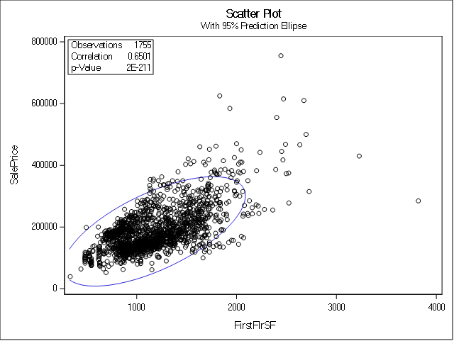
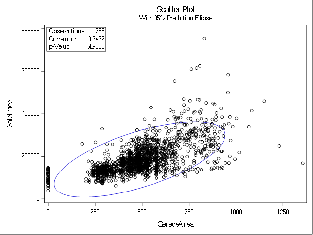
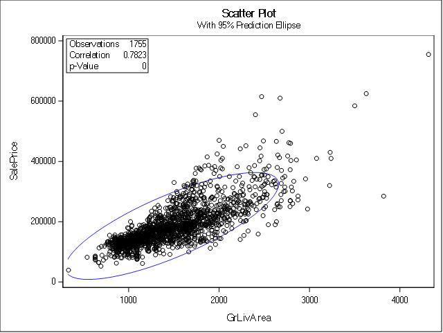
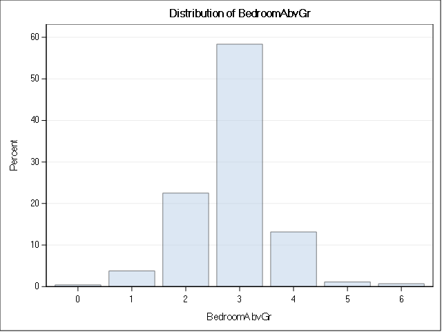
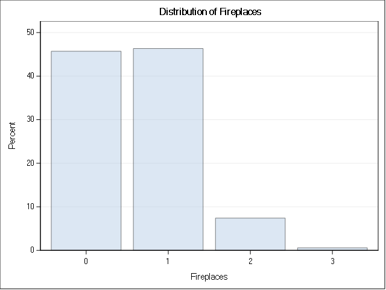
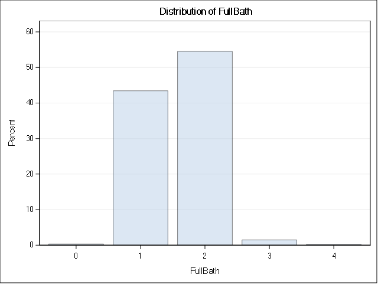

# MSPA PREDICT 410-DL-58 LEC
# Assignment 1: Ames Housing Exploratory Analysis
## Darryl Buswell

&nbsp;

\newpage

# 1 Introduction

This document presents the results of the first assignment for the Masters of Science in Predictive Analytics course: PREDICT 410. This assessment required the student to conduct a data survey, quality check and perform some basic exploratory analysis on a set of housing data for Ames, Iowa.

# 2 Data

The Ames, Iowa property dataset that was leveraged for this assessment can be found published in the Journal of Statistics Education [@decock2011].

The dataset contains variables which focus on physical property attributes. It includes 20 continuous, 14 discrete, 23 nominal and 23 ordinal variable types. DeCock (2011) notes that continuous variables tend to relate to area dimensions for each property, discrete variables tend to quantify the number of items in each property, and categorical variables identify a range of attributes for each property, such as the type of street and neighborhood in which the property is located.

# 3 Data Check and Exploration

## 3.1 Define the Sample Population

In order to define a sample set of data which contains relevant records, we can first create a waterfall statement which filters out records based on unwanted values. The SAS procedure for the implemented waterfall is shown in the SAS Procedure section at the end of this report.

Based on a review of the dataset documentation, I have chosen to remove records based on four criteria:

- Non-typical Function: Remove if record has been identified as a non-normal property or with greater than minimal deductions.
- Non-typical Residential Zoning: Remove if property has not been zoned as residential.
- Built 1940 & Older: Remove if property was built in 1940 or earlier.
- Non-typical Sale: Remove if property was not sold under 'normal' sale conditions.

A table summarizing both the dropped records, and retained 'sample population' is shown below.

### Table 3.1.1: Waterfall Results

| drop_condition                 | Frequency | Percent | Cumulative Frequency | Cumulative Percent |
|--------------------------------|-----------|---------|----------------------|--------------------|
| 01: Non-typical Function       | 202       | 6.89    | 202                  | 6.89               |
| 02: Non-typical Residential Zo | 159       | 5.43    | 361                  | 12.32              |
| 03: Built 1940 & Older         | 438       | 14.95   | 799                  | 27.27              |
| 04: Non-typical Sale           | 376       | 12.83   | 1175                 | 40.1               |
| 05: Sample Population          | 1755      | 59.9    | 2930                 | 100                |
  
From this procedure, we have removed 1,175 records (or 40.1%) of the original dataset.

## 3.2 Data Quality Check

In order to check the quality of the data, a subset of 20 variables have been selected and passed to the SAS 'means', 'univariate', 'corr' and 'freq' procedures. The selected variables include both continuous and discrete types, and are listed below.

    Continuous: FirstFlrSF GarageArea GrLivArea LotArea LotFrontage LowQualFinSF MasVnrArea
    MiscVal OpenPorchSF SecondFlrSF
    
    Discrete: BedroomAbvGr Fireplaces FullBath GarageYrBlt GarageCars TotRmsAbvGrd MoSold 
    YrSold YearBuilt YearRemodel

Scatter plots for three of the above continuous variables, and frequency plots for three of the above discrete variables are shown below.

From the first scatter plot, we can see a general positive relationship between sales price and first floor area. This is intuitive as a greater first floor area would suggest a larger house and greater expected value. There are some reported floor areas which would suggest a rather small property (min of 334 sq ft). These seem like data errors in the instance, however they do coincide with the positive bivariate relationship.

### Figure 3.2.1: ScatterPlot: Sales Price vs. First Floor Surface Area

{#id .class height=320px}

From the second scatter plot below, we can again see a general positive relationship between sales price and garage area. However, the plot indicates a number of zero values for garage area, suggesting either data errors, or that a garage did not exist on the property for that record.

### Figure 3.2.2: ScatterPlot: Sales Price vs. Garage Area

{#id .class height=320px}

For the final scatter plot shown below, we can again see a positive relationship between sales price and living area. As with the reported floor area, there are some reported living areas which would suggest a rather small property (min of 334 sq ft). The minimum reported value of this variable is likely related to the same record which recorded the minimum first floor area noted above.

### Figure 3.2.3: ScatterPlot: Sales Price vs. Living Area

{#id .class height=320px}

From the frequency plot shown below, we can see that the majority of our sample is made up of properties with three bedrooms. Also, it is worth noting that there are some properties which have reported zero bedrooms, possibly indicating bad data or a studio-type configuration. 

### Figure 3.2.4: FrequencyPlot: Bedrooms Above Grade

{#id .class height=320px}

For the second frequency plot below, we can see a large number of properties which have reported zero fireplaces. Again this could be either bad data, or that the property does not have a fireplace.

### Figure 3.2.5: FrequencyPlot: Fireplaces

{#id .class height=320px}

Finally, the frequency plot shown below indicates that the majority of our sample is made up of properties with two full bathrooms. Again, some properties have reported zero bathrooms, which is more likely to be bad data in comparison to the other zero values we have noted.

### Figure 3.2.6: FrequencyPlot: Full Baths

{#id .class height=320px}

As part of the data quality routine, we have identified a number of missing or questionable observations. At this stage however, we will postpone any further data cleaning routine until we have conducted an assessment of which variables we wish to retain. Doing this will ensure that we are not removing observations for a variable of interest, simply due to having a missing or questionable observation in another variable over the same data record.

## 3.3 Identify Relevant Variables

Based on the original dataset documentation, we can see that there are 20 variables which can be considered 'continuous'. These are listed below:

    BsmtFinSF1 BsmtFinSF2 BsmtUnfSF EnclosedPorch FirstFlrSF GarageArea GrLivArea LotArea 
    LotFrontage LowQualFinSF MasVnrArea MiscVal OpenPorchSF PoolArea ScreenPorch SecondFlrSF 
    ThreeSsnPorch TotalBsmtSF WoodDeckSF

For this assessment, we will focus on assessing the relevance of only the above continuous variables, rather than attempting to make any data type or dummy variable conversions.

Since we intend on building a prediction model for house prices, we have an interest in those variables which have explanatory power over this variable. As such, we can use the SAS procedure 'corr' to see if there are any continuous variables that have a high Pearson correlation coefficient and low $p$-value in relation to our dependent variable, 'saleprice'.

### Table 3.3.1: Correlations for Continuous Variables

| Variable      | Pearson Correlation Coefficients | Prob > |r| under H0: Rho=0 |
|---------------|----------------------------------|----------------------------|
| BsmtFinSF1    | 0.43291                          | <.0001                     |
| BsmtFinSF2    | 0.00589                          | 0.7499                     |
| BsmtUnfSF     | 0.18286                          | <.0001                     |
| EnclosedPorch | -0.12879                         | <.0001                     |
| FirstFlrSF    | 0.62168                          | <.0001                     |
| GarageArea    | 0.64040                          | <.0001                     |
| GrLivArea     | 0.70678                          | <.0001                     |
| LotArea       | 0.26655                          | <.0001                     |
| LotFrontage   | 0.35732                          | <.0001                     |
| LowQualFinSF  | -0.03766                         | 0.0415                     |
| MasVnrArea    | 0.50828                          | <.0001                     |
| MiscVal       | -0.01569                         | 0.3958                     |
| OpenPorchSF   | 0.31295                          | <.0001                     |
| PoolArea      | 0.06840                          | 0.0002                     |
| ScreenPorch   | 0.11215                          | <.0001                     |
| SecondFlrSF   | 0.26937                          | <.0001                     |
| ThreeSsnPorch | 0.03222                          | 0.0812                     |
| TotalBsmtSF   | 0.63228                          | <.0001                     |
| WoodDeckSF    | 0.32714                          | <.0001                     |

Since we have a rather large number of continuous variables to select from, we can be rather selective in filtering variables. As such, I have elected to eliminate those variables which have a correlation coefficient less than $|0.5|$, and a $p$-value of $> 0.0001$. Below forms a list of our retained variables.

### Table 3.3.2: Correlations for Selected Continuous Variables

| Variable    | Pearson Correlation Coefficients | Prob > |r| under H0: Rho=0 |
|-------------|----------------------------------|----------------------------|
| FirstFlrSF  | 0.62168                          | <.0001                     |
| GarageArea  | 0.64040                          | <.0001                     |
| GrLivArea   | 0.70678                          | <.0001                     |
| MasVnrArea  | 0.50828                          | <.0001                     |
| TotalBsmtSF | 0.63228                          | <.0001                     |

Descriptions for each of our retained variables are shown below.

- FirstFlrSF: First Floor square feet
- GarageArea: Size of garage in square feet
- GrLivArea: Above grade (ground) living area square feet
- MasVnrArea: Masonry veneer area in square feet
- TotalBsmtSF: Total square feet of basement area

All of the retained variables have highly significant p-values under null hypothesis that the coefficient is equal to zero. This allow us to reject the null hypothesis in each case and conclude that all variables have non-zero coefficients.

Based on the above variable descriptions, it would be reasonable to suggest that each of the retained variables have a relationship with house price, with the only possible exception being 'MasVnrArea'. The applicability of this variable may be limited in many cases, and will be worth tracking as part of any future exploratory analysis.

Next, we can then use the SAS procedure 'means' in order to generate summary statistics for each of our retained variables.

### Table 3.3.3: Statistics for Selected Continuous Variables

| Variable    | Minimum     | Maximum   | Mean        | Std Dev     |
|-------------|-------------|-----------|-------------|-------------|
| SalePrice   | 39300.00    | 755000.00 | 185792.77   | 72389.58    |
| FirstFlrSF  | 334.0000000 | 3820.00   | 1175.55     | 372.3764480 |
| GarageArea  | 0           | 1356.00   | 486.1584046 | 186.0053088 |
| GrLivArea   | 334.000000  | 4316.00   | 1476.97     | 481.5901804 |
| MasVnrArea  | 0           | 1378.00   | 116.9140893 | 179.7044392 |
| TotalBsmtSF | 0           | 3206.00   | 1090.38     | 410.4548038 |

Since we have now identified a number of variables to be used within our prediction model. We can subset our data based on these variables and remove and records which have missing values. The SAS procedure for removing records with these missing values can be found in the 'SAS Output' section.

Finally, we can generate scatterplots with a LOESS smoother overlay for three of our retained variables.

### Figure 3.3.1: ScatterPlot LOESS: Sales Price vs. First Floor Area

{#id .class height=350px}

### Figure 3.3.2: ScatterPlot LOESS: Sales Price vs. Garage Area

{#id .class height=350px}

### Figure 3.3.3: ScatterPlot LOESS: Sales Price vs. Living Area

{#id .class height=350px}

The plots above indicate the existence of a number of outliers for each of our relevant variables. Future assessments may look to implement some form of processing routine to filter out records which contain an outlier.

#4 Conclusion

For this assessment, I have taken a first pass at isolating those continuous variables which will likely have superior explanatory power over house prices. However, as noted above, I have left open a number of areas to expand on this analysis. This will include an investigation of the relevance of non-continuous variables (either through data type conversion or the use of dummy variables), and the employment of data processing routines to filter out records which have either too many recorded 'zero' values and/or data outliers.

Ultimately, this assessment has provided an opportunity to gain some familiarity with the dataset. I was particularly surprised at the depth of data, with an impressive number of records and relevant variables. Although I have built house price prediction models in the past, I have not previously had access to such an extensive dataset.

\newpage

# SAS Proceedure

## Load the Dataset
~~~{.fortran}
libname mydata '/scs/crb519/PREDICT_410/SAS_Data/' access=readonly;

DATA ames;
	SET mydata.ames_housing_data;
RUN; QUIT;

PROC PRINT DATA=ames (obs=10);
RUN; QUIT;

PROC CONTENTS DATA=ames ORDER=VARNUM OUT=ames_cont;
RUN; QUIT;
~~~

## Data Waterfall
~~~{.fortran}
PROC MEANS DATA=ames MIN MAX MEAN STDDEV NMISS N;
RUN; QUIT;

DATA ames_smpl;
	SET ames;
	FORMAT drop_condition $30.;
	* Functional (Ordinal): Home functionality (Assume typical unless deductions are warranted);
	IF ((Functional ne 'Typ') AND (Functional ne 'Min1') AND (Functional ne 'Min2'))
		THEN drop_condition='01: Non-typical Function';
	* MS Zoning (Nominal): Identifies the general zoning classification of the sale.;
	ELSE IF ((Zoning ne 'RH') AND (Zoning ne 'RL') AND (Zoning ne 'RP') AND (Zoning ne 'RM')) 
		THEN drop_condition='02: Non-typical Residential Zoning';
	ELSE IF (YearBuilt < 1941)
	  THEN drop_condition='03: Built 1940 & Older';
	* Sale Condition (Nominal): Condition of sale;
	ELSE IF (SaleCondition ne 'Normal') 
		THEN drop_condition='04: Non-typical Sale';
	ELSE drop_condition='05: Sample Population';
RUN; QUIT;

PROC FREQ DATA=ames_smpl;
	TABLES drop_condition;
RUN; QUIT;

DATA ames_smpl;
	SET ames_smpl;
	IF (drop_condition ne '05: Sample Population') THEN DELETE;
RUN; QUIT;

PROC MEANS DATA=ames_smpl MIN MAX MEAN STDDEV NMISS N;
RUN; QUIT;
~~~

## Initial Exploratory Analysis
~~~{.fortran}
PROC MEANS DATA=ames_smpl;
	VAR FirstFlrSF GarageArea GrLivArea LotArea LotFrontage LowQualFinSF MasVnrArea MiscVal 
	OpenPorchSF SecondFlrSF;
RUN; QUIT;

PROC UNIVARIATE DATA=ames_smpl;
	VAR FirstFlrSF GarageArea GrLivArea LotArea LotFrontage LowQualFinSF MasVnrArea MiscVal 
	OpenPorchSF SecondFlrSF;
RUN; QUIT;

PROC CORR DATA=ames_smpl NOSIMPLE RANK PLOTS=(SCATTER);
	VAR FirstFlrSF GarageArea GrLivArea LotArea LotFrontage LowQualFinSF MasVnrArea MiscVal
	OpenPorchSF SecondFlrSF;
	WITH SalePrice;
RUN; QUIT;

PROC MEANS DATA=ames_smpl;
	VAR BedroomAbvGr Fireplaces FullBath GarageYrBlt GarageCars TotRmsAbvGrd MoSold YrSold
	YearBuilt YearRemodel;
RUN; QUIT;

PROC UNIVARIATE DATA=ames_smpl;
	VAR BedroomAbvGr Fireplaces FullBath GarageYrBlt GarageCars TotRmsAbvGrd MoSold YrSold
	YearBuilt YearRemodel;
RUN; QUIT;

PROC FREQ DATA=ames_smpl;
	TABLES BedroomAbvGr Fireplaces FullBath GarageYrBlt GarageCars TotRmsAbvGrd MoSold YrSold
	YearBuilt YearRemodel / PLOTS=FreqPlot(SCALE=PERCENT) OUT=FREQOUT;
RUN; QUIT;
~~~

## Identify Predictor Variables
~~~{.fortran}
PROC CORR DATA=ames_smpl NOSIMPLE RANK;
	VAR saleprice;
	WITH BsmtFinSF1 BsmtFinSF2 BsmtUnfSF EnclosedPorch FirstFlrSF GarageArea GrLivArea LotArea
	LotFrontage LowQualFinSF MasVnrArea MiscVal OpenPorchSF PoolArea ScreenPorch SecondFlrSF
	ThreeSsnPorch TotalBsmtSF WoodDeckSF;
RUN; QUIT;
~~~

## Eliminate Missing Variables
~~~{.fortran}
DATA ames_smpl;
	SET ames_smpl(KEEP=SalePrice FirstFlrSF GarageArea GrLivArea MasVnrArea TotalBsmtSF);
RUN; QUIT;

PROC MEANS nolabels DATA=ames_smpl MIN MAX MEAN STDDEV NMISS N;
RUN; QUIT;

DATA ames_smpl;
	SET ames_smpl;
	IF cmiss(OF _all_) THEN DELETE;
RUN; QUIT;

PROC MEANS nolabels DATA=ames_smpl MIN MAX MEAN STDDEV NMISS N;
RUN; QUIT;
~~~

## Final Exploratory Analysis
~~~{.fortran}
PROC SGSCATTER DATA=ames_smpl;
	TITLE1 'Scatter Plot: SalePrice vs. FirstFlrSF';
	TITLE2 'Bands at 95% Confidence Level';
	COMPARE X=FirstFlrSF Y=SalePrice / LOESS REG;
RUN; QUIT;

PROC SGSCATTER DATA=ames_smpl;
	TITLE1 'Scatter Plot: SalePrice vs. GarageArea';
	TITLE2 'Bands at 95% Confidence Level';
	COMPARE X=GarageArea Y=SalePrice / LOESS REG;
RUN; QUIT;

PROC SGSCATTER DATA=ames_smpl;
	TITLE1 'Scatter Plot: SalePrice vs. GrLivArea';
	TITLE2 'Bands at 95% Confidence Level';
	COMPARE X=GrLivArea Y=SalePrice / LOESS REG;
RUN; QUIT;

PROC SGSCATTER DATA=ames_smpl;
	TITLE1 'Scatter Plot: SalePrice vs. MasVnrArea';
	TITLE2 'Bands at 95% Confidence Level';
	COMPARE X=MasVnrArea Y=SalePrice / LOESS REG;
RUN; QUIT;

PROC SGSCATTER DATA=ames_smpl;
	TITLE1 'Scatter Plot: SalePrice vs. TotalBsmtSF';
	TITLE2 'Bands at 95% Confidence Level';
	COMPARE X=TotalBsmtSF Y=SalePrice / LOESS REG;
RUN; QUIT;
~~~

\newpage

# References