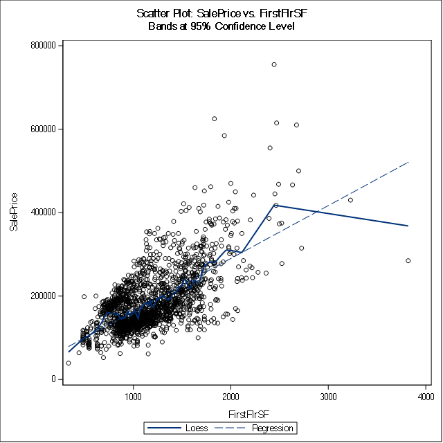
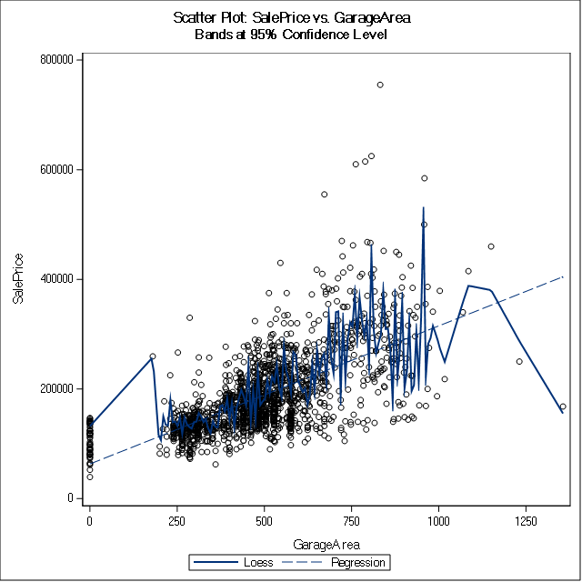
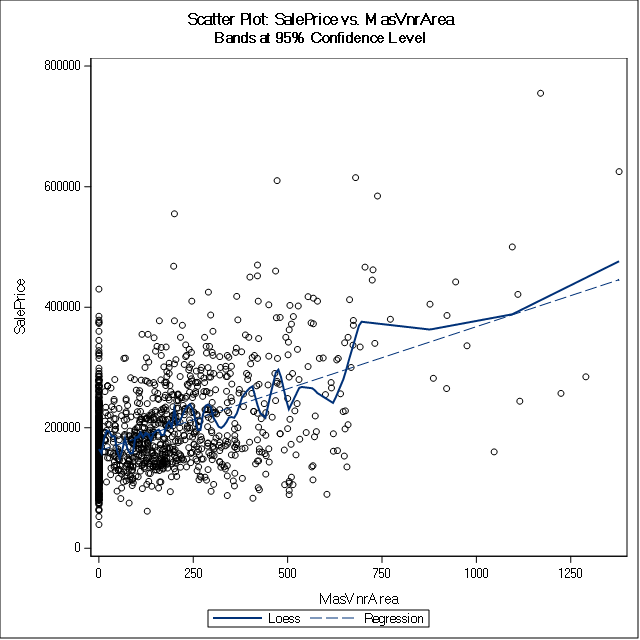
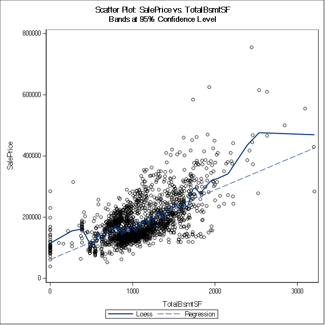
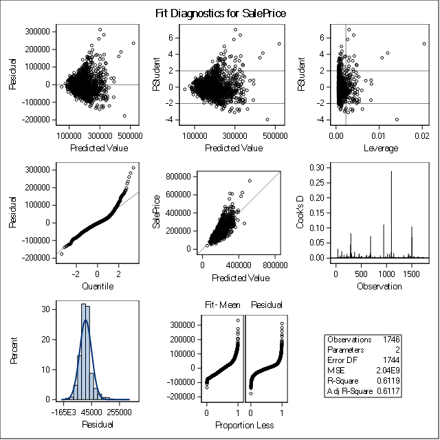
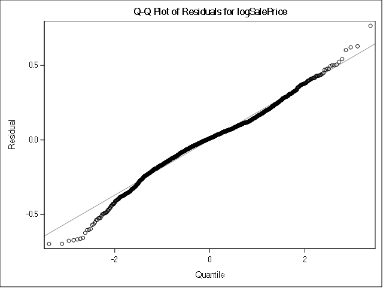
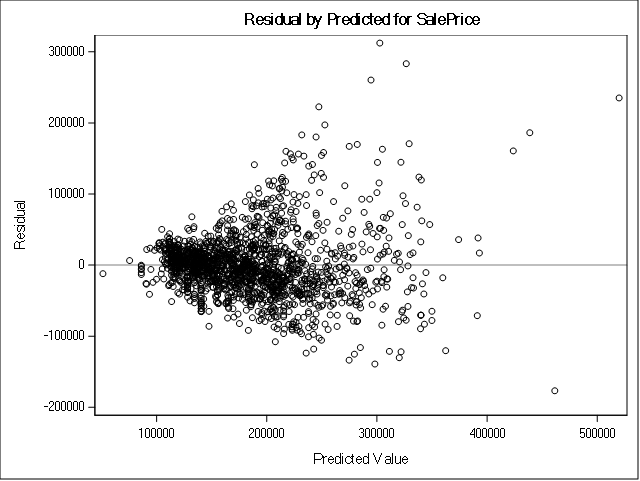
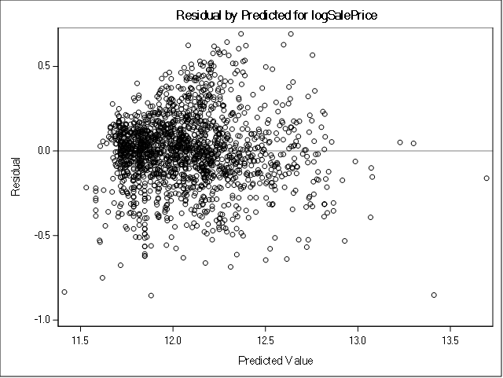
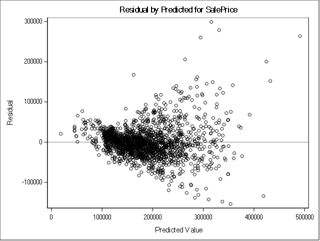
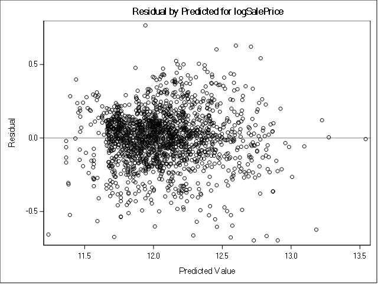

# MSPA PREDICT 410-DL-58 LEC
# Assignment 2: Regression Model Building
## Darryl Buswell

&nbsp;

# 1 Introduction

This document presents the results of the second assignment for the Masters of Science in Predictive Analytics course: PREDICT 410. This assessment required the student to build a regression model which predicts property prices in Ames, Iowa

# 2 Data

The Ames, Iowa property dataset that was leveraged for this assessment can be found published in the Journal of Statistics Education [@decock2011].

The dataset contains variables which focus on physical property attributes. It includes 20 continuous, 14 discrete, 23 nominal and 23 ordinal variable types. DeCock (2011) notes that continuous variables tend to relate to area dimensions for each property, discrete variables tend to quantify the number of items in each property, and categorical variables identify a range of attributes for each property, such as the type of street and neighborhood in which the property is located.

# 3 Build a Linear Regression Model

## 3.1 Define the Sample Population

In order to define a sample set of data which contains relevant records, we can first create a waterfall statement which filters out records based on unwanted values. The SAS procedure for the implemented waterfall is shown in the SAS Procedure section at the end of this report.

Based on a review of the dataset documentation, I have chosen to remove records based on four criteria:

- Non-typical Function: Remove if record has been identified as a non-normal property or with greater than minimal deductions.
- Non-typical Residential Zoning: Remove if property has not been zoned as residential.
- Built 1940 & Older: Remove if property was built in 1940 or earlier.
- Non-typical Sale: Remove if property was not sold under 'normal' sale conditions.

A table summarizing both the dropped records, and retained 'sample population' is shown below.

### Table 3.1.1: Waterfall Results

| drop_condition                 | Frequency | Percent | Cumulative Frequency | Cumulative Percent |
|--------------------------------|-----------|---------|----------------------|--------------------|
| 01: Non-typical Function       | 202       | 6.89    | 202                  | 6.89               |
| 02: Non-typical Residential Zo | 159       | 5.43    | 361                  | 12.32              |
| 03: Built 1940 & Older         | 438       | 14.95   | 799                  | 27.27              |
| 04: Non-typical Sale           | 376       | 12.83   | 1175                 | 40.1               |
| 05: Sample Population          | 1755      | 59.9    | 2930                 | 100                |
  
From this procedure, we have removed 1,175 records (or 40.1%) of the original dataset.

## 3.2 Identify Relevant Variables

The goal is to identify two variables which best predict sale price. To achieve this, I first employ high level statistical techniques in order to filter to five variables of interest, and then implement exploratory analysis techniques to make a subjective assessment of which two variables are likely to demonstrate the greatest predictive value. Do note that for this assessment, we focus on assessing the relevance of only continuous variables rather than attempting to make any data type or dummy variable conversions.

Since the assessment requires the student to build a prediction model for sale price, we have an interest in those continuous variables which have explanatory power over this variable. To identify such variables, we first use the SAS procedure 'corr' to see if there are any continuous variables that have a high Pearson correlation coefficient and low $p$-value in relation to sale price. Since there are such a large number of continuous variables to select from, we can be rather selective in filtering variables. As such, I have elected to eliminate those variables which have a correlation coefficient less than $|0.5|$, and a $p$-value of $< 0.0001$. Below forms a list of our retained variables.

### Table 3.2.1: Correlations for Selected Continuous Variables

| Variable    | Pearson Correlation Coefficients | Prob > |r| under H0: Rho=0 |
|-------------|----------------------------------|----------------------------|
| FirstFlrSF  | 0.65008                          | <.0001                     |
| GarageArea  | 0.64624                          | <.0001                     |
| GrLivArea   | 0.78228                          | <.0001                     |
| MasVnrArea  | 0.51077                          | <.0001                     |
| TotalBsmtSF | 0.64263                          | <.0001                     |

All of the retained variables have highly significant p-values under the null hypothesis that the coefficient is equal to zero. This allow us to reject the null hypothesis in each case and conclude that all variables have non-zero coefficients. Descriptions for each of our retained variables are shown below.

- FirstFlrSF: First floor area in square feet
- GarageArea: Size of garage in square feet
- GrLivArea: Above grade (ground) living area in square feet
- MasVnrArea: Masonry veneer area in square feet
- TotalBsmtSF: Total square feet of basement area

Based on the above variable descriptions, it would be reasonable to suggest that each have a fundamental relationship with sale price and that each should be relevant for the majority of assessed properties. The only possible exception to this being masonry veneer area, which may be a irrelevant and therefore not reported for many properties. The polarity of each coefficient estimate also appears correct, with it being reasonable to suggest that an increase in any of the above variables should coincide with an increase in sale price.

Next, we can use the SAS procedure 'means' to generate summary statistics for each of our retained variables.

### Table 3.2.2: Statistics for Selected Continuous Variables

| Variable    | Minimum     | Maximum   | Mean        | Std Dev     |
|-------------|-------------|-----------|-------------|-------------|
| FirstFlrSF  | 334.0000000 | 3820.00   | 1175.55     | 372.3764480 |
| GarageArea  | 0           | 1356.00   | 486.1584046 | 186.0053088 |
| GrLivArea   | 334.0000000 | 4316.00   | 1476.97     | 481.5901804 |
| MasVnrArea  | 0           | 1378.00   | 116.9140893 | 179.7044392 |
| TotalBsmtSF | 0           | 3206.00   | 1090.38     | 410.4548038 |

We can see from the summary statistics above that garage area, masonry veneer area and basement area all include at least a single zero observation within our sample dataset. A zero value may suggest that the variable was not relevant for that recorded observation, however, we cannot be sure whether the zero values are at least partially attributed to missing or inaccurately reported data. Also note that both first floor area and living area have recorded the same minimum value. Further investigation reveals that the reported value of 334 square feet for these variables was made under the same record, which may suggest overlap in the interpretation between these two variables. 

Scatter plots for each of the above retained variables against the house price variable are shown below. Each scatter plot is shown with a LOESS smoother overlay.

### Figure 3.2.1: ScatterPlot: Sale Price vs. First Floor Surface Area

{#id .class height=320px}

From the first scatter plot, we can see a general positive relationship between sale price and first floor area. This is intuitive as a greater first floor area would suggest a larger property and greater expected value. There are some reported floor areas which would suggest a rather small property (minimum of 334 square feet). These seem like data errors in the first instance, however the sale price recorded for these observations does coincide with the positive bi-variate relationship. There are also some outliers present over the range of observations.

### Figure 3.2.2: ScatterPlot: Sale Price vs. Garage Area

{#id .class height=320px}

From the second scatter plot shown above, we again see a positive relationship to sale price. However, the plot indicates a number of zero values for garage area, suggesting either data errors, or that a garage did not exist on the property. As with the first floor area, we again note a number of outliers over the range of observations.

### Figure 3.2.3: ScatterPlot: Sale Price vs. Living Area

{#id .class height=320px}

For the third scatter plot shown above, we again see a positive relationship to sale price. The property which was reported to have a 334 square foot first floor area is shown to also have a 334 square foot living area. There are in fact a number of similarities in characteristics between this plot and the scatter plot shown for first floor area in Figure 3.2.1. Due to this, it may be worth avoiding a regression specification which includes both first floor area and living area, as doing so may introduce multicollinearity issues.

### Figure 3.2.4: ScatterPlot: Sale Price vs. Basement Area

{#id .class height=320px}

For the forth scatter plot shown above, we again see a positive relationship to sale price, a presence of recorded zero values, and a number of outliers.

### Figure 3.2.5: ScatterPlot: Sale Price vs. Veneer Area

{#id .class height=320px}

For the final scatter plot shown above, we again see a positive relationship to sale price. However this variable has a greater amount of recorded zero values when compared to the other retained variables. Perhaps even more disturbing, is that there is a lot of variation in sale price against those recorded zero values. As a result, masonry veneer area would likely have less explanatory power for sale price compared to the other four variables.

Based on the exploratory analysis conducted above, I have decided to retain variables for Above grade ground living area (living area) and size of garage. My first instinct was to include first floor area rather than garage area, as doing so would avoid retaining observations with a recorded zero value. However, I felt that including first floor area and living area would have a higher chance of introducing effects of multicollinearity than including living area and garage area. Also, both living area and garage area were identified as having the greatest correlation coefficient to house price under the Pearson Correlation Coefficient measures shown in Table 3.2.2 (when omitting first floor area), providing an additional incentive for retaining this pair of variables. As a final note, although our exploratory analysis above suggests that our retained variables would benefit from the removal of outliers and zero values, such a routine is outside of the scope of this assessment.

## 3.3 Simple Linear Regression Model

We will next move on to estimating two simple linear regression models, one which regresses living area against sale price, the other which regresses garage area against sale price. The SAS procedure 'reg' can be used to estimate the parameters for each model.

### Table 3.3.1: Simple Linear Regression Parameter Estimates

| Model   | Variable   | DF | Parameter Estimate | Standard Error | t Value | $\text{Pr} > |t|$ |
|---------|------------|----|--------------------|----------------|---------|-------------------|
| Model 1 |                                                                                     |
|         | Intercept  | 1  | 12119              | 3474.12342     | 3.49    | 0.0005            |
|         | GrLivArea  | 1  | 117.58737          | 2.23637        | 52.58   | <.0001            |
|---------|------------|----|--------------------|----------------|---------|-------------------|
| Model 2 |                                                                                     |
|         | Intercept  | 1  | 63522              | 3692.21060     | 17.20   | <.0001            |
|         | GarageArea | 1  | 251.50489          | 7.09348        | 35.46   | <.0001            |

The fitted specification for each model is shown below:

$$ \text{SalePrice}=12119+117.5874\text{(GrLivArea)}+\varepsilon \text{ : Model 1} $$

$$ \text{SalePrice}=63522+251.5049\text{(GarageArea)}+\varepsilon \text{ : Model 2} $$

For Model 1, both coefficient estimates have highly significant p-values under the null hypothesis that coefficients are equal to zero. As such, we are able to reject the null hypothesis in each case and conclude that both the intercept estimate and coefficient estimate for living area have non-zero coefficients. For this model, the estimated intercept of 12119 suggests that a property which has a recorded value of zero for living area (i.e. potentially does not have a living area), would result in a sale price of $12,119. However, do note that a zero value for living area lies outside of the sample range and we should therefore be cautious in making such an inference. The coefficient estimate for living area suggests that for each square foot increase in living area, sale price increases by $117.59.

For Model 2, again, both coefficient estimates have highly significant p-values under the null hypothesis that coefficients are equal to zero. As such, we are able to reject the null hypothesis in each case and conclude that both the intercept estimate and the coefficient estimate for garage area have non-zero coefficients. For this model, the estimated intercept of 63522 suggests that a property which has a recorded value of zero for garage area (i.e. potentially does not have a garage), would result in a sale price of $63,522. In this case, a zero value for garage area does indeed lie within the sample range. The coefficient estimate for garage area suggests that for each square foot increase in above garage area, sale price tend to increase by $251.50.

The SAS procedure 'reg' also produces goodness-of-fit information for both models.

### Table 3.3.2: Simple Linear Regression Goodness-of-Fit Statistics

| Model   | DF | Sum of Squares | Mean Square | F Value | $\text{Pr} > F$ |
|---------|----|----------------|-------------|---------| ----------------|
| Model 1 | 1  | 5.624789E12    | 5.624789E12 | 2764.60 | <.0001          |
| Model 2 | 1  | 3.838603E12    | 3.838603E12 | 1257.11 | <.0001          |

Both Model 1 and Model 2 have reported large F-values suggesting that the observations and regression differ from the grand mean. Likewise the F-value for both models has a highly significant p-value under the null hypothesis that there is no linear relationship between the predictor and response variable. This allows us to reject the null hypothesis in each case and conclude that there is a linear relationship between sale price and living area, as well as between sale price and garage area.

Model performance statistics for both models are shown below.

### Table 3.3.3: Simple Linear Regression Performance Statistics

| Model   | Root MSE | Dependent Mean | Coeff Var | R-Square | Adj R-Square |
|---------|----------|----------------|-----------|----------|--------------|
| Model 1 | 45106    | 185793         | 24.27773  | 0.6120   | 0.6117       |
| Model 2 | 55259    | 185793         | 29.74203  | 0.4176   | 0.4173       |

The R-Square suggests that Model 1 explains ~61% of the variability in sale price using living area. While Model 2 explains ~42% of the variability in sale price using garage area. Clearly, the R-square measures suggest that a large amount of variability has been left unexplained by both models.

Finally, we are able to view the ODS graphics output for both models in order to further assess the model fit. The ODS plots for both Model 1 and Model 2 can be found below.

As part of our assessment of model fit, we are able to assess the normality of residuals by examining the residual Q-Q plot and histogram of residuals within the ODS summaries. Doing so reveals that the residuals for both models have a heavy tail, and therefore do not follow the assumed normal distribution. Next, we are able to make an assessment for multicollinearity by observing the Cook's D plot. According to [@fox1991], attention should be paid to points along the D plot which are substantially larger in comparison to the remaining points. Following the advice of Fox, we can see that both models have a number of points along the D plot which suggest the presence of influential observations and effects of multicollinearity. Finally, we are able to make an assessment of variance of the residuals by observing the scatter plots of residuals versus predicted values. Doing so reveals a slight fan pattern in the residuals for both models, and therefore a lack of homoscedasticity over residuals.

### Figure 3.3.1: Model 1 ODS Fit Summary

{#id .class height=380px}

### Figure 3.3.2: Model 2 ODS Fit Summary

{#id .class height=380px}

## 3.4 Multiple Linear Regression Model

We next estimate a multiple linear regression model with living area and garage area regressed against sale price. The SAS procedure 'reg' can be used to estimate the parameters for the model.

### Table 3.4.1: Multiple Linear Regression Parameter Estimates

| Variable   | DF | Parameter Estimate | Standard Error | t Value | $\text{Pr} > |t|$ |
|------------|----|--------------------|----------------|---------| ------------------|
| Intercept  | 1  | -12366             | 3319.74292     | -3.72   | 0.0002            |
| GrLivArea  | 1  | 91.97799           | 2.34490        | 39.22   | <.0001            |
| GarageArea | 1  | 128.05431          | 6.07642        | 21.07   | <.0001            |

The fitted specification for the model is shown below:

$$ \text{SalePrice}=-12366+91.9780\text{GrLivArea}+128.0543\text{GrLivArea}+\varepsilon \text{ : Model 3} $$

For Model 3, all coefficient estimates have highly significant p-values under the null hypothesis that the coefficients are equal to zero. As such, we are able to reject the null hypothesis in each case and conclude that the intercept estimate, as well as the coefficient estimate for living area and garage area, have non-zero coefficients. For this model, the estimated intercept of -12366 suggests that a property which has a recorded value of zero for both living area and garage area, would result in a sale price of -$12,366. This is clearly an invalid inference, and we again note that a zero value for living area lies outside of the sample range. The coefficient estimate for living area suggests that for each square foot increase in living area (whilst holding garage area constant), sale price will increase by $91.98. Likewise, the coefficient estimate for garage area suggests that for each square foot increase in garage area (whilst holding living area constant), sale price will increase by $128.05.

The SAS procedure 'reg' also produces goodness-of-fit information for the model.

### Table 3.4.2: Multiple Linear Regression Goodness-of-Fit Statistics

| Measure         | DF   | Sum of Squares | Mean Square | F Value | $\text{Pr} > F$ |
|-----------------|------|----------------|-------------|---------| ----------------|
| Model 3         | 2    | 6.336261E12    | 3.168131E12 | 1946.23 | <.0001          |

Model 3 reported a large F-value suggesting that the observations and regression differ from the grand mean. Likewise the F-value has a highly significant p-value under the null hypothesis that there is no linear relationship between the predictor and response variable. Do note that the F-value for Model 3 is greater than the value reported for Model 2, but is less than the value reported for Model 1. Again, for Model 3, we reject the null hypothesis and conclude that there is a linear relationship between sale price and the two predictor variables, living area and garage area.

Model performance statistics for the model are shown below.

### Table 3.4.3: Multiple Linear Regression Performance Statistics

| Model   | Root MSE | Dependent Mean | Coeff Var | R-Square | Adj R-Square |
|---------|----------|----------------|-----------|----------|--------------|
| Model 3 | 40346    | 185719         | 21.72437  | 0.6907   | 0.6904       |

The Adjusted R-Square suggests that Model 3 explains ~69% of the variability in sale price using the two predictor variables, living area and garage area. This an improvement over the Adjusted R-Square over Model 1 and Model 2, however, the Adjusted R-square measure still suggests that a reasonable amount of variability remains unexplained by the model.

Finally, we are able to view the ODS graphics output for the model in order to further assess the model fit.

### Figure 3.4.1: Multiple Linear Regression ODS Fit Summary

{#id .class height=380px}

As part of our assessment of model fit, we again turn to the residual Q-Q plot and histogram of residuals in order to make an assessment of normality of residuals. Doing so reveals that the residuals for Model 3 appear to be more normal in comparison to Model 1 or Model 2, with only a few exceptions from observations within the extremes of the distribution. Next we can make an assessment of multicollinearity by again following the advice of Fox, noting that Model 3 has a number of points which suggest the presence of influential observations. And finally, we are able to make an assessment of variance of the residuals by observing the scatter plots of residuals versus predicted values, noting less of a fan pattern in the residuals in comparison to Model 1 or Model 2.

## 3.5 Regression with Transformed Response

Next, we refit each of the previously estimated models shown above using a log transformation on the response variable, sale price. The SAS procedure 'reg' can be used to estimate the parameters for each model.

### Table 3.5.1: Transformed Response Model Parameter Estimates

| Model   | Variable   | DF | Parameter Estimate | Standard Error | t Value | $\text{Pr} > |t|$ |
|---------|------------|----|--------------------|----------------|---------|-------------------|
| Model 4 |                                                                                     |
|         | Intercept  | 1  | 11.22144           | 0.01659        | 676.60  | <.0001            |
|         | GrLivArea  | 1  | 0.00057325         | 0.00001068     | 53.68   | <.0001            |
|---------|------------|----|--------------------|----------------|---------|-------------------|
| Model 5 |                                                                                     |
|         | Intercept  | 1  | 11.44843           | 0.01728        | 662.69  | <.0001            |
|         | GarageArea | 1  | 0.00127            | 0.00003318     | 38.39   | <.0001            |
|---------|------------|----|--------------------|----------------|---------|-------------------|
| Model 6 |                                                                                     |
|         | Intercept  | 1  | 11.09063           | 0.01524        | 727.65  | <.0001            |
|         | GrLivArea  | 1  | 0.00043543         | 0.00001077     | 40.45   | <.0001            |
|         | GarageArea | 1  | 0.00068739         | 0.00002790     | 24.64   | <.0001            |

The fitted specification for each model is shown below:

$$ \text{log(SalePrice)}=11.2214+0.0006\text{(GrLivArea)}+\varepsilon \text{ : Model 4} $$

$$ \text{log(SalePrice)}=11.4484+0.0013\text{(GarageArea)}+\varepsilon \text{ : Model 5} $$

$$ \text{log(SalePrice)}=11.0901+0.0004\text{(GrLivArea)}+0.0007\text{(GarageArea)}+\varepsilon \text{ : Model 6} $$

As with the previous models, all coefficient estimates have highly significant p-values under the null hypothesis that the coefficients are equal to zero. As such, we are able to reject the null hypothesis in each case and conclude that the intercept estimate, as well as the coefficient estimate for living area and garage area under each specification have non-zero coefficients.

Since the above models have had the response variable log transformed, we interpret a change in the predictor variables by:

$$ \%\Delta y=100\cdot (e^{\beta \:_1}-1) $$

As such, according to the specifications for Model 4, a one square foot increase in living area results in a 0.057% increase in sale price. According to Model 5, a one square foot increase in garage area results in a 0.127% increase in sale price. And finally, for Model 6, a one square foot increase in living area results in a 0.044% increase in sale price (whilst holding garage area constant) and a one square foot increase in garage area results in a 0.069% increase in sale price (whilst holding living area constant).

The SAS procedure 'reg' also produces goodness-of-fit information for each model.

### Table 3.5.2: Transformed Response Model Goodness-of-Fit Statistics

| Model   | DF | Sum of Squares | Mean Square | F Value | $\text{Pr} > F$ |
|---------|----|----------------|-------------|---------| ----------------|
| Model 4 | 1  | 133.26200      | 133.26200   | 2882.05 | <.0001          |
| Model 5 | 1  | 97.96369       | 97.96369    | 1473.62 | <.0001          |
| Model 6 | 2  | 154.09380      | 77.04690    | 2245.39 | <.0001          |

Note that all three models have reported more favorable F-values in comparison to their non-transformed alternatives. Models 4, 5 and 6 were able to achieve F-value's of 2882.05, 1473.62 and 2245.39 respectively, compared to Models 1, 2 and 3 which achieved F-value's of 2764.60, 1257.11 and 1946.23 respectively. Again, the F-value for each transformed model has a highly significant p-value under the null hypothesis that there is no linear relationship between the predictor and response variable.

Model performance statistics for each of the transformed models are shown below.

### Table 3.5.3: Transformed Response Model Performance Statistics

| Model   | Root MSE | Dependent Mean | Coeff Var | R-Square | Adj R-Square |
|---------|----------|----------------|-----------|----------| -------------|
| Model 4 | 0.21503  | 12.06786       | 1.78185   | 0.6230   | 0.6228       |
| Model 5 | 0.25783  | 12.06786       | 2.13654   | 0.4580   | 0.4577       |
| Model 6 | 0.18524  | 12.06786       | 1.53498   | 0.7204   | 0.7201       |

Again, we note that all three models have reported more favorable R-squared values in comparison to their non-transformed alternatives. Models 4, 5 and 6 were able to achieve R-squared values of 0.6230, 0.4580 and 0.7204 respectively, compared to Models 1, 2 and 3 which achieved R-squared values of 0.6120, 0.4176 and 0.6907 respectively.

Finally, we are able to view unpacked ODS graphics output for both the non-transformed and transformed models in order to assess whether there has been an improvement in goodness-of-fit. 

The figure below shows four plots. The two plots in the first row show the Q-Q plot of residuals for both the non-transformed (left) and log transformed (right) simple linear regression model regressed against living area (Model 1 and Model 4 respectively). The two plots on the second row show the Q-Q plot of residuals for both the non-transformed (left) and log transformed (right) multiple linear regression model regressed against living area and garage area (Model 3 and Model 6 respectively). No log transformation was performed on Model 2 as it has less explanatory power than Model 1.

The figure reveals that the residuals for the non-transformed models on the left have heavy tails, and therefore do not follow the assumed normal distribution. However, the transformed models in the right-hand column are much more normally distributed. The transformation seems most effective in normalizing those residuals which are greatest in value.

### Figure 3.5.1: Q-Q Plot Transformation Comparison

{#id .class height=230px} {#id .class height=230px}

{#id .class height=230px} {#id .class height=230px}

The figure below shows four plots which follow the same layout as the plot discussed above, however in this case each are showing the Cook's D-plot of residuals. The linear regression plots in the top row show that transformation for the simple linear regression model reduced the number of spikes, and therefore suggests fewer influential observations. However, the same effect was not observed for the multiple linear regression model where the transformation did not reduce the number of spikes.

### Figure 3.5.2: Cooks D-Plot Transformation Comparison

{#id .class height=230px} {#id .class height=230px}

{#id .class height=230px} {#id .class height=230px}

Again, the figure below shows four plots which follow the same layout as the two plots discussed above, however in this case each are showing a scatter plot of residuals. While the non-transformed models tend to exhibit some fanning of residuals, the residuals of the transformed models appear much more uniform. It is likely that the transformation has reduced the effects of heteroskedasicity.

### Figure 3.5.3: Model 1 Distribution of Residuals

{#id .class height=230px} {#id .class height=230px}

{#id .class height=230px} {#id .class height=230px}

#4 Conclusion

For this assessment, I isolated two continuous variables (living area and garage area) which were likely to have superior explanatory power over sale price. Using these variables, I then built two simple linear regression models with sale price as the response variable. I found that both models did indeed provide some explanatory power over sale price, however the simple linear regression model which used living area as the predictor variable had superior explanatory power over the model which used garage area as the predictor variable. In both cases, there were a number of observed violations of regression assumptions, including those related to the lack of normality of residuals, effects of multicollinearity, and presence of heteroskedasicity of residuals. These two variables were then used as part of the specification for multiple variable regression model, with sale price again used as the predictor variable. 

I found that the multiple linear regression model had superior explanatory power compared to the two simple linear regression models, and indicated a reduction in severity of violation of regression assumptions. Finally, a log transformation of the predictor variable was conducted for the simple linear regression model which used living area as the predictor variable, as well as for the multiple linear regression model. It was noted that this transformation was able to greatly normalize the residuals and reduce the presence of heteroskedasicity within the residuals. However, the effects of multicollinearity did still seem to be present for the multiple regression model.

Ultimately, this assessment reaffirms the importance of visually inspecting, rather than simply reviewing statistical measures of diagnostics.

\newpage

# SAS Procedure

## Load the Dataset

~~~{.fortran}
libname mydata '/scs/crb519/PREDICT_410/SAS_Data/' access=readonly;

DATA ames;
	SET mydata.ames_housing_data;
RUN; QUIT;

PROC PRINT DATA=ames (obs=10);
RUN; QUIT;

PROC CONTENTS DATA=ames ORDER=VARNUM OUT=ames_cont;
RUN; QUIT;
~~~

## Data Waterfall

~~~{.fortran}
PROC MEANS DATA=ames MIN MAX MEAN STDDEV NMISS N;
RUN; QUIT;

DATA ames_smpl;
	SET ames;
	FORMAT drop_condition $30.;
	* Functional (Ordinal): Home functionality (Assume typical unless deductions are warranted);
	IF ((Functional ne 'Typ') AND (Functional ne 'Min1') AND (Functional ne 'Min2'))
		THEN drop_condition='01: Non-typical Function';
	* MS Zoning (Nominal): Identifies the general zoning classification of the sale.;
	ELSE IF ((Zoning ne 'RH') AND (Zoning ne 'RL') AND (Zoning ne 'RP') AND (Zoning ne 'RM')) 
		THEN drop_condition='02: Non-typical Residential Zoning';
	ELSE IF (YearBuilt < 1941)
	  THEN drop_condition='03: Built 1940 & Older';
	* Sale Condition (Nominal): Condition of sale;
	ELSE IF (SaleCondition ne 'Normal') 
		THEN drop_condition='04: Non-typical Sale';
	ELSE drop_condition='05: Sample Population';
RUN; QUIT;

PROC FREQ DATA=ames_smpl;
	TABLES drop_condition;
RUN; QUIT;

DATA ames_smpl;
	SET ames_smpl;
	IF (drop_condition ne '05: Sample Population') THEN DELETE;
RUN; QUIT;

PROC MEANS DATA=ames_smpl MIN MAX MEAN STDDEV NMISS N;
RUN; QUIT;
~~~

## Identify Predictor Variables

~~~{.fortran}
PROC CORR DATA=ames_smpl NOSIMPLE RANK;
	VAR saleprice;
	WITH BsmtFinSF1 BsmtFinSF2 BsmtUnfSF EnclosedPorch FirstFlrSF GarageArea GrLivArea LotArea
	LotFrontage LowQualFinSF MasVnrArea MiscVal OpenPorchSF PoolArea ScreenPorch SecondFlrSF
	ThreeSsnPorch TotalBsmtSF WoodDeckSF;
RUN; QUIT;
~~~

## Exploratory Analysis

~~~{.fortran}
PROC CORR DATA=ames_smpl NOSIMPLE RANK;
	VAR saleprice;
	WITH FirstFlrSF GarageArea GrLivArea MasVnrArea TotalBsmtSF;
RUN; QUIT;

PROC SGSCATTER DATA=ames_smpl;
	TITLE1 'Scatter Plot: SalePrice vs. FirstFlrSF';
	TITLE2 'Bands at 95% Confidence Level';
	COMPARE X=FirstFlrSF Y=SalePrice / LOESS REG;
RUN; QUIT;

PROC SGSCATTER DATA=ames_smpl;
	TITLE1 'Scatter Plot: SalePrice vs. GarageArea';
	TITLE2 'Bands at 95% Confidence Level';
	COMPARE X=GarageArea Y=SalePrice / LOESS REG;
RUN; QUIT;

PROC SGSCATTER DATA=ames_smpl;
	TITLE1 'Scatter Plot: SalePrice vs. GrLivArea';
	TITLE2 'Bands at 95% Confidence Level';
	COMPARE X=GrLivArea Y=SalePrice / LOESS REG;
RUN; QUIT;

PROC SGSCATTER DATA=ames_smpl;
	TITLE1 'Scatter Plot: SalePrice vs. MasVnrArea';
	TITLE2 'Bands at 95% Confidence Level';
	COMPARE X=MasVnrArea Y=SalePrice / LOESS REG;
RUN; QUIT;

PROC SGSCATTER DATA=ames_smpl;
	TITLE1 'Scatter Plot: SalePrice vs. TotalBsmtSF';
	TITLE2 'Bands at 95% Confidence Level';
	COMPARE X=TotalBsmtSF Y=SalePrice / LOESS REG;
RUN; QUIT;
~~~

## Simple Linear Regression Model

~~~{.fortran}
ODS graphics ON;
RUN; QUIT;

DATA ames_smpl_reg;
	SET ames_smpl;
RUN; QUIT;

PROC REG DATA=ames_smpl_reg;
	TITLE1 'ODS: SalePrice=GrLivArea';
	MODEL SalePrice=GrLivArea;
RUN; QUIT;

PROC REG DATA=ames_smpl_reg;
	TITLE1 'ODS: SalePrice=GarageArea';
	MODEL SalePrice=GarageArea;
RUN; QUIT;

ODS graphics OFF;
RUN; QUIT;
~~~

## Multiple Linear Regression Model

~~~{.fortran}
ODS graphics ON;
RUN; QUIT;

DATA ames_smpl_reg;
	SET ames_smpl;
RUN; QUIT;

PROC REG DATA=ames_smpl_reg;
	TITLE1 'ODS: SalePrice=GrLivArea GarageArea';
	MODEL SalePrice=GrLivArea GarageArea;
RUN; QUIT;

ODS graphics OFF;
RUN; QUIT;
~~~

## Linear Regression Model (Transformed Response)

~~~{.fortran}
ODS graphics ON;
RUN; QUIT;

DATA ames_smpl_reg;
	SET ames_smpl;
	logSalePrice=LOG(SalePrice);
RUN; QUIT;

PROC REG DATA=ames_smpl_reg;
	TITLE1 'ODS: logSalePrice=GrLivArea';
	MODEL logSalePrice=GrLivArea;
RUN; QUIT;

PROC REG DATA=ames_smpl_reg;
	TITLE1 'ODS: logSalePrice=GarageArea';
	MODEL logSalePrice=GarageArea;
RUN; QUIT;

PROC REG DATA=ames_smpl_reg;
	TITLE1 'ODS: logSalePrice=GrLivArea GarageArea';
	MODEL logSalePrice=GrLivArea GarageArea;
RUN; QUIT;

ODS graphics OFF;
RUN; QUIT;
~~~

## Comparison between Non-Transformed and Transformed Response

~~~{.fortran}
ODS graphics ON;
RUN; QUIT;

PROC REG DATA=ames_smpl
	PLOTS(UNPACK) PLOTS=RESIDUALS(SMOOTH);
	TITLE1 'ODS Unpack: SalePrice=GrLivArea';
	MODEL SalePrice=GrLivArea / ALPHA=0.05 STB CLB;
RUN; QUIT;

PROC REG DATA=ames_smpl
	PLOTS(UNPACK) PLOTS=RESIDUALS(SMOOTH);
	TITLE1 'ODS Unpack: SalePrice=GrLivArea GarageArea';
	MODEL SalePrice=GrLivArea GarageArea / ALPHA=0.05 STB CLB;
RUN; QUIT;

DATA ames_smpl_reg;
	SET ames_smpl;
	logSalePrice=LOG(SalePrice);
RUN; QUIT;

PROC REG DATA=ames_smpl_reg
	PLOTS(UNPACK) PLOTS=RESIDUALS(SMOOTH);
	TITLE1 'ODS Unpack: logSalePrice=GrLivArea';
	MODEL logSalePrice=GrLivArea / ALPHA=0.05 STB CLB;
RUN; QUIT;

PROC REG DATA=ames_smpl_reg
	PLOTS(UNPACK) PLOTS=RESIDUALS(SMOOTH);
	TITLE1 'ODS Unpack: logSalePrice=GrLivArea GarageArea';
	MODEL logSalePrice=GrLivArea GarageArea / ALPHA=0.05 STB CLB;
RUN; QUIT;

ODS graphics OFF;
RUN; QUIT;
~~~

\newpage

# References