# MSPA PREDICT 410-DL-58 LEC 
# Assignment 3: Data Analysis and Regression
## Darryl Buswell

&nbsp;

# 1 Introduction

This document presents the results of the third assignment for the Masters of Science in Predictive Analytics course: PREDICT 410. This assessment required the student to build a regression model which predicts property prices in Ames, Iowa.

# 2 Data

The Ames, Iowa property dataset can be found published in the Journal of Statistics Education [@decock2011]. The dataset contains variables which focus on physical property attributes. It includes 20 continuous, 14 discrete, 23 nominal and 23 ordinal variable types. [@decock2011] notes that the continuous variables tend to relate to area dimensions for each property, discrete variables tend to quantify the number of items in each property, and categorical variables identify a range of attributes for each property, such as the type of street and neighborhood in which the property is located.

# 3 Build a Linear Regression Model

## 3.1 Define the Sample Population

The purpose of this assessment is to build a regression model which predicts property prices. However, judging by the scope of variables and range of observations in the dataset, it is quite clear that the raw dataset does in fact accommodate a number of different property types. We should be cautious in using such a dataset in its raw form, as our fitted regression models may be forced into explaining relationships for properties which can be considered 'non-typical'.

As a first pass, we can define a sample set of the raw data which only includes observations for properties which we consider 'typical'. To do this, we first create a waterfall statement which filters out records based on unwanted values. The SAS procedure for this waterfall is shown in Appendix B. Based on a review of the dataset documentation, I have chosen to remove records based on four criteria:

- Non-typical Function: Remove if record has been identified as a non-normal property or with greater than minimal deductions.
- Non-typical Residential Zoning: Remove if property has not been zoned as residential.
- Built 1940 & Older: Remove if property was built in 1940 or earlier.
- Non-typical Sale: Remove if property was not sold under 'normal' sale conditions.

A table summarizing both the dropped records, and retained 'sample population' is shown below.

### Table 3.1.1: Non-Typical Waterfall Results

| drop_condition                 | Frequency | Percent | Cumulative Frequency | Cumulative Percent |
|--------------------------------|-----------|---------|----------------------|--------------------|
| 01: Non-typical Function       | 202       | 6.89    | 202                  | 6.89               |
| 02: Non-typical Residential Zo | 159       | 5.43    | 361                  | 12.32              |
| 03: Built 1940 & Older         | 438       | 14.95   | 799                  | 27.27              |
| 04: Non-typical Sale           | 376       | 12.83   | 1175                 | 40.1               |
| 05: Sample Population          | 1755      | 59.9    | 2930                 | 100                |
  
From this procedure, we have removed 1,175 records (or 40.1%) of the original dataset.

## 3.2 Identify Relevant Variables

The goal is to identify two variables which best predict sale price. To achieve this, I have first employed high level statistical techniques in order to filter to five variables of interest, and then implemented exploratory analysis techniques to make a subjective assessment of which two variables are likely to demonstrate the greatest predictive value. Do note that for this assessment, we focus on assessing the relevance of only continuous variables rather than attempting to make any data type or dummy variable conversions.

Since the assessment requires the student to build a prediction model for sale price, we have an interest in those continuous variables which have explanatory power over this variable. To identify such variables, we first use the SAS procedure 'corr' to see if there are any continuous variables that have a high Pearson correlation coefficient and low $p$-value in relation to sale price. I have elected to eliminate those variables which have a correlation coefficient less than $|0.5|$, and a $p$-value of $< 0.0001$. Below forms a list of our retained variables.

### Table 3.2.1: Correlations for Selected Continuous Variables

| Variable    | Pearson Correlation Coefficients | Prob > |r| under H0: Rho=0 |
|-------------|----------------------------------|----------------------------|
| FirstFlrSF  | 0.65008                          | <.0001                     |
| GarageArea  | 0.64624                          | <.0001                     |
| GrLivArea   | 0.78228                          | <.0001                     |
| MasVnrArea  | 0.51077                          | <.0001                     |
| TotalBsmtSF | 0.64263                          | <.0001                     |

All of the retained variables have highly significant p-values under the null hypothesis that the coefficient is equal to zero. This allow us to reject the null hypothesis in each case and conclude that all variables have non-zero coefficients. Descriptions for each of our retained variables are shown below.

- FirstFlrSF: First floor area in square feet
- GarageArea: Size of garage in square feet
- GrLivArea: Above grade (ground) living area in square feet
- MasVnrArea: Masonry veneer area in square feet
- TotalBsmtSF: Total square feet of basement area

Based on the above variable descriptions, it would be reasonable to suggest that each have a fundamental relationship with sale price and that each should be relevant for the majority of assessed properties. The only possible exception to this being masonry veneer area, which may be irrelevant and therefore not reported for many properties. The polarity of each coefficient estimate also appears correct, with it being reasonable to suggest that an increase in any of the above variables should coincide with an increase in sale price. 

We can use scatter plots with a Locally Estimated Scatter Plot Smoother (LOESS) overlay to further explore each of these variables. Scatter plots for each variable against the house price variable can be found in Appendix A. 

From Figure A1, we can see a general positive relationship between sale price and first floor area. There are some reported floor areas which would suggest a rather small property (minimum of 334 square feet), and some potential outliers present over the range of observations. Do note however, that the LOESS overlay does tend to show a minimal amount of noise and provides reasonable support that the relationship between these two variables is approximately linear.

Figure A2 shows a scatter plot of sale price against garage area. From this plot, we see a positive relationship to sale price. However, the plot indicates a number of zero values for garage area, suggesting either data errors or that a garage did not exist on the property. As with the first floor area, we again note a number of potential outliers over the range of observations. A noisy LOESS overlay can also be seen as its fit attempts to accommodate the data, this may suggest the need to apply outlier identification and removal techniques, or the need to apply data transformation techniques to this variable [@mont2011].

Figure A3 shows a scatter plot of sale price against living area. From this plot, we again see a positive relationship to sale price. A minimum value of 334 square feet is also noted, which upon further investigation, was revealed to be related to the same dataset record which reported a 334 square foot first floor area. There are in fact a number of similarities in characteristics between this plot and the scatter plot shown for sale price against first floor area in Figure A1. Due to this, it may be worth avoiding a regression specification which includes both first floor area and living area, as doing so may introduce multicollinearity issues.

Figure A4 shows a scatter plot of sale price against veneer area. As with the previous plots, we again see a positive relationship to sale price as well as a number of recorded zero values and potential outliers. There does seem to be a much greater amount of recorded zero values for this variable, and a great deal of variation in sale price against those recorded zero values. As a result, veneer area may have less explanatory power for sale price compared to other variables. As with Figure A2, this plot includes a fairly noisy LOESS overlay.

Finally, Figure A5 shows a scatter plot of sale price against basement area. We again see a positive relationship to sale price, a number of outliers, and recorded zero values.

Based on the exploratory analysis conducted above, I have decided to retain variables for living area and garage area. My first instinct was to include first floor area rather than garage area, as doing so would avoid retaining observations with a recorded zero value. However, I felt that including first floor area and living area would have a higher chance of introducing effects of multicollinearity than including living area and garage area. Also, both living area and garage area were identified as having the greatest correlation coefficient to house price under the Pearson Correlation Coefficient measures shown in Table 3.2.1 (when omitting first floor area), providing an additional incentive for retaining this pair of variables.

## 3.3 Simple Linear Regression Model

We will next move on to estimating two simple linear regression models. One which regresses living area against sale price, the other which regresses garage area against sale price. The SAS procedure 'reg' can be used to estimate the parameters for each model.

### Table 3.3.1: Simple Linear Regression Parameter Estimates

| Model   | Variable   | DF | Parameter Estimate | Standard Error | t Value | $\text{Pr} > |t|$ |
|---------|------------|----|--------------------|----------------|---------|-------------------|
| Model 1 |                                                                                     |
|         | Intercept  | 1  | 12119              | 3474.12342     | 3.49    | 0.0005            |
|         | GrLivArea  | 1  | 117.58737          | 2.23637        | 52.58   | <.0001            |
|---------|------------|----|--------------------|----------------|---------|-------------------|
| Model 2 |                                                                                     |
|         | Intercept  | 1  | 63522              | 3692.21060     | 17.20   | <.0001            |
|         | GarageArea | 1  | 251.50489          | 7.09348        | 35.46   | <.0001            |

The fitted specification for each model is shown below:

$$ \text{SalePrice}=12119+117.5874\text{(GrLivArea)}+\varepsilon \text{ : Model 1} $$

$$ \text{SalePrice}=63522+251.5049\text{(GarageArea)}+\varepsilon \text{ : Model 2} $$

For Model 1, both coefficient estimates have highly significant p-values under the null hypothesis that coefficients are equal to zero. As such, we are able to reject the null hypothesis in each case and conclude that both the intercept estimate and coefficient estimate for living area have non-zero coefficients. For this model, the estimated intercept of 12119 suggests that a property which has a recorded value of zero for living area (i.e. potentially does not have a living area), would result in a sale price of $12,119. However, do note that a zero value for living area lies outside of the sample range and we should therefore be cautious in making such an inference. The coefficient estimate for living area suggests that for each square foot increase in living area, sale price increases by $117.59.

For Model 2, again, both coefficient estimates have highly significant p-values under the null hypothesis that coefficients are equal to zero. As such, we are able to reject the null hypothesis in each case and conclude that both the intercept estimate and the coefficient estimate for garage area have non-zero coefficients. For this model, the estimated intercept of 63522 suggests that a property which has a recorded value of zero for garage area (i.e. potentially does not have a garage), would result in a sale price of $63,522. In this case, a zero value for garage area does indeed lie within the sample range. The coefficient estimate for garage area suggests that for each square foot increase in above garage area, sale price tend to increase by $251.50.

The SAS procedure 'reg' produces additional goodness-of-fit information for both models.

### Table 3.3.2: Simple Linear Regression Goodness-of-Fit Statistics

| Model   | DF | Sum of Squares | Mean Square | F Value | $\text{Pr} > F$ |
|---------|----|----------------|-------------|---------|-----------------|
| Model 1 | 1  | 5.624789E12    | 5.624789E12 | 2764.60 | <.0001          |
| Model 2 | 1  | 3.838603E12    | 3.838603E12 | 1257.11 | <.0001          |

Both Model 1 and Model 2 have reported large F-values suggesting that the observations and regression differ from the grand mean. Likewise the F-value for both models has a highly significant p-value under the null hypothesis that there is no linear relationship between the predictor and response variable. This allows us to reject the null hypothesis in each case and conclude that there is a linear relationship between sale price and living area, as well as between sale price and garage area.

Model performance statistics for both models are shown below.

### Table 3.3.3: Simple Linear Regression Performance Statistics

| Model   | Root MSE | Dependent Mean | Coeff Var | R-Square | Adj R-Square |
|---------|----------|----------------|-----------|----------|--------------|
| Model 1 | 45106    | 185793         | 24.27773  | 0.6120   | 0.6117       |
| Model 2 | 55259    | 185793         | 29.74203  | 0.4176   | 0.4173       |

The R-Square suggests that Model 1 explains ~61% of the variability in sale price using living area. While Model 2 explains ~42% of the variability in sale price using garage area. Clearly, the R-square measures suggest that a large amount of variability has been left unexplained by both models.

Finally, we are able to view the ODS graphics output for both models in order to further assess the fit diagnostics for the model and violation of regression assumptions. The ODS plots for both Model 1 and Model 2 are shown in Figure A6 and Figure A7, within Appendix A. 

As part of the assessment, we can first observe the plots of residuals against predicted variables, as well as RStudent residuals against predicted variables. These plots allow us to identify whether there is non-constant variance of the residuals as well as the presence of data outliers [@cody2011]. The plot of RStudent residuals is particularly useful here, as the plot shows externally studentized residuals and includes threshold values of +-2 which can be used to indicate outlying observations [@cody2011]. For Model 1 and 2, we note a number of RStudent residuals which fall outside of these indicated threshold values, particularly for higher predicted values. For both residual plots, the lack of uniformity of these residuals and general 'fanning' pattern suggests non-constant variance.

To assess the existence of influential observations, we can observe the plot of RStudent residuals against Leverage, as well as the plot of Cook's D distance against observations. For the plot of RStudent residuals against Leverage, those points which lie outside the bounds are noted to be unusually high or low in comparison to the remaining dataset, and therefore may be influential to parameter estimates. It seems that there are indeed a number of leverage points for both models, with Model 1 in particular showing a collection of extreme points which lie well beyond the stated bounds. Likewise, for the Cooks D distance plot, [@fox1991] notes that attention should be paid to points along the D plot which are substantially larger in comparison to the remaining points, as these points are suggested to be influential. The Cooks D plot also provides an observable threshold for these values, shown as a horizontal line on the plot and calculated as 4/N, where N is the number of observations [@fox1991]. Following the advice of Fox, we can see that both models have a number of observations which spike beyond the majority, and likewise the majority of observations lie beyond the identified threshold.

To assess non-normality of residuals, we can observe the normal Q-Q plot which plots residual quantiles against theoretical quantiles. If points along this plot fail to trace the indicated diagonal line, the residuals are said to be non-normal. Observing this plot reveals that the residuals for both models have a heavy tail and fail to follow the indicated line over the higher end of the residual range. There is however a suggestion of normality for residual values over the much of the residual range for both models, but the deviation noted above suggests that the model may struggle to generalize over a range of the data.

Finally, the plot of sale price against predicted values allows us to make a high assessment of linearity, and how well the model is accommodating the data. Both models show a growing spread in predicted values as sale price increases. This confirms the point above, and suggests that the model may struggle to generalize for predictions of higher sale price.

## 3.4 Multiple Linear Regression Model

We next estimate a multiple linear regression model with living area and garage area regressed against sale price. 

The SAS procedure 'reg' can be used to estimate the parameters for the model.

### Table 3.4.1: Multiple Linear Regression Parameter Estimates

| Variable   | DF | Parameter Estimate | Standard Error | t Value | $\text{Pr} > |t|$ | VIF     |
|------------|----|--------------------|----------------|---------|-------------------|---------|
| Intercept  | 1  | -12366             | 3319.74292     | -3.72   | 0.0002            | 0       |
| GrLivArea  | 1  | 91.97799           | 2.34490        | 39.22   | <.0001            | 1.36978 |
| GarageArea | 1  | 128.05431          | 6.07642        | 21.07   | <.0001            | 1.36978 |

The fitted specification for the model is shown below:

$$ \text{SalePrice}=-12366+91.9780\text{GrLivArea}+128.0543\text{GarageArea}+\varepsilon \text{ : Model 3} $$

For Model 3, all coefficient estimates have highly significant p-values under the null hypothesis that the coefficients are equal to zero. As such, we are able to reject the null hypothesis in each case and conclude that the intercept estimate, as well as the coefficient estimate for living area and garage area, have non-zero coefficients. For this model, the estimated intercept of -12366 suggests that a property which has a recorded value of zero for both living area and garage area, would result in a sale price of -$12,366. This is clearly an invalid inference, and we again note that a zero value for living area lies outside of the sample range. The coefficient estimate for living area suggests that for each square foot increase in living area (whilst holding garage area constant), sale price will increase by $91.98. Likewise, the coefficient estimate for garage area suggests that for each square foot increase in garage area (whilst holding living area constant), sale price will increase by $128.05. The Variance Inflation Factor (VIF) is also shown which can be used to identify collinearity between predictor variables [@cody2011]. The VIF is found by regressing all other predictor variables within the original specification against the variable in question, and applying the formula [@cody2011]. 

$$ \text{VIF}_i=\frac{1}{(1-R_i^2)} $$ 

Both living area and garage area have reported a VIF of 1.36978, suggesting moderate correlation between these variables.

The SAS procedure 'reg' produces additional goodness-of-fit information for the model.

### Table 3.4.2: Multiple Linear Regression Goodness-of-Fit Statistics

| Measure         | DF   | Sum of Squares | Mean Square | F Value | $\text{Pr} > F$ |
|-----------------|------|----------------|-------------|---------| ----------------|
| Model 3         | 2    | 6.336261E12    | 3.168131E12 | 1946.23 | <.0001          |

Model 3 reported a large F-value suggesting that the observations and regression differ from the grand mean. Likewise the F-value has a highly significant p-value under the null hypothesis that there is no linear relationship between the predictor and response variable. Do note that the F-value for Model 3 is greater than the value reported for Model 2, but is less than the value reported for Model 1. Again, for Model 3, we reject the null hypothesis and conclude that there is a linear relationship between sale price and the two predictor variables, living area and garage area.

Model performance statistics for the model are shown below.

### Table 3.4.3: Multiple Linear Regression Performance Statistics

| Model   | Root MSE | Dependent Mean | Coeff Var | R-Square | Adj R-Square |
|---------|----------|----------------|-----------|----------|--------------|
| Model 3 | 40346    | 185719         | 21.72437  | 0.6907   | 0.6904       |

It is worth noting that simply including additional predictor variables will have the effect of improving R-square, even if this improvement is by chance alone [@fros2013]. As such, in order to draw comparisons between the simple linear regression models from Section 3 and the multiple linear regression model above, the Adjusted R-Square is used rather than the R-Square measure. The Adjusted R-Square is a modified version of R-square that includes an adjustment for the number of included predictors so that its value will only increase if the inclusion of a new predictor variable results in an increase in R-Square which is greater than that which could be obtained by chance [@fros2013]. With that in mind, we note from the table above that the Adjusted R-Square for Model 3 suggests that the model explains ~69% of the variability in sale price using the two predictor variables, living area and garage area. This an improvement over the Adjusted R-Square over Model 1 and Model 2, however, the Adjusted R-square measure still suggests that a reasonable amount of variability remains unexplained by the model.

We are able to view the ODS graphics output for Model 3 in order to further assess the fit diagnostics for the model and violation of regression assumptions. The ODS plots for Model 3 is shown in Figure A8, within Appendix A. As part of the assessment, we can first observe the plots of residuals against predicted variables, as well as RStudent residuals against predicted variables, in order to make an assessment of residual variance. For Model 3, we note that the residual plot appears to have collapsed a greater amount of residuals within the RStudent bounds, however the improvement is slight. A similar fan pattern over the residuals appears as that noted for Model 1 and Model 2, suggesting a lack of constant variance over the residuals for Model 3.

To assess the existence of influential observations, we can observe the plot of RStudent residuals against Leverage, as well as the plot of Cook's D distance against observations. As with Model 1 and Model 2, we can see that the Cook's D plot for Model 3 has a number of observations which spike beyond the majority, and likewise the majority of observations lie beyond the identified threshold. This suggests that Model 3 has retained observations of influence.

To assess non-normality of residuals, we can observe the normal Q-Q plot which plots residual quantiles against theoretical quantiles. If points along this plot fail to trace the indicated diagonal line, the residuals are said to be non-normal. Observing this plot reveals that the residuals for Model 3 appear to be suffer from the same lack of normality as Model 1 and Model 2.

Finally, the plot of sale price versus predicted values allows us to make a high level assessment of how well the model is accommodating the data. We can see that Model 3 accommodates higher sale price observations slightly better than Model 1 or Model 2, suggesting that this model may be able to generalize slightly better over this range.

## 3.5 Outlier Identification

As part of this section, we will take a step back and look to remove records which contain outliers for each of the five variables retained in Section 3.2. Doing so may allow us to achieve an improvement in model fit or eliminate regression assumption violations. The difficulty however, is defining what constitutes an outlier for the purpose of this assessment. In general, an outlier is an extreme value which lies well beyond other observations within the dataset [@brow2013]. However, within a modelling context, it may be more appropriate to recognize an outlier as an extreme value for which the response variable of a fitted specification cannot accommodate. That is, we may have a collection of extreme values within our dataset, but if the model specification can accommodate these values, we may not recognize those values as outliers. Do note that those extreme data points may be accommodated for by a model specification whilst causing issues to that specification through effects of leverage or influence for instance. In which case, the definition of outlier would be appropriate.

The SAS procedure 'univariate' can be used to help identify outliers within our sample dataset. Distribution and probability plots from this procedure can be found in Appendix A. In each case, we use the quantiles to inform boundaries for the removal of outliers. Such an approach remains naive to our model specification, however does have the advantage of being simple to employ and interpret. A summary of quantiles can be found in the table below.

### Table 3.5.1: Quantiles Summary

| Variable    | 100% Max | 0.99 | 0.95 | 0.9  | 75% Q3 | 50% Median | 25% Q1 | 0.1 | 0.05 | 0.01 | 0% Min |
|-------------|----------|------|------|------|--------|------------|--------|-----|------|------|--------|
| FirstFlrSF  | 3820     | 2279 | 1827 | 1675 | 1405   | 1102.5     | 904    | 788 | 686  | 516  | 334    |
| GarageArea  | 1356     | 938  | 839  | 741  | 576    | 484        | 375    | 280 | 240  | 0    | 0      |
| GrLivArea   | 4316     | 2794 | 2418 | 2125 | 1728   | 1430       | 1092   | 918 | 864  | 752  | 334    |
| MasVnrArea  | 1378     | 726  | 491  | 351  | 182    | 0          | 0      | 0   | 0    | 0    | 0      |
| TotalBsmtSF | 3206     | 2208 | 1776 | 1618 | 1341   | 1040       | 848    | 672 | 506  | 0    | 0      |

Figure A9 shows the distribution and probability plot for first floor surface area. From this plot, we can see that the data has a positive skew with a number of outliers towards the higher end of the range. For first floor surface area, values towards the higher end of the range seem to be more problematic than values towards the lower end of the range. From an outlier removal perspective, we may be satisfied with simply removing records associated with those values of first floor area which lie greater than the 0.99 quantile. However, a value of 334 square feet for first floor area could also reasonably be classified as a too small for a 'typical' property. As such, we will remove records associated with those values of first floor area which are less than 516 square feet and greater than 2279 square feet. These are the 0.01 and 0.99 quantiles respectively.

Figure A10 shows the distribution and probability plot for garage area. From this plot, we note a slight positive skew in the data as well as a number of recorded zero values. For this variable, zero values appear to cause the greatest deviation from normality for the lower end of the range, whilst the 0.99 quantile appears to be a reasonable boundary for removal of values on the higher end of the range. As such, we will remove those records associated with values of garage area which are equal to zero, and those which are associated with values of garage area which are greater than 938 square feet.

Figure A11 shows the distribution and probability plot for living area. From this plot, we note a similar shaped distribution to first floor area. As discussed previously, the same minimum value of 334 square feet for first floor area is also reported for living area. Noting these similarities, we will take the same approach for living area as we did with first floor surface area, removing those records associated with values of living area which lie below 752 square feet and those records which are associated with values which lie above 2794 square feet. These are the 0.01 and 0.99 quantiles respectively.

Figure A12 shows the distribution and probability plot for veneer area. We note a heavy positive skew in observations for this variable. As such, we will be more aggressive in setting a boundary for those values on the higher end of the range, removing those records associated with values of veneer which are greater than 491. However, since such a large number of observations are recorded as zero for this variable, we will avoid removing records associated with a zero value for veneer area. Instead, we continue to recognize the limitations in including this variable as part of any future model specifications. 

Finally, Figure A13 shows the distribution and probability plot for basement area. From this plot, we again see a number of recorded zero values as well as a number values which could be considered outliers. There is also much less skew in this variable compared to those discussed above. For this variable, we will remove records associated with basement area values which lie below 506 or above 2208, which are the 0.05 and 0.99 quantiles respectively.

A simple waterfall statement can be used to filter records based on the above boundaries. The SAS procedure for the implemented waterfall is shown in Appendix B. A table summarizing the number of records removed according to each variable boundary is shown below.

### Table 3.5.2: Outlier Waterfall Results

| outlier_def           | Frequency | Percent | Cumulative Frequency | Cumulative Percent |
|-----------------------|-----------|---------|----------------------|--------------------|
| 01. FirstFlrSF        | 33        | 1.89    | 33                   | 1.89               |
| 02. GarageArea        | 65        | 3.72    | 98                   | 5.61               |
| 03. GrLivArea         | 21        | 1.2     | 119                  | 6.82               |
| 04. MasVnrArea        | 64        | 3.67    | 183                  | 10.48              |
| 05. TotalBsmtSF       | 64        | 3.67    | 247                  | 14.15              |
| 06. Sample Population | 1499      | 85.85   | 1746                 | 100                |

The above routine has allowed us to remove 247 records (or 14%), of our dataset.

## 3.6 Regression without Outlier Observations

Next, we refit the same model specification used to estimate Model 3, with the identified outlier records removed. The SAS procedure 'reg' can be used to estimate the parameters for the model.

### Table 3.6.1: Multiple Linear Regression with Removed Outliers Parameter Estimates

| Variable   | DF | Parameter Estimate | Standard Error | t Value | $\text{Pr} > |t|$ | VIF     |
|------------|----|--------------------|----------------|---------| ------------------|---------|
| Intercept  | 1  | 835.26697          | 3567.17197     | 0.23    | 0.8149            | 0       |
| GrLivArea  | 1  | 80.62820           | 2.34675        | 34.36   | <.0001            | 1.25546 |
| GarageArea | 1  | 131.94365          | 6.46952        | 20.39   | <.0001            | 1.25546 |

The fitted specification for the model is shown below:

$$ \text{SalePrice}=835.26697+80.62820\text{GrLivArea}+131.94365\text{GarageArea}+\varepsilon \text{ : Model 4} $$

While Model 3 reported all coefficient estimates to have highly significant p-values, Model 4 has reported a poor standard error for its intercept estimate. As such, we are not able to reject the null hypothesis that the intercept estimate for Model 4 is non-zero at even a 90% confidence level. We are however able to reject the null hypothesis of a non-zero coefficient estimate for living area and garage area. For this model, the estimated coefficient estimate for living area suggests that for each square foot increase in living area (whilst holding garage area constant), sale price will increase by $80.63. Likewise, the coefficient estimate for garage area suggests that for each square foot increase in garage area (whilst holding living area constant), sale price will increase by $131.94. These estimates are not too dissimilar from Model 3, which reported estimated values of 91.98 and 129.05 for these coefficients respectively.

The SAS procedure 'reg' produces additional goodness-of-fit information for the model.

### Table 3.6.2: Multiple Linear Regression with Removed Outliers Goodness-of-Fit Statistics

| Measure         | DF   | Sum of Squares | Mean Square | F Value | $\text{Pr} > F$ |
|-----------------|------|----------------|-------------|---------| ----------------|
| Model 4         | 2    | 3.313243E12    | 1.656622E12 | 1398.91 | <.0001          |

Model 4 reported a large F-value suggesting that the observations and regression differ from the grand mean. Likewise the F-value has a highly significant p-value under the null hypothesis that there is no linear relationship between the predictor and response variable. Do note that the F-value for Model 4 is less than the 1946.23 value reported for Model 3.

Model performance statistics for the model are shown below.

\newpage

### Table 3.6.3: Multiple Linear Regression with Removed Outliers Performance Statistics

| Model   | Root MSE | Dependent Mean | Coeff Var | R-Square | Adj R-Square |
|---------|----------|----------------|-----------|----------|--------------|
| Model 4 | 34413    | 182667         | 18.83890  | 0.6516   | 0.6511       |

The Adjusted R-Square suggests that Model 4 explains ~65% of the variability in sale price using the two predictor variables, living area and garage area. This slightly lower than than the Adjusted R-Square of Model 3 which reported a value of ~69%.

We are able to view the ODS graphics output for Model 4 in order to further assess the fit diagnostics for the model and violation of regression assumptions. The ODS plots for Model 4 is shown in Figure A14, within Appendix A. As part of the assessment, we can first observe the plots of residuals against predicted variables, as well as RStudent residuals against predicted variables, in order to make an assessment of residual variance. For Model 4, we note that outlier removal routine appears to have omitted many of the residuals which fell outside the RStudent bounds of previous models. However, a similar fan pattern over the residuals appears as that noted for Model 1 and Model 2, suggesting a lack of constant variance over the residuals for Model 3.

To assess the existence of influential observations, we can observe the plot of RStudent residuals against Leverage, as well as the plot of Cook's D distance against observations. As with Model 3, we can see that the Cook's D plot for Model 4 has a number of observations which spike beyond the majority, however it has become more difficult to isolate these spikes to a limited number of observations. In effect, the Cook's D plot looks more uniform for Model 4, however the majority of observations still lie beyond the identified threshold. This suggests that Model 4 has retained observations of influence.

To assess non-normality of residuals, we can observe the normal Q-Q plot which plots residual quantiles against theoretical quantiles. If points along this plot fail to trace the indicated diagonal line, the residuals are said to be non-normal. Observing this plot reveals that the residuals for Model 4 appear to suffer from the same lack of normality as Model 3.

Finally, the plot of sale price versus predicted values allows us to make a high level assessment of how well the model is accommodating the data. As with Model 3, we can see that Model 4 accommodates higher sale price observations slightly better than Model 1 or Model 2, suggesting that this model may generalize slightly better over this range.

## 3.7 Regression with Transformed Response

Next, we refit each of the previously estimated models using a log transformation on the response variable, sale price. Non-linear re-expression of variables may be necessary if residuals are found to be non-normal or lack constant variance, or if we need to accommodate a non-linear relationship [@nist2012]. As such, log transformations on the response variable may improve model fits discussed above or eliminate regression violations. The SAS procedure 'reg' can be used to estimate the parameters for each model.

### Table 3.7.1: Transformed Response Model Parameter Estimates

| Model   | Variable   | DF | Parameter Estimate | Standard Error | t Value | $\text{Pr} > |t|$ | VIF     |
|---------|------------|----|--------------------|----------------|---------|-------------------|---------|
| Model 5 |                                                                                     |         |
|         | Intercept  | 1  | 11.22144           | 0.01659        | 676.60  | <.0001            |         |
|         | GrLivArea  | 1  | 0.00057325         | 0.00001068     | 53.68   | <.0001            |         |
|---------|------------|----|--------------------|----------------|---------|-------------------|---------|
| Model 6 |                                                                                     |         |
|         | Intercept  | 1  | 11.44843           | 0.01728        | 662.69  | <.0001            |         |
|         | GarageArea | 1  | 0.00127            | 0.00003318     | 38.39   | <.0001            |         |
|---------|------------|----|--------------------|----------------|---------|-------------------|---------|
| Model 7 |                                                                                     |         |
|         | Intercept  | 1  | 11.09063           | 0.01524        | 727.65  | <.0001            | 0       |
|         | GrLivArea  | 1  | 0.00043543         | 0.00001077     | 40.45   | <.0001            | 1.36978 |
|         | GarageArea | 1  | 0.00068739         | 0.00002790     | 24.64   | <.0001            | 1.36978 |

The fitted specification for each model is shown below:

$$ \text{log(SalePrice)}=11.2214+0.0006\text{(GrLivArea)}+\varepsilon \text{ : Model 5} $$

$$ \text{log(SalePrice)}=11.4484+0.0013\text{(GarageArea)}+\varepsilon \text{ : Model 6} $$

$$ \text{log(SalePrice)}=11.0901+0.0004\text{(GrLivArea)}+0.0007\text{(GarageArea)}+\varepsilon \text{ : Model 7} $$

As with the previous models, all coefficient estimates have highly significant p-values under the null hypothesis that the coefficients are equal to zero. As such, we are able to reject the null hypothesis in each case and conclude that the intercept estimate, as well as the coefficient estimate for living area and garage area under each specification have non-zero coefficients.

Since the above models have had the response variable log transformed, we interpret a change in the predictor variables by:

$$ \%\Delta y=100\cdot (e^{\beta \:_1}-1) $$

As such, according to the specifications for Model 5, a one square foot increase in living area results in a 0.057% increase in sale price. According to Model 6, a one square foot increase in garage area results in a 0.127% increase in sale price. And finally, for Model 7, a one square foot increase in living area results in a 0.044% increase in sale price (whilst holding garage area constant) and a one square foot increase in garage area results in a 0.069% increase in sale price (whilst holding living area constant).

The SAS procedure 'reg' also produces goodness-of-fit information for each model.

### Table 3.7.2: Transformed Response Model Goodness-of-Fit Statistics

| Model   | DF | Sum of Squares | Mean Square | F Value | $\text{Pr} > F$ |
|---------|----|----------------|-------------|---------| ----------------|
| Model 5 | 1  | 133.26200      | 133.26200   | 2882.05 | <.0001          |
| Model 6 | 1  | 97.96369       | 97.96369    | 1473.62 | <.0001          |
| Model 7 | 2  | 154.09380      | 77.04690    | 2245.39 | <.0001          |

Note that all three models have reported more favorable F-values in comparison to their non-transformed alternatives. Models 5, 6 and 7 were able to achieve F-value's of 2882.05, 1473.62 and 2245.39 respectively, compared to Models 1, 2 and 3 which achieved F-value's of 2764.60, 1257.11 and 1946.23 respectively. Again, the F-value for each transformed model has a highly significant p-value under the null hypothesis that there is no linear relationship between the predictor and response variable.

Model performance statistics for each of the transformed models are shown below.

### Table 3.7.3: Transformed Response Model Performance Statistics

| Model   | Root MSE | Dependent Mean | Coeff Var | R-Square | Adj R-Square |
|---------|----------|----------------|-----------|----------| -------------|
| Model 5 | 0.21503  | 12.06786       | 1.78185   | 0.6230   | 0.6228       |
| Model 6 | 0.25783  | 12.06786       | 2.13654   | 0.4580   | 0.4577       |
| Model 7 | 0.18524  | 12.06786       | 1.53498   | 0.7204   | 0.7201       |

Again, we note that all three models have reported more favorable R-squared values in comparison to their non-transformed alternatives. Models 5, 6 and 7 were able to achieve R-squared values of 0.6230, 0.4580 and 0.7204 respectively, compared to Models 1, 2 and 3 which achieved R-squared values of 0.6120, 0.4176 and 0.6907 respectively.

Finally, we are able to view unpacked ODS graphics output for both the non-transformed and transformed models in order to assess whether there has been an improvement in goodness-of-fit. 

Figures A15 to A17 in Appendix A each show four plots. The first row of plots for each of these figures shows outputs related to the non-transformed (left) and log transformed (right) simple linear regression model, regressed against living area (Model 1 and Model 5 respectively). The second row of plots for each of these figures shows outputs related to the non-transformed (left) and log transformed (right) multiple linear regression model, regressed against living area and garage area (Model 3 and Model 7 respectively). No outputs are shown for the log transformed version of Model 2 as this model had less explanatory power than Model 1.

Figure A15, shows the Q-Q plot of residuals for each of these models. The plots reveals that the residuals for the non-transformed models on the left have heavy tails, and therefore do not follow the assumed normal distribution. However, the transformed models in the right-hand column are much more normally distributed. The transformation seems most effective in normalizing those residuals which are greatest in value.

Figure A16 shows four plots which follow the same layout as the plot discussed above, however in this case each are showing the Cook's D-plot of residuals. The linear regression plots in the top row show that transformation for the simple linear regression model reduced the number of spikes, and therefore suggests fewer influential observations. However, the same effect was not observed for the multiple linear regression model where the transformation did not reduce the number of spikes.

And finally, Figure A17 shows four plots which follow the same layout as the two plots discussed above, however in this case each are showing a scatter plot of residuals. While the non-transformed models tend to exhibit some fanning of residuals, the residuals of the transformed models appear much more uniform. It is appears that the transformation has reduced the effects of non-constant variance over the residuals.

#4 Conclusion

For this assessment, we isolated two continuous variables (living area and garage area) which were likely to have superior explanatory power over sale price. Using these variables, we then built two simple linear regression models with sale price as the response variable. Both models did indeed provide some explanatory power over sale price, however the simple linear regression model which used living area as the predictor variable had superior explanatory power over the model which used garage area as the predictor variable. In both cases, there were a number of observed violations of regression assumptions, including those related to the lack of normality and constant variance of residuals. These two variables were then used as part of the specification for multiple variable regression model, with sale price again used as the predictor variable. We found that the multiple linear regression model had superior explanatory power compared to the two simple linear regression models, and indicated a slight reduction in severity of violation of regression assumptions.

In order to improve model fit and eliminate the violation of residual violations, both a routine to remove outliers and a routine to transform the response variable was conducted. Removal of identified outliers was able to further reduce the severity of these violations, however the reduction in severity was only slight. The fitted model under the outlier-reduced dataset also reported a slightly lower adjusted r-squared value. Finally, a log transformation of the predictor variable was conducted for the simple linear regression model which used living area as the predictor variable, as well as for the multiple linear regression model. It was noted that this transformation was able to greatly normalize residuals, reduce the presence of non-constant variance over the residuals and generally improve model fit.

\newpage

# Appendix A Figure Output

## Figure A1: Scatter Plot: Sale Price vs. First Floor Surface Area

{#id .class height=390px}

## Figure A2: Scatter Plot: Sale Price vs. Garage Area

{#id .class height=390px}

\newpage

## Figure A3: Scatter Plot: Sale Price vs. Living Area

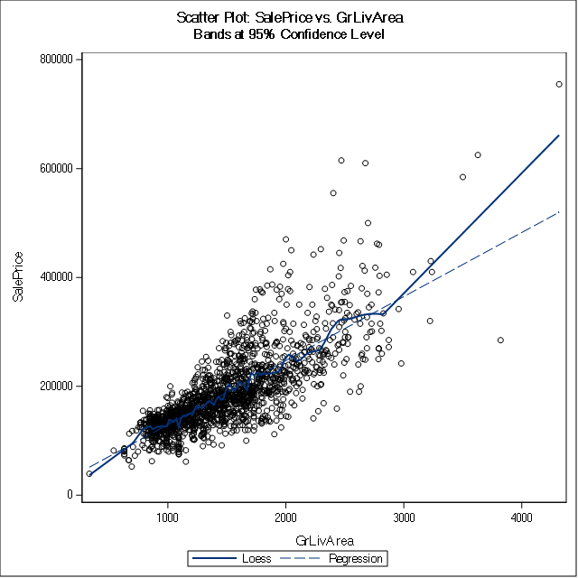{#id .class height=390px}

## Figure A4: Scatter Plot: Sale Price vs. Veneer Area

{#id .class height=390px}

\newpage

## Figure A5: Scatter Plot: Sale Price vs. Basement Area

{#id .class height=390px}

\newpage

## Figure A6: ODS Fit Summary: Model 1

{#id .class height=700px}

\newpage

## Figure A7: ODS Fit Summary: Model 2

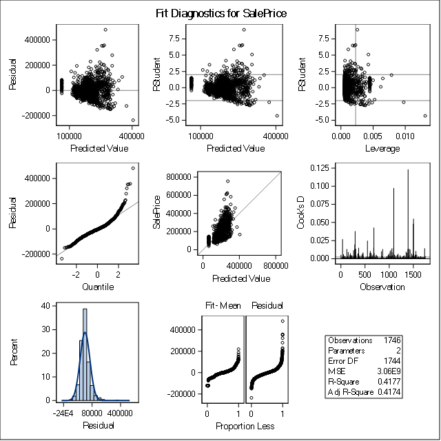{#id .class height=700px}

\newpage

## Figure A8: ODS Fit Summary: Model 3

{#id .class height=700px}

\newpage

## Figure A9: Distribution and Probability Plot: First Floor Surface Area

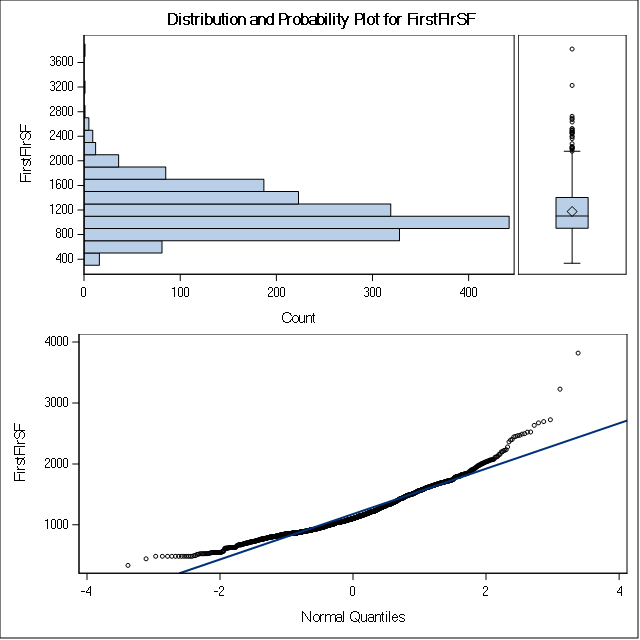{#id .class height=390px}

## Figure A10: Distribution and Probability Plot: Garage Area

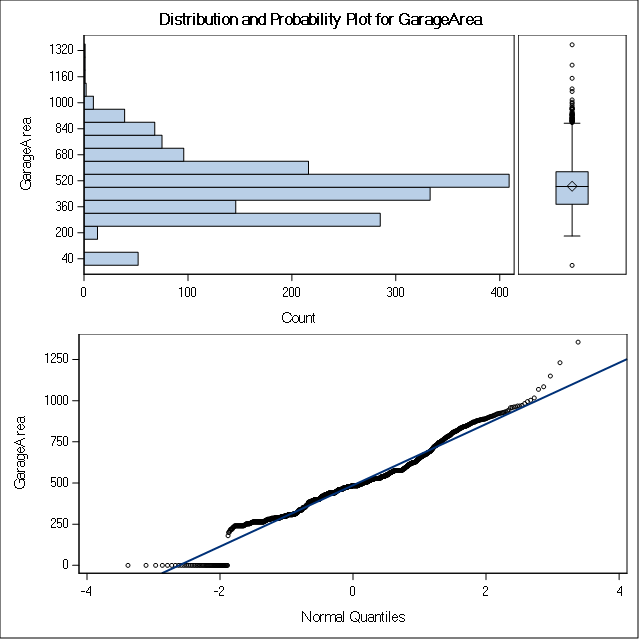{#id .class height=390px}

\newpage

## Figure A11: Distribution and Probability Plot: Living Area

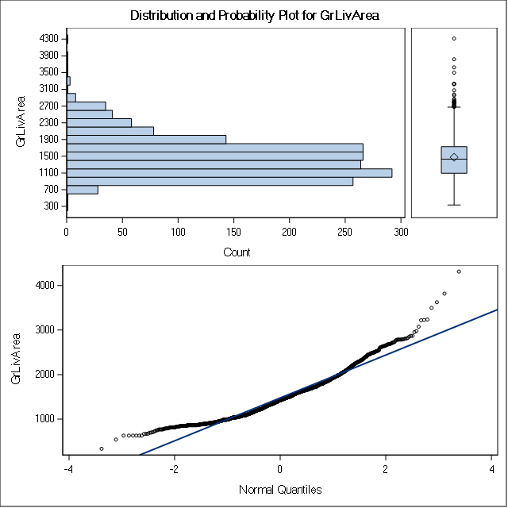{#id .class height=390px}

## Figure A12: Distribution and Probability Plot: Veneer Area

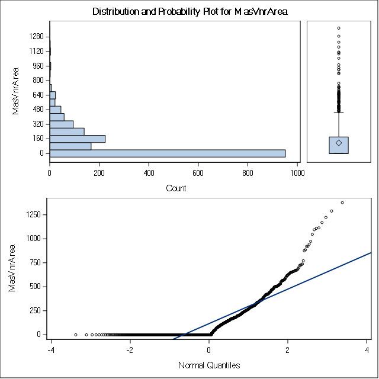{#id .class height=390px}

\newpage

## Figure A13: Distribution and Probability Plot: Basement Area

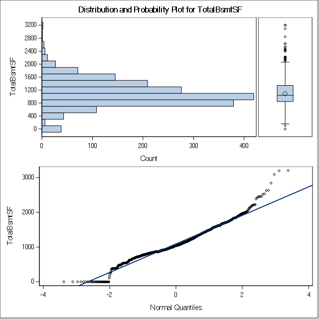{#id .class height=390px}

\newpage

## Figure A14: ODS Fit Summary: Model 4

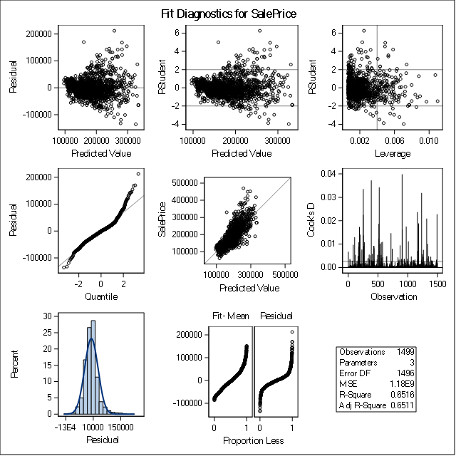{#id .class height=700px}

\newpage

## Figure A15: Q-Q Plot Transformation Comparison 

### Simple Linear Regression (Model 1) vs. Log Transformed Simple Linear Regression (Model 5)

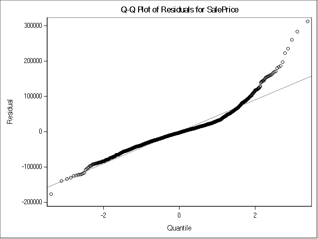{#id .class height=230px} 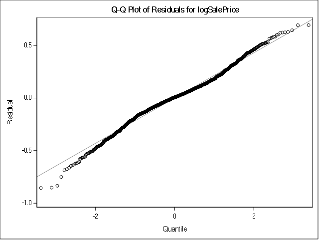{#id .class height=230px}

### Multiple Linear Regresion (Model 3) vs. Log Transformed Multiple Linear Regression (Model 7)

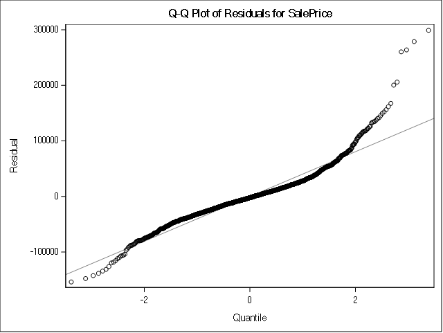{#id .class height=230px} {#id .class height=230px}

\newpage

## Figure A16: Cooks D-Plot Transformation Comparison

### Simple Linear Regression (Model 1) vs. Log Transformed Simple Linear Regression (Model 5)

{#id .class height=230px} 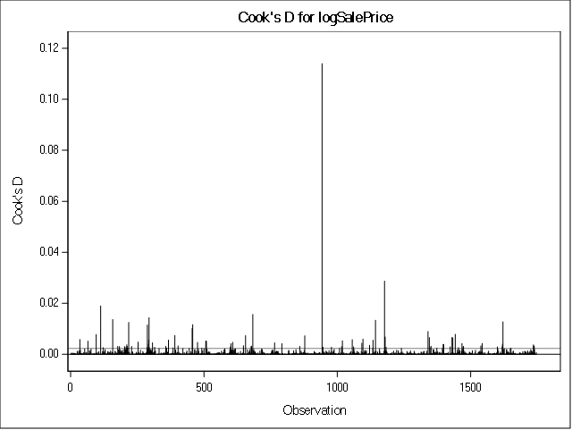{#id .class height=230px}

### Multiple Linear Regresion (Model 3) vs. Log Transformed Multiple Linear Regression (Model 7)

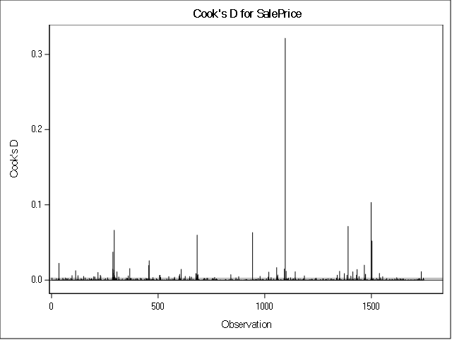{#id .class height=230px} 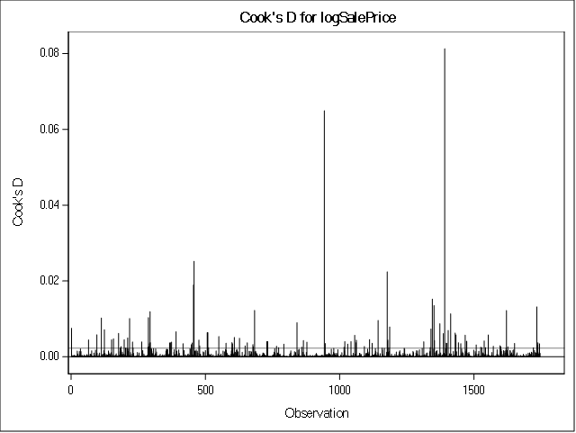{#id .class height=230px}

\newpage

## Figure A17: Distribution of Residuals Comparison

### Simple Linear Regression (Model 1) vs. Log Transformed Simple Linear Regression (Model 5)

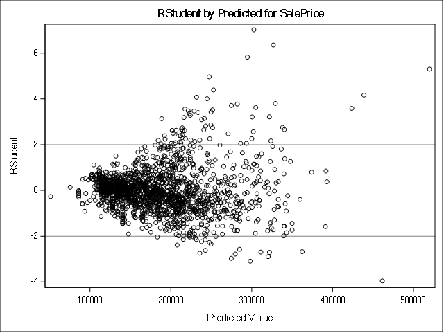{#id .class height=230px} 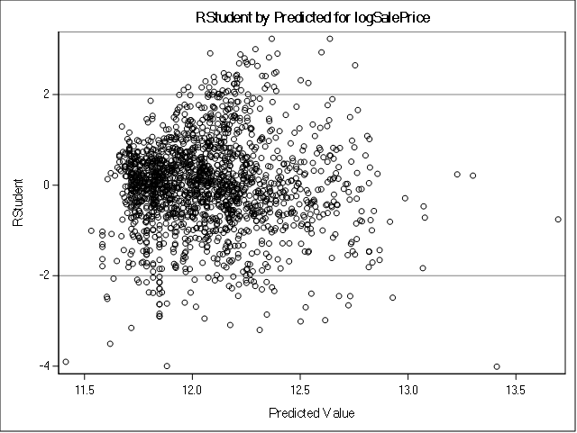{#id .class height=230px}

### Multiple Linear Regresion (Model 3) vs. Log Transformed Multiple Linear Regression (Model 7)

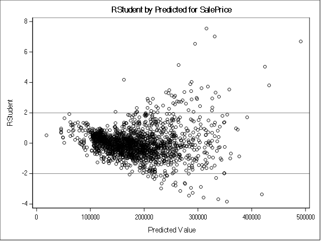{#id .class height=230px} 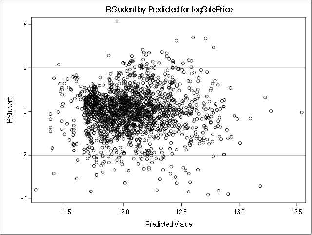{#id .class height=230px}

\newpage

# Appendix B SAS Procedure

## SAS Procedure B1: Load the Dataset

~~~{.fortran}
libname mydata '/scs/crb519/PREDICT_410/SAS_Data/' access=readonly;

DATA ames;
	SET mydata.ames_housing_data;
RUN; QUIT;

PROC PRINT DATA=ames (obs=10);
RUN; QUIT;

PROC CONTENTS DATA=ames ORDER=VARNUM OUT=ames_cont;
RUN; QUIT;
~~~

## SAS Procedure B2: Data Waterfall

~~~{.fortran}
PROC MEANS DATA=ames MIN MAX MEAN STDDEV NMISS N;
RUN; QUIT;

DATA ames_smpl;
	SET ames;
	FORMAT drop_condition $30.;
	* Functional (Ordinal): Home functionality (Assume typical unless deductions are warranted);
	IF ((Functional ne 'Typ') AND (Functional ne 'Min1') AND (Functional ne 'Min2'))
		THEN drop_condition='01: Non-typical Function';
	* MS Zoning (Nominal): Identifies the general zoning classification of the sale.;
	ELSE IF ((Zoning ne 'RH') AND (Zoning ne 'RL') AND (Zoning ne 'RP') AND (Zoning ne 'RM')) 
		THEN drop_condition='02: Non-typical Residential Zoning';
	ELSE IF (YearBuilt < 1941)
	  THEN drop_condition='03: Built 1940 & Older';
	* Sale Condition (Nominal): Condition of sale;
	ELSE IF (SaleCondition ne 'Normal') 
		THEN drop_condition='04: Non-typical Sale';
	ELSE drop_condition='05: Sample Population';
RUN; QUIT;

PROC FREQ DATA=ames_smpl;
	TABLES drop_condition;
RUN; QUIT;

DATA ames_smpl;
	SET ames_smpl;
	IF (drop_condition ne '05: Sample Population') THEN DELETE;
RUN; QUIT;

PROC MEANS DATA=ames_smpl MIN MAX MEAN STDDEV NMISS N;
RUN; QUIT;
~~~

## SAS Procedure B3: Identify Predictor Variables

~~~{.fortran}
PROC CORR DATA=ames_smpl NOSIMPLE RANK;
	VAR saleprice;
	WITH BsmtFinSF1 BsmtFinSF2 BsmtUnfSF EnclosedPorch FirstFlrSF GarageArea GrLivArea LotArea
	LotFrontage LowQualFinSF MasVnrArea MiscVal OpenPorchSF PoolArea ScreenPorch SecondFlrSF
	ThreeSsnPorch TotalBsmtSF WoodDeckSF;
RUN; QUIT;
~~~

## SAS Procedure B4: Exploratory Analysis

~~~{.fortran}
PROC CORR DATA=ames_smpl NOSIMPLE RANK;
	VAR saleprice;
	WITH FirstFlrSF GarageArea GrLivArea MasVnrArea TotalBsmtSF;
RUN; QUIT;

PROC SGSCATTER DATA=ames_smpl;
	TITLE1 'Scatter Plot: SalePrice vs. FirstFlrSF';
	COMPARE X=FirstFlrSF Y=SalePrice / LOESS REG;
RUN; QUIT;

PROC SGSCATTER DATA=ames_smpl;
	TITLE1 'Scatter Plot: SalePrice vs. GarageArea';
	COMPARE X=GarageArea Y=SalePrice / LOESS REG;
RUN; QUIT;

PROC SGSCATTER DATA=ames_smpl;
	TITLE1 'Scatter Plot: SalePrice vs. GrLivArea';
	COMPARE X=GrLivArea Y=SalePrice / LOESS REG;
RUN; QUIT;

PROC SGSCATTER DATA=ames_smpl;
	TITLE1 'Scatter Plot: SalePrice vs. MasVnrArea';
	COMPARE X=MasVnrArea Y=SalePrice / LOESS REG;
RUN; QUIT;

PROC SGSCATTER DATA=ames_smpl;
	TITLE1 'Scatter Plot: SalePrice vs. TotalBsmtSF';
	COMPARE X=TotalBsmtSF Y=SalePrice / LOESS REG;
RUN; QUIT;
~~~

## SAS Procedure B5: Simple Linear Regression Model

~~~{.fortran}
ODS graphics ON;
RUN; QUIT;

DATA ames_smpl_reg;
	SET ames_smpl;
RUN; QUIT;

PROC REG DATA=ames_smpl_reg;
	TITLE1 'ODS: SalePrice=GrLivArea';
	MODEL SalePrice=GrLivArea;
RUN; QUIT;

PROC REG DATA=ames_smpl_reg;
	TITLE1 'ODS: SalePrice=GarageArea';
	MODEL SalePrice=GarageArea;
RUN; QUIT;

ODS graphics OFF;
RUN; QUIT;
~~~

## SAS Procedure B6: Multiple Linear Regression Model

~~~{.fortran}
ODS graphics ON;
RUN; QUIT;

DATA ames_smpl_reg;
	SET ames_smpl;
RUN; QUIT;

PROC REG DATA=ames_smpl_reg;
	TITLE1 'ODS: SalePrice=GrLivArea GarageArea';
	MODEL SalePrice=GrLivArea GarageArea / VIF;
RUN; QUIT;

ODS graphics OFF;
RUN; QUIT;
~~~

## SAS Procedure B7: Outlier Identification and Removal

~~~{.fortran}
ODS graphics ON;
RUN; QUIT;

PROC UNIVARIATE NORMAL PLOT
	DATA=ames_smpl;
    VAR FirstFlrSF;
	TITLE1 'Univariate: FirstFlrSF';
RUN; QUIT;

PROC UNIVARIATE NORMAL PLOT 
	DATA=ames_smpl;
    VAR GarageArea;
	TITLE1 'Univariate: GarageArea';
RUN; QUIT;

PROC UNIVARIATE NORMAL PLOT 
	DATA=ames_smpl;
    VAR GrLivArea;
	TITLE1 'Univariate: GrLivArea';
RUN; QUIT;

PROC UNIVARIATE NORMAL PLOT 
	DATA=ames_smpl;
    VAR MasVnrArea;
	TITLE1 'Univariate: MasVnrArea';
RUN; QUIT;

PROC UNIVARIATE NORMAL PLOT 
	DATA=ames_smpl;
    VAR TotalBsmtSF;
	TITLE1 'Univariate: TotalBsmtSF';
RUN; QUIT;

ODS graphics OFF;
RUN; QUIT;

PROC MEANS DATA=ames_smpl MIN MAX MEAN STDDEV NMISS N;
RUN; QUIT;

DATA ames_smpl_out;
	SET ames_smpl;
	FORMAT outlier_def $30.;
    IF (FirstFlrSF < 516) OR (FirstFlrSF > 2279) THEN DO 
		outlier_def='01. FirstFlrSF';
		outlier_code=1;
		END;
    ELSE IF (GarageArea = 0) OR (GarageArea > 938) THEN DO 
		outlier_def='02. GarageArea';
		outlier_code=2;
		END;
    ELSE IF (GrLivArea < 752) OR (GrLivArea > 2794) THEN DO 
		outlier_def='03. GrLivArea';
		outlier_code=3;
		END;
    ELSE IF MasVnrArea > 491 THEN DO 
		outlier_def='04. MasVnrArea';
		outlier_code=4;
		END;
    ELSE IF (TotalBsmtSF < 506) OR (TotalBsmtSF > 2208) THEN DO
		outlier_def='05. TotalBsmtSF';
		outlier_code=5;
		END;
    ELSE DO
		outlier_def='06. Sample Population';
		outlier_code=6;
		END;
RUN; QUIT;

PROC FREQ DATA=ames_smpl_out;
	TABLES outlier_def;
RUN; QUIT;

DATA ames_smpl_out;
  SET ames_smpl_out;
	IF (outlier_code ne 6) THEN DELETE;
RUN; QUIT;

PROC MEANS DATA=ames_smpl_out MIN MAX MEAN STDDEV NMISS N;
RUN; QUIT;
~~~

## SAS Procedure B8: Multiple Linear Regression Model (Outliers Removed)

~~~{.fortran}
ODS graphics ON;
RUN; QUIT;

DATA ames_smpl_out_reg;
	SET ames_smpl_out;
RUN; QUIT;

PROC REG DATA=ames_smpl_out_reg;
	TITLE1 'ODS: SalePrice=GrLivArea GarageArea';
	MODEL SalePrice=GrLivArea GarageArea / VIF;
RUN; QUIT;

ODS graphics OFF;
RUN; QUIT;
~~~

## SAS Procedure B9: Linear Regression Model (Transformed Response)

~~~{.fortran}
ODS graphics ON;
RUN; QUIT;

DATA ames_smpl_reg;
	SET ames_smpl;
	logSalePrice=LOG(SalePrice);
RUN; QUIT;

PROC REG DATA=ames_smpl_reg;
	TITLE1 'ODS: logSalePrice=GrLivArea';
	MODEL logSalePrice=GrLivArea;
RUN; QUIT;

PROC REG DATA=ames_smpl_reg;
	TITLE1 'ODS: logSalePrice=GarageArea';
	MODEL logSalePrice=GarageArea;
RUN; QUIT;

PROC REG DATA=ames_smpl_reg;
	TITLE1 'ODS: logSalePrice=GrLivArea GarageArea';
	MODEL logSalePrice=GrLivArea GarageArea / VIF;
RUN; QUIT;

ODS graphics OFF;
RUN; QUIT;
~~~

## SAS Procedure B9: Comparison between Non-Transformed and Transformed Response

~~~{.fortran}
ODS graphics ON;
RUN; QUIT;

PROC REG DATA=ames_smpl
	PLOTS(UNPACK) PLOTS=RESIDUALS(SMOOTH);
	TITLE1 'ODS Unpack: SalePrice=GrLivArea';
	MODEL SalePrice=GrLivArea / ALPHA=0.05 STB CLB;
RUN; QUIT;

PROC REG DATA=ames_smpl
	PLOTS(UNPACK) PLOTS=RESIDUALS(SMOOTH);
	TITLE1 'ODS Unpack: SalePrice=GrLivArea GarageArea';
	MODEL SalePrice=GrLivArea GarageArea / ALPHA=0.05 STB CLB;
RUN; QUIT;

DATA ames_smpl_reg;
	SET ames_smpl;
	logSalePrice=LOG(SalePrice);
RUN; QUIT;

PROC REG DATA=ames_smpl_reg
	PLOTS(UNPACK) PLOTS=RESIDUALS(SMOOTH);
	TITLE1 'ODS Unpack: logSalePrice=GrLivArea';
	MODEL logSalePrice=GrLivArea / ALPHA=0.05 STB CLB;
RUN; QUIT;

PROC REG DATA=ames_smpl_reg
	PLOTS(UNPACK) PLOTS=RESIDUALS(SMOOTH);
	TITLE1 'ODS Unpack: logSalePrice=GrLivArea GarageArea';
	MODEL logSalePrice=GrLivArea GarageArea / ALPHA=0.05 STB CLB;
RUN; QUIT;

ODS graphics OFF;
RUN; QUIT;
~~~

\newpage

# References