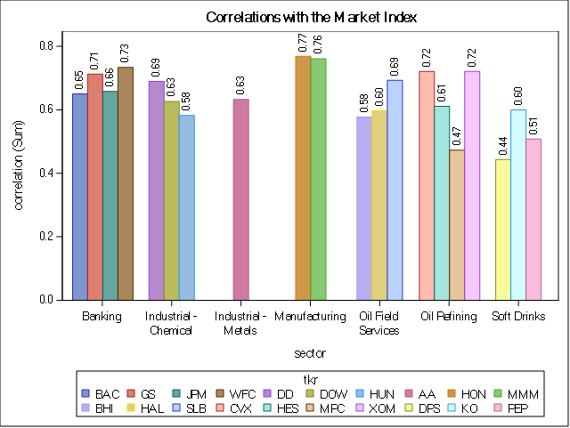
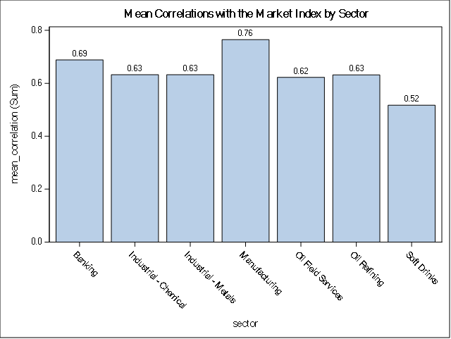
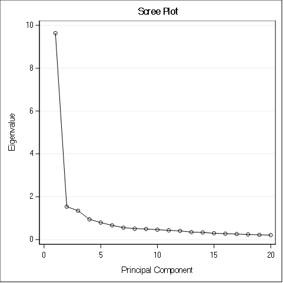
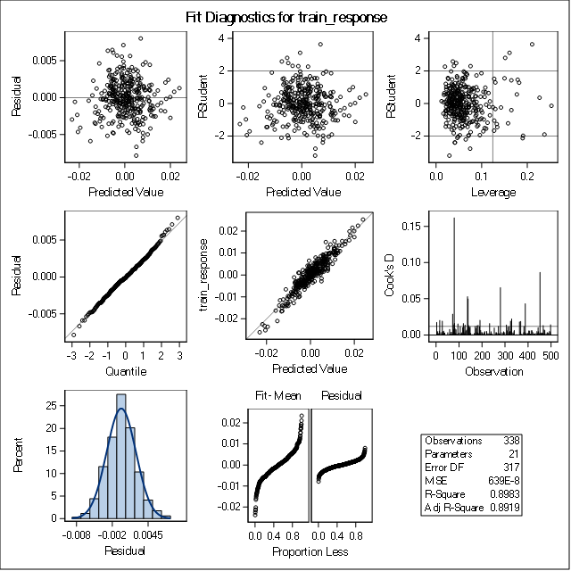
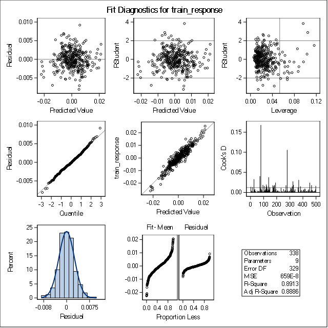

# MSPA PREDICT 410-DL-58 LEC 
# Assignment 6: Principal Components in Predictive Modeling
## Darryl Buswell

&nbsp;

# 1 Introduction

This document presents results of the sixth assignment for the Masters of Science in Predictive Analytics course: PREDICT 410. This assessment required the student to use Principal Component Analysis (PCA) as a method of dimensionality reduction in Ordinary Least Squares regression. For this assessment we leverage price data for twenty stocks and an index fund. PCA is initially performed on the set of stock data in order to derive a set of components. Two regression models are then fitted, with the first model making use of the original stock data for its set of predictor variables, and the second making use of the principle components for its set of predictor variables. Finally, an assessment of both models is made, with a focus on whether using principle components for predictor variables results in an improvement in either goodness-of-fit or model performance.

# 2 Data

The raw data used for this assessment consists of timeseries data of daily closing stock prices for twenty stocks and a large-cap index fund. Stocks within the dataset are spread over a variety of sectors, while the index fund is from Vanguard (VV). The data ranges from January 3rd 2012 to December 31st 2013, and is in daily frequency. As part of the data pre-processing routine, a log transformation is conducted on the daily returns for each stock and the index fund. Computing the log return provides a mechanism of normalization, allowing each variable to be assessed over a comparable metric which is generally more normalized than raw price.

# 3 PCA Analysis & Regression Model Fit

## 3.1 Data Correlations

We calculate the Pearson Correlation Coefficient for each of the individual stocks against the index fund, VV. The below table shows a summary of correlation coefficients.

#### Table 3.1.1 Individial Stock Pearson Correlation Statistics

| Obs | Correlation | Ticker | Sector                |
|-----|-------------|--------|-----------------------|
| 1   | 0.63241     | AA     | Industrial - Metals   |
| 2   | 0.65019     | BAC    | Banking               |
| 3   | 0.57750     | BHI    | Oil Field Services    |
| 4   | 0.72090     | CVX    | Oil Refining          |
| 5   | 0.68952     | DD     | Industrial - Chemical |
| 6   | 0.62645     | DOW    | Industrial - Chemical |
| 7   | 0.44350     | DPS    | Soft Drinks           |
| 8   | 0.71216     | GS     | Banking               |
| 9   | 0.59750     | HAL    | Oil Field Services    |
| 10  | 0.61080     | HES    | Oil Refining          |
| 11  | 0.76838     | HON    | Manufacturing         |
| 12  | 0.58194     | HUN    | Industrial - Chemical |
| 13  | 0.65785     | JPM    | Banking               |
| 14  | 0.59980     | KO     | Soft Drinks           |
| 15  | 0.76085     | MMM    | Manufacturing         |
| 16  | 0.47312     | MPC    | Oil Refining          |
| 17  | 0.50753     | PEP    | Soft Drinks           |
| 18  | 0.69285     | SLB    | Oil Field Services    |
| 19  | 0.73357     | WFC    | Banking               |
| 20  | 0.72111     | XOM    | Oil Refining          |

We can also show each correlation coefficient within a bar plot, with individual stocks grouped by sector.

#### Figure 3.1.1 Individial Stock Pearson Correlation Statistics

{#id .class height=450px}

We can see that 'HON' and 'MMM' have reported the highest correlation coefficient values, and both belong to the Manufacturing sector. Likewise, 'DPS' and 'MPC' have reported the lowest correlation coefficient, which belong to the Soft Drinks and Oil Refining sectors respectively.

In order to better understand the correlation between each sector and the wider market index, we can find the Pearson Correlation Coefficient between the mean price of stocks for each sector against the market index, VV.

#### Table 3.1.2 Average Sector Pearson Correlation Statistics

| Obs | Sector                | Frequency | Mean Correlation |
|-----|-----------------------|-----------|------------------|
| 1   | Banking               | 4         | 0.68844          |
| 2   | Industrial - Chemical | 3         | 0.63264          |
| 3   | Industrial - Metals   | 1         | 0.63241          |
| 4   | Manufacturing         | 2         | 0.76461          |
| 5   | Oil Field Services    | 3         | 0.62262          |
| 6   | Oil Refining          | 4         | 0.63148          |
| 7   | Soft Drinks           | 3         | 0.51694          |

Again, we can show each correlation coefficient for the mean return of each sector as a bar plot.

#### Figure 3.1.2 Average Sector Pearson Correlation Statistics

{#id .class height=450px}

The mean return for stocks within the Manufacturing sector has reported the highest correlation coefficient value, while the mean return for stocks within the Soft Drinks sector has reported the lowest. The correlation coefficient for mean returns over other sectors are quite similar.

## 3.2 Principle Components Analysis

We next perform PCA on each of the stocks within the dataset. Note that the response variable, VV is excluded from the dataset prior to performing the PCA routine. The below table shows the eigenvalues for each principle component.

#### Table 3.2.1 PCA Eigenvalues

| Obs | Eigenvalue | Difference | Proportion | Cumulative |
|-----|------------|------------|------------|------------|
| 1   | 9.63645075 | 8.09792128 | 0.4818     | 0.4818     |
| 2   | 1.53852947 | 0.19109235 | 0.0769     | 0.5587     |
| 3   | 1.34743712 | 0.39975791 | 0.0674     | 0.6261     |
| 4   | 0.94767921 | 0.15217268 | 0.0474     | 0.6735     |
| 5   | 0.79550653 | 0.12909860 | 0.0398     | 0.7133     |
| 6   | 0.66640793 | 0.10798740 | 0.0333     | 0.7466     |
| 7   | 0.55842052 | 0.04567198 | 0.0279     | 0.7745     |
| 8   | 0.51274854 | 0.01590728 | 0.0256     | 0.8002     |
| 9   | 0.49684126 | 0.03250822 | 0.0248     | 0.8250     |
| 10  | 0.46433304 | 0.03089374 | 0.0232     | 0.8482     |
| 11  | 0.43343929 | 0.02568332 | 0.0217     | 0.8699     |
| 12  | 0.40775598 | 0.05667006 | 0.0204     | 0.8903     |
| 13  | 0.35108592 | 0.01597897 | 0.0176     | 0.9078     |
| 14  | 0.33510695 | 0.03813712 | 0.0168     | 0.9246     |
| 15  | 0.29696984 | 0.02068234 | 0.0148     | 0.9394     |
| 16  | 0.27628750 | 0.01692712 | 0.0138     | 0.9532     |
| 17  | 0.25936037 | 0.01730228 | 0.0130     | 0.9662     |
| 18  | 0.24205809 | 0.02020002 | 0.0121     | 0.9783     |
| 19  | 0.22185807 | 0.01013445 | 0.0111     | 0.9894     |
| 20  | 0.21172363 |            | 0.0106     | 1.0000     |

We can also plot both the individual eigenvalues for each principle component. This plot is referred to as a Scree plot, and can be used evaluate the amount of explained variability per component.

#### Figure 3.2.1 Scree Plot

{#id .class height=450px}

There are a number of options available for determining how many components should be retained. One possibility is to simply set an arbitrary threshold on the desired amount of retained variability. If for example, we wished to retain at least 70% of data variability, we would retain the first five components. Alternatively, we can take a more informed approach and leverage the Scree plot above to assess any substantial drop-offs in explained variance over each component. Such a method may motivate us to retain the first four components, as the amount of explained variance does seem to level off beyond this level. This approach which would result in 67% of the data variability being retained. Finally, we can use the Kaiser Rule as a guide for component retention, which suggests that all components which have a eigenvalue under one should be dropped. This would result in the first three components being retained which would explain 63% of data variability. Regardless of the method, the analyst should remain aware of trade-offs. If the analyst is less concerned with retaining feature information, and more interested in reducing feature count or simplifying subsequent modelling, they may elect to retain less variance.

Finally, we are able to make a high level assessment of the dataset properties over the first two principle components by generating a scatter plot over these components.

#### Figure 3.2.2 Scatter Plot of First Two Components

{#id .class height=450px}

The plot above tends to indicate two clusters of data, we can see that the stocks 'DPS', 'PEP' and 'KO' which all belong to the Soft Drinks sector have clustered together with a high second component value, whilst the remaining stocks have clustered together, with a high first component value.

## 3.3 Regression Model Fit

In this section, we fit two regression models with market index returns used as the response variable for each. The first model is fit using stock return data as the set of predictor variables, while the second is fit using the eight principle components of that stock data (discussed above) as the set of predictor variables.

### 3.3.1 Create a Train/Test Split

Prior to fitting the regression models, the data is split into a training and testing subset. Both models will be subsequently fit to the training subset and evaluated over both the training and testing subsets. By splitting the data, we are able to avoid overfitting models to the data, which may lead to high variance and poor out-of-sample model performance (D. Montgomery 2012). A 70% training and 30% test set split is applied. A table summarizing the split between training and test data is shown below.

#### Table 3.3.1.1 Train/Test Split of Data

| train | Frequency | Percent | Cumulative Frequency | Cumulative Percent |
|-------|-----------|---------|----------------------|--------------------|
| 0     | 164       | 32.67   | 164                  | 32.67              |
| 1     | 338       | 67.33   | 502                  | 100.00             |

### 3.3.2 Regression using Original Variables

We first fit a regression model with market index as the response variable and individual stocks as predictor variables. Parameter estimates for the model (Model_Orig) are shown below.

#### Table 3.3.2.1: Model_Orig Parameter Estimates (Training Set)

| Variable   | DF | Parameter Estimate | Standard Error | t Value | $\text{Pr} > |t|$ | VIF     |
|------------|----|--------------------|----------------|---------|-------------------|---------|
| Intercept  | 1  | 0.00008640         | 0.00014092     | 0.61    | 0.5403            | 0       |
| return_AA  | 1  | 0.01769            | 0.01317        | 1.34    | 0.1802            | 2.11490 |
| return_BAC | 1  | 0.03198            | 0.01165        | 2.75    | 0.0064            | 3.10927 |
| return_BHI | 1  | -0.00111           | 0.01323        | -0.08   | 0.9333            | 2.62997 |
| return_CVX | 1  | 0.04907            | 0.02536        | 1.93    | 0.0539            | 3.07524 |
| return_DD  | 1  | 0.04674            | 0.02037        | 2.29    | 0.0224            | 2.51406 |
| return_DOW | 1  | 0.03642            | 0.01162        | 3.14    | 0.0019            | 1.88893 |
| return_DPS | 1  | 0.03670            | 0.01679        | 2.19    | 0.0295            | 1.54768 |
| return_GS  | 1  | 0.04849            | 0.01555        | 3.12    | 0.0020            | 3.10450 |
| return_HAL | 1  | 0.00948            | 0.01466        | 0.65    | 0.5184            | 3.08758 |
| return_HES | 1  | 0.00359            | 0.01092        | 0.33    | 0.7425            | 2.10199 |
| return_HON | 1  | 0.12213            | 0.01924        | 6.35    | <.0001            | 2.73505 |
| return_HUN | 1  | 0.02712            | 0.00836        | 3.24    | 0.0013            | 1.79852 |
| return_JPM | 1  | 0.00902            | 0.01708        | 0.53    | 0.5979            | 3.36439 |
| return_KO  | 1  | 0.07903            | 0.02226        | 3.55    | 0.0004            | 1.93633 |
| return_MMM | 1  | 0.09796            | 0.02646        | 3.70    | 0.0003            | 2.98277 |
| return_MPC | 1  | 0.01673            | 0.00809        | 2.07    | 0.0394            | 1.32999 |
| return_PEP | 1  | 0.02911            | 0.02231        | 1.30    | 0.1929            | 1.68825 |
| return_SLB | 1  | 0.03776            | 0.01709        | 2.21    | 0.0279            | 3.13690 |
| return_WFC | 1  | 0.07587            | 0.01848        | 4.10    | <.0001            | 2.59492 |
| return_XOM | 1  | 0.05467            | 0.02697        | 2.03    | 0.0435            | 2.98393 |

For this model, many of the coefficient estimates fail to have significant p-values at the 95% level, these include estimates for 'return_AA', 'return_BHI', 'return_CVX', 'return_HAL', 'return_HES', 'return_JPM' and 'return_PEP'. The polarity of each coefficient estimate is positive, with the exception of 'return_BHI', which suggests that an increase in any of the these stocks would result in an increase in the response variable, VV. Finally, the Variance Inflation Factor (VIF) is shown for each variable in the table above, which can be used to identify collinearity between predictor variables [@cody2011]. The VIF is found by regressing all other predictor variables within the original specification against the variable in question, and applying the formula [@cody2011].

$$ \text{VIF}_i=\frac{1}{(1-R_i^2)} $$ 

We refer to [@mini2016], which puts forward a guideline for interpreting VIF factors. According to this guideline, a VIF value of one suggests that the predictor variable is not correlated with other predictors, a VIF between one and five suggests moderate correlation, and finally, a VIF between five and ten suggest high correlation. Using this guide, we note that many of the variables are suggested to have low to moderate correlation. Those variables which have reported a VIF of greater than three, including 'return_CVX', 'return_GS', 'return_HAL', 'return_JPM', and 'return_SLB', are of most concern.

Goodness-of-fit information for the model is shown below.

#### Table 3.3.2.2: Model_Orig Analysis of Variance (Training Set)

| Source          | DF  | Sum of Squares | Mean Squares | F Value | Pr > F |
|-----------------|-----|----------------|--------------|---------|--------|
| Model           | 20  | 0.01790        | 0.00089510   | 140.04  | <.0001 |
| Error           | 317 | 0.00203        | 0.00000639   |         |        |
| Corrected Total | 337 | 0.01993        |              |         |        |

The model has reported a large F-value suggesting that the observations and regression differ from the grand mean. Likewise the F-value has a highly significant p-value under the null hypothesis that there is no linear relationship between the predictor and response variable. This allows us to reject the null hypothesis and conclude that there is a linear relationship between the predictor and response variable. 

Model performance statistics over the training set are shown below.

#### Table 3.3.2.3: Model_Orig Performance Metrics (Training Set)

| Measure        | Value      |
|----------------|------------|
| MSE            | 0.00000639 |
| MAE            | 0.0019020  |
| Root MSE       | 0.00253    |
| Dependent Mean | 0.00061635 |
| Coeff Var      | 410.18453  |
| R-Square       | 0.8983     |
| Adj R-Sq       | 0.8919     |

The R-Square suggests that the model explains ~90% of the variability in the market index value using the included predictors. 

Model performance statistics over the test set are shown below.

#### Table 3.3.2.4: Model_Orig Performance Metrics (Test Set)

| Measure        | Value      |
|----------------|------------|
| MSE            | 0.00000828 |
| MAE            | 0.0019514  |
| Root MSE       | 0.00288    |
| Dependent Mean | 0.00103    |
| Coeff Var      | 278.40988  |
| R-Square       | 0.8679     |
| Adj R-Sq       | 0.8492     |

A similar R-Square is reported for the test set of data, suggesting that the model is able to generalize fairly well.

We can also view the goodness-of-fit ODS graphics output in order to further assess the fit diagnostics and violation of regression assumptions. The ODS plot is shown below.

\newpage

#### Figure 3.3.2.1: Model_Orig ODS Summary (Training Set)

{#id .class height=600px}

As part of the assessment, we first observe the plots of residuals against predicted variables as well as RStudent residuals against predicted variables. These plots allow us to identify whether there is non-constant variance of the residuals as well as the presence of data outliers [@cody2011]. The plot of RStudent residuals is particularly useful here, as the plot shows externally studentized residuals and includes threshold values of +-2 which can be used to indicate outlying observations [@cody2011]. For  this model, we note only a small amount of RStudent residuals fall outside of these indicated threshold values. However, for both residual plots, the uniformity of these residuals suggests relatively constant variance.

To assess the existence of influential observations, we can observe the plot of RStudent residuals against Leverage, as well as the plot of Cook's D distance against observations. For this model, it seems that there are indeed a small number of leverage points, with the plot of RStudent residuals against Leverage showing a collection of extreme points which lie beyond the stated bounds. Likewise, for the Cooks D distance plot, [@fox1991] notes that attention should be paid to points along the D plot which are substantially larger in comparison to the remaining points. Following the advice of Fox, we can see a number of observations which spike beyond the majority.

To assess non-normality of residuals, we can observe the normal Q-Q plot which plots residual quantiles against theoretical quantiles. If points along this plot fail to trace the indicated diagonal line, the residuals are said to be non-normal. Observing this plot reveals that the residuals for this model generally follow the indicated line over the residual range, suggesting normality for residuals.

We can also make an operational validation of the model by determining the number of predicted values which lie within certain ranges of the actual values. Prediction grades are labelled, 'Grade 1', 'Grade 2' and 'Grade 3' and are representations of the number of predicted values which lie within 10% of the actual value, 10-15% of the actual value, or greater than 15% of the actual value respectively.

The table below shows a summary of the performance over the training  and test sets.

#### Table 3.3.2.5: Model_Orig Operational Validation Summary

| Prediction Grade          | Percent (Training Set) | Percent (Test Set) |
|---------------------------|------------------------|--------------------|
| 01: Grade 1 within 10%    | 17.46                  | 18.40              |
| 02: Grade 2 within 10-15% | 9.47                   | 11.04              |
| 03: Grade 3 above 15%     | 73.08                  | 70.55              |

For this model, we can see a large amount of predicted values being classified as 'Grade 3'. Interestingly, there is an improvement in operational validation over the test set of data for this model.

### 3.3.4 Regression using Principle Components

We then fit a regression model with market index as the response variable, and the eight principle components as predictor variables. Parameter estimates for the model (Model_PCA) are also shown below.

#### Table 3.3.4.1: Model_PCA Parameter Estimates (Training Set)

| Variable  | DF | Parameter Estimate | Standard Error | t Value | $\text{Pr} > |t|$ | VIF     |
|-----------|----|--------------------|----------------|---------|-------------------|---------|
| Intercept | 1  | 0.00075978         | 0.00014045     | 5.41    | <.0001            | 0       |
| Prin1     | 1  | 0.00231            | 0.00004519     | 51.05   | <.0001            | 1.00527 |
| Prin2     | 1  | 0.00032245         | 0.00011425     | 2.82    | 0.0051            | 1.00868 |
| Prin3     | 1  | 0.00070635         | 0.00012322     | 5.73    | <.0001            | 1.00861 |
| Prin4     | 1  | 0.00030481         | 0.00014536     | 2.10    | 0.0368            | 1.00636 |
| Prin5     | 1  | -0.00017356        | 0.00015516     | -1.12   | 0.2641            | 1.00297 |
| Prin6     | 1  | 0.00000315         | 0.00017108     | 0.02    | 0.9853            | 1.00766 |
| Prin7     | 1  | -0.00010331        | 0.00018604     | -0.56   | 0.5791            | 1.02315 |
| Prin8     | 1  | -0.00040760        | 0.00020293     | -2.01   | 0.0454            | 1.02271 |

For this model, coefficient estimates for components 5, 6 and 7 fail to have significant p-values at the 95% level. The coefficient estimates for the first three components are highly significant however. The greatest improvement however is in the reported VIF value for each coefficient estimate. The VIF for all variables are close to one, which suggests no correlation between predictors [@mini2016].

Goodness-of-fit information for the model is shown below.

#### Table 3.3.4.2: Model_PCA Analysis of Variance (Training Set)

| Source          | DF  | Sum of Squares | Mean Square | F Value | Pr > F |
|-----------------|-----|----------------|-------------|---------|--------|
| Model           | 8   | 0.01776        | 0.00222     | 337.13  | <.0001 |
| Error           | 329 | 0.00217        | 0.00000659  |         |        |
| Corrected Total | 337 | 0.01993        |             |         |        |

The model has reported a large F-value with a highly significant p-value under the null hypothesis that there is no linear relationship between the predictor and response variable. This allows us to reject the null hypothesis and conclude that there is a linear relationship between the predictor and response variable. Interestingly, the F Value for this model is greater than the value reported for Model_Orig.

Model performance statistics over the training set are shown below.

#### Table 3.3.4.3: Model_PCA Performance Metrics (Training Set)

| Measure        | Value       |
|----------------|-------------|
| MSE            | 0.00000659  |
| MAE            | 0.0019752   |
| Root MSE       | 0.00257     |
| Dependent Mean | 0.00061635  |
| Coeff Var      | 416.36522   |
| R-Square       | 0.8913      |
| Adj R-Sq       | 0.8886      |

The R-Square suggests that the model explains ~90% of the variability in the market index value using the included predictors. The Adjusted R-Square value for this model is very similar to that reported by Model_Orig, suggesting similar explanatory power. 

Model performance statistics over the test set are shown below.

#### Table 3.3.4.4: Model_PCA Performance Metrics (Test Set)

| Measure        | Value       |
|----------------|-------------|
| MSE            | 0.00000884  |
| MAE            | 0.0020776   |
| Root MSE       | 0.00297     |
| Dependent Mean | 0.00103     |
| Coeff Var      | 287.68055   |
| R-Square       | 0.8470      |
| Adj R-Sq       | 0.8390      |

Again, a similar R-Square is reported for the test set of data, suggesting that the model is able to generalize well.

The goodness-of-fit ODS graphics output is shown below.

\newpage

#### Figure 3.3.4.1: Model_PCA ODS Summary

{#id .class height=600px}

We note very similar diagnostic plots to Model_Orig. The uniformity of residual plots suggests relatively constant variance, the Cooks D plot shows a small number of observations which spike beyond the majority suggesting a number of influential observations, and finally, the Q-Q plot shows residuals which generally follow the indicated line over the residual range suggesting normality for residuals.

The table below shows a summary of the performance over the training and test sets.

#### Table 3.3.4.5: Model_PCA Operational Validation Summary

| Prediction Grade          | Percent (Training Set) | Percent (Test Set) |
|---------------------------|------------------------|--------------------|
| 01: Grade 1 within 10%    | 15.98                  | 16.56              |
| 02: Grade 2 within 10-15% | 9.76                   | 10.43              |
| 03: Grade 3 above 15%     | 74.26                  | 73.01              |

For this model, we again see a large amount of predicted values being classified as 'Grade 3'. In general, operational performance is slightly worse than Model_Orig over both the training and test sets of data.

## 3.4 Model Comparison

A comparison of performance metrics for each model is shown below.

#### Table 3.4.1: Model Performance Metric Summary (Training Set)

| Model      | Pred. | MSE        | MAE       | Adj R-Square |
|------------|-------|------------|-----------|--------------|
| Model_Orig | 19    | 0.00000639 | 0.0019020 | 0.8919       |
| Model_PCA  | 8     | 0.00000659 | 0.0019752 | 0.8886       |

#### Table 3.4.2: Model Performance Metric Summary (Test Set)

| Model      | Pred. | MSE        | MAE       | Adj R-Square |
|------------|-------|------------|-----------|--------------|
| Model_Orig | 19    | 0.00000828 | 0.0019514 | 0.8492       |
| Model_PCA  | 8     | 0.00000884 | 0.0020776 | 0.8390       |

Both models have shown similar performance over both the training and test sets of data. Clearly the greatest differentiation between the two models is in the indicated VIF values, with Model_Orig having an average VIF of 2.48, while Model_PCA had an average VIF of 1.01. That is, while Model_Orig has signs of low to moderate multicollinearity, Model_PCA has almost no indication of multicollinearity. 

# 4 Conclusion

For this assessment, we fit two regression models. The first model made use of the original stock data for its set of predictor variables, while the second made use of derived principle components for its set of predictor variables. In general, model performance and goodness-of-fit was similar for both models, however the regression model based on first eight principle components demonstrated much lower VIF values for its set of predictors. Clearly the biggest advantage from the PCA analysis for this assessment was the reduction in indicated multicollinearity. However, it is worth noting that the PCA analysis did provide some auxiliary benefits. For example, we were able to identify groupings of multiple predictors and subsequently build a simplified model which required fewer parameters. 

\newpage

# Appendix A SAS Procedure

## SAS Procedure A1: Load the Dataset

~~~{.fortran}
LIBNAME mydata '/scs/crb519/PREDICT_410/SAS_Data/' ACCESS=readonly;

DATA vv;
	SET mydata.stock_portfolio_data;
RUN; QUIT;

PROC SORT DATA=vv; BY date; RUN; QUIT;

PROC CONTENTS DATA=vv ORDER=VARNUM OUT=vv_cont; RUN; QUIT;
~~~

## SAS Procedure A2: Data Pre-Processing

~~~{.fortran}
DATA vv_smpl;
	SET vv;
  
	return_AA = log(AA/lag1(AA));
	return_BAC = log(BAC/lag1(BAC));
	return_BHI = log(BHI/lag1(BHI));
	return_CVX = log(CVX/lag1(CVX));
	return_DD = log(DD/lag1(DD));
	return_DOW = log(DOW/lag1(DOW));
	return_DPS = log(DPS/lag1(DPS));
	return_GS = log(GS/lag1(GS));
	return_HAL = log(HAL/lag1(HAL));
	return_HES = log(HES/lag1(HES));
	return_HON = log(HON/lag1(HON));
	return_HUN = log(HUN/lag1(HUN));
	return_JPM = log(JPM/lag1(JPM));
	return_KO = log(KO/lag1(KO));
	return_MMM = log(MMM/lag1(MMM));
	return_MPC = log(MPC/lag1(MPC));
	return_PEP = log(PEP/lag1(PEP));
	return_SLB = log(SLB/lag1(SLB));
	return_WFC = log(WFC/lag1(WFC));
	return_XOM = log(XOM/lag1(XOM));
  
	response_VV = log(VV/lag1(VV));
	
RUN; QUIT;

PROC PRINT DATA=vv (obs=10); RUN; QUIT;

PROC MEANS DATA=vv_smpl MIN MAX MEAN STDDEV NMISS N; RUN; QUIT;
~~~

## SAS Procedure A3: Data Correlations

~~~{.fortran}
ODS TRACE ON;

ODS OUTPUT PearsonCorr=portfolio_correlations;
PROC CORR DATA=vv_smpl;
*VAR return: with response_VV;
VAR return_:;
WITH response_VV;
RUN; QUIT;

ODS TRACE OFF;

PROC PRINT DATA=portfolio_correlations; RUN; QUIT;

* Long vs. Wide Correlations;

DATA wide_correlations;
	SET portfolio_correlations (KEEP=return_:);
RUN; QUIT;

PROC TRANSPOSE DATA=wide_correlations OUT=long_correlations;
RUN; QUIT;

DATA long_correlations;
	SET long_correlations;
	tkr = SUBSTR(_NAME_,8,3);
	DROP _NAME_;
	RENAME COL1=correlation;
RUN; QUIT;

PROC PRINT DATA=long_correlations;
RUN; QUIT;

* Visualize Correlations;
* Merge on sector id and make a colored bar plot;

DATA sector;
INPUT tkr $ 1-3 sector $ 4-35;
DATALINES;
AA  Industrial - Metals
BAC Banking
BHI Oil Field Services
CVX Oil Refining
DD  Industrial - Chemical
DOW Industrial - Chemical
DPS Soft Drinks
GS  Banking
HAL Oil Field Services
HES Oil Refining
HON Manufacturing
HUN Industrial - Chemical
JPM Banking
KO  Soft Drinks
MMM Manufacturing
MPC Oil Refining
PEP Soft Drinks
SLB Oil Field Services
WFC Banking
XOM Oil Refining
VV  Market Index
;
RUN;

PROC PRINT DATA=sector; RUN; QUIT;

PROC SORT DATA=sector; BY tkr; RUN; QUIT;
PROC SORT DATA=long_correlations; BY tkr; RUN; QUIT;

DATA long_correlations;
	MERGE long_correlations (IN=a) sector (IN=b);
	BY tkr;
	IF (a=1) AND (b=1);
RUN;

PROC PRINT DATA=long_correlations; RUN; QUIT;

PROC SQL NOWARN;
	CREATE TABLE merge_correlations AS
	SELECT *
	FROM long_correlations, sector
	WHERE long_correlations.tkr=sector.tkr;
RUN; QUIT;

PROC SORT DATA=merge_correlations; BY correlation; RUN; QUIT;

PROC PRINT DATA=merge_correlations; RUN; QUIT;

ODS graphics ON;

TITLE 'Correlations with the Market Index';
PROC SGPLOT DATA=long_correlations;
	FORMAT correlation 3.2;
	VBAR tkr / RESPONSE=correlation GROUP=sector groupdisplay=CLUSTER 
	datalabel;
RUN; QUIT;

TITLE 'Correlations with the Market Index';
PROC SGPLOT DATA=long_correlations;
	FORMAT correlation 3.2;
	VBAR sector / RESPONSE=correlation GROUP=tkr groupdisplay=CLUSTER
	datalabel;
RUN; QUIT;

PROC MEANS DATA=long_correlations NWAY NOPRINT;
	CLASS sector;
	VAR correlation;
	OUTPUT OUT=mean_correlation MEAN(correlation)=mean_correlation;
RUN; QUIT;

PROC PRINT DATA=mean_correlation; RUN; QUIT;

TITLE 'Mean Correlations with the Market Index by Sector';
PROC SGPLOT DATA=mean_correlation;
  FORMAT mean_correlation 3.2;
  VBAR sector / RESPONSE=mean_correlation datalabel;
run; quit;

ODS graphics OFF;
~~~

## SAS Procedure A4: Principle Components

~~~{.fortran}
DATA return_data;
	SET vv_smpl(keep= return_:);
RUN; QUIT;

PROC PRINT DATA=return_data(OBS=10); run;

ODS graphics ON;

PROC PRINCOMP DATA=return_data OUT=pca_output OUTSTAT=eigenvectors PLOTS=scree(unpackpanel);
RUN; QUIT;

ODS graphics OFF;

PROC PRINT DATA=pca_output(OBS=10); 
RUN; QUIT;

proc print data=eigenvectors(where=(_TYPE_='SCORE')); 
RUN; QUIT;

DATA pca2;
	SET eigenvectors(WHERE=(_NAME_ IN ('Prin1','Prin2')));
	DROP _TYPE_ ;
RUN; QUIT;

PROC PRINT DATA=pca2; RUN; QUIT;

PROC TRANSPOSE DATA=pca2 OUT=long_pca; RUN; QUIT;
PROC PRINT DATA=long_pca; RUN; QUIT;

DATA long_pca;
	SET long_pca;
	FORMAT tkr $3.;
	tkr = SUBSTR(_NAME_,8,3);
	DROP _NAME_;
RUN; QUIT;

PROC PRINT DATA=long_pca; RUN; QUIT;

ODS graphics ON;

TITLE 'Scatter Plot of Component 1 vs. Component 2';
PROC SGPLOT DATA=long_pca;
	SCATTER X=Prin1 Y=Prin2 / datalabel=tkr;
RUN; QUIT;

ODS graphics OFF;
~~~

## SAS Procedure A5: Regression Model Fit

~~~{.fortran}
data vv_smpl_split;
	MERGE pca_output vv_smpl(keep=response_VV);
	U = UNIFORM(123);
	IF (U < 0.70) 
		THEN train = 1;
		ELSE train = 0;
	IF (U > 0.70) THEN test = 1;
		ELSE test = 0;
	IF (train = 1) THEN train_response = response_VV;
		ELSE train_response = .;
	IF (test = 1) THEN test_response = response_VV;
		ELSE test_response = .;
RUN; QUIT;

PROC FREQ DATA = vv_smpl_split;
	TABLES train test;
RUN; QUIT;

PROC CONTENTS DATA = vv_smpl_split;
RUN; QUIT;

* Regression (Original);

PROC REG DATA=vv_smpl_split;
	MODEL train_response = return_: / VIF;
	OUTPUT OUT=model_orig_train PREDICTED = yhat RESIDUAL = res;
RUN; QUIT;

DATA model_orig_train_res;
	SET model_orig_train;
	res = (yhat - train_response);
	WHERE res IS NOT MISSING;
	mae = abs(res);
	mse = abs(res**2);
RUN; QUIT;

PROC MEANS DATA = model_orig_train_res;
	VAR mae mse;

DATA model_orig_train_perf;
	SET model_orig_train;
	FORMAT prediction_grade $7.;
	pred = ABS((yhat - train_response) / train_response);
	IF train_response = . 
		THEN DELETE;
	ELSE IF pred <= 0.10
		THEN prediction_grade = 'Grade 1';
	ELSE IF pred > 0.10 AND pred <= 0.15
		THEN prediction_grade = 'Grade 2';
	ELSE IF pred > 0.15
		THEN prediction_grade = 'Grade 3';

PROC FREQ DATA = model_orig_train_perf;
	TABLES prediction_grade;

PROC REG DATA=vv_smpl_split;
	MODEL test_response = return_: / VIF;
	OUTPUT OUT=model_orig_test PREDICTED = yhat RESIDUAL = res;
RUN; QUIT;

DATA model_orig_test_res;
	SET model_orig_test;
	res = (yhat - test_response);
	WHERE res IS NOT MISSING;
	mae = abs(res);
	mse = abs(res**2);
RUN; QUIT;

PROC MEANS DATA = model_orig_test_res;
	VAR mae mse;

DATA model_orig_test_perf;
	SET model_orig_test;
	FORMAT prediction_grade $7.;
	pred = ABS((yhat - test_response) / test_response);
	IF test_response = . 
		THEN DELETE;
	ELSE IF pred <= 0.10
		THEN prediction_grade = 'Grade 1';
	ELSE IF pred > 0.10 AND pred <= 0.15
		THEN prediction_grade = 'Grade 2';
	ELSE IF pred > 0.15
		THEN prediction_grade = 'Grade 3';

PROC FREQ DATA = model_orig_test_perf;
	TABLES prediction_grade;

* Regression (PCA);

PROC REG DATA=vv_smpl_split;
	MODEL train_response = prin1-prin8 / VIF;
	OUTPUT OUT=model_pca_train PREDICTED = yhat RESIDUAL = res;
RUN; QUIT;

DATA model_pca_train_res;
	SET model_pca_train;
	res = (yhat - train_response);
	WHERE res IS NOT MISSING;
	mae = abs(res);
	mse = abs(res**2);
RUN; QUIT;

PROC MEANS DATA = model_pca_train_res;
	VAR mae mse;

DATA model_pca_train_perf;
	SET model_pca_train;
	FORMAT prediction_grade $7.;
	pred = ABS((yhat - train_response) / train_response);
	IF train_response = . 
		THEN DELETE;
	ELSE IF pred <= 0.10
		THEN prediction_grade = 'Grade 1';
	ELSE IF pred > 0.10 AND pred <= 0.15
		THEN prediction_grade = 'Grade 2';
	ELSE IF pred > 0.15
		THEN prediction_grade = 'Grade 3';

PROC FREQ DATA = model_pca_train_perf;
	TABLES prediction_grade;

PROC REG DATA=vv_smpl_split;
	MODEL test_response = prin1-prin8 / VIF;
	OUTPUT OUT=model_pca_test PREDICTED = yhat RESIDUAL = res;
RUN; QUIT;

DATA model_pca_test_res;
	SET model_pca_test;
	res = (yhat - test_response);
	WHERE res IS NOT MISSING;
	mae = abs(res);
	mse = abs(res**2);
RUN; QUIT;

PROC MEANS DATA = model_pca_test_res;
	VAR mae mse;

DATA model_pca_test_perf;
	SET model_pca_test;
	FORMAT prediction_grade $7.;
	pred = ABS((yhat - test_response) / test_response);
	IF test_response = . 
		THEN DELETE;
	ELSE IF pred <= 0.10
		THEN prediction_grade = 'Grade 1';
	ELSE IF pred > 0.10 AND pred <= 0.15
		THEN prediction_grade = 'Grade 2';
	ELSE IF pred > 0.15
		THEN prediction_grade = 'Grade 3';

PROC FREQ DATA = model_pca_test_perf;
	TABLES prediction_grade;
~~~

\newpage

# References