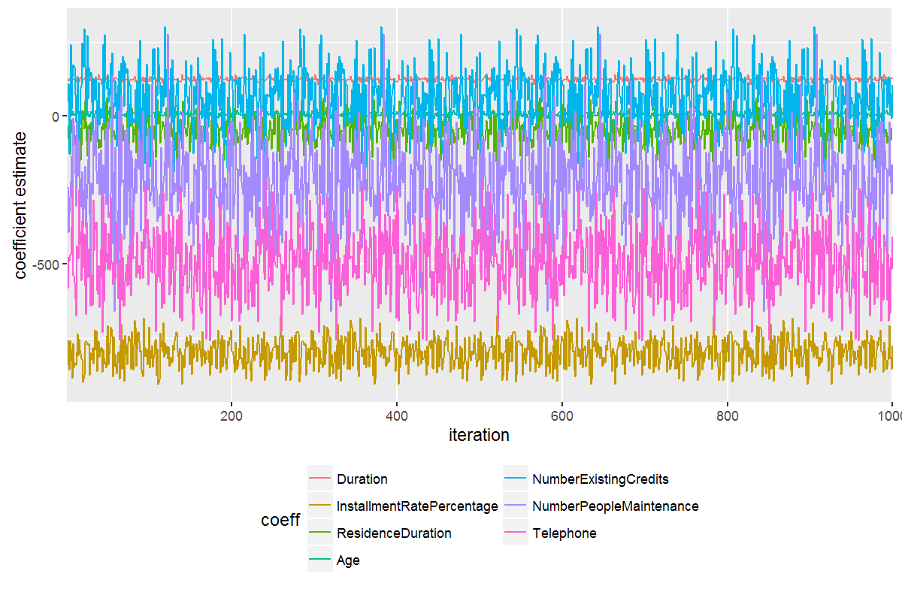
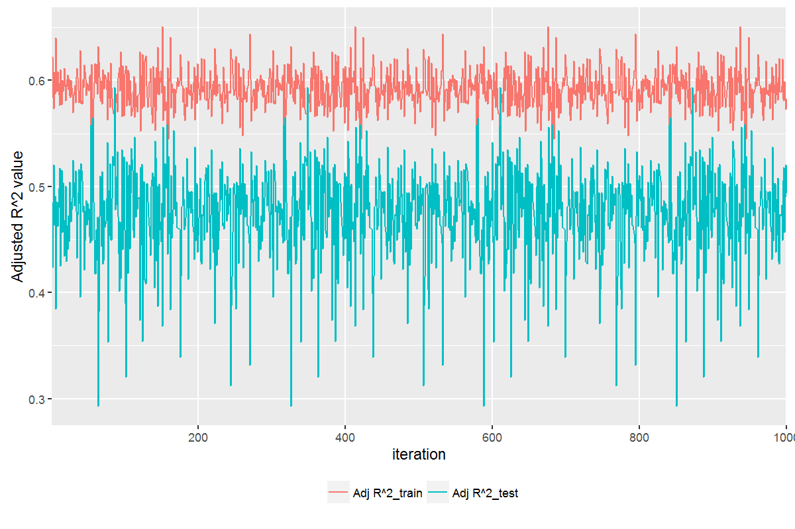
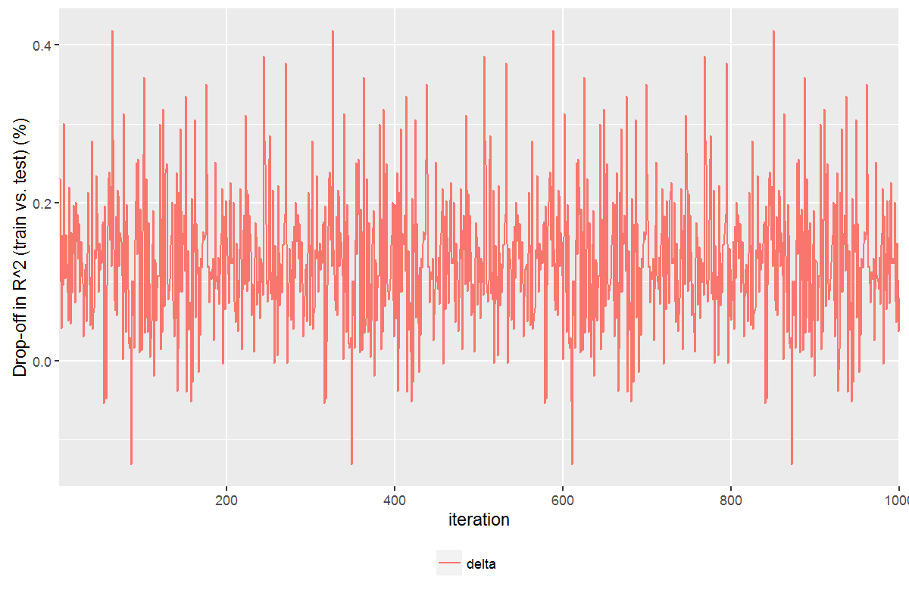

# 1 Introduction

This document presents results of the second bonus assessment for the Masters of Science in Predictive Analytics course: PREDICT 422. This assessment required the student to employ regression analysis techniques using German credit score data from the caret package.

# 2 Bonus Assessment

## 2.1 Load the Dataset

As a first step, we load the 'GermanCredit' data from the rpart package and observe the structure of the data.

```{r, include=FALSE}
for(package in c("caret",
                 "reshape",
                 "ggplot2",
                 "knitr")) {
  if(!require(package, character.only=TRUE)) {
    install.packages(package, repos="http://cran.us.r-project.org")
    library(package, character.only=TRUE)
  }
}

rm(package)
```

```{r, include=FALSE}
data(GermanCredit)
credit.raw <- GermanCredit

#summary(credit.raw)
str(credit.raw)
```

The dataset includes 1,000 observations spread over 62 variables. Predictors include variables such as checking account status, duration, credit history, purpose of the loan, and the amount of the loan. For this assessment, we fit a linear regression model with 'Amount' as our response variable. Do do this, we first separate the dataset into a training and test set. In this case, 63.2% of the data is reserved for training with the remainder reserved for testing. The number of observations for each set is shown below.

```{r, echo=FALSE}
print(paste("length(training set):", nrow(credit.raw)*0.632))
print(paste("length(test set):", nrow(credit.raw)*(1-0.632)))
```

## 2.2 Model Fit

We use the caret package in order to fit a linear model with 'Amount' as our response variable. We do this 1,000 times, re-sampling the train/test split and refitting the model each time. We are then able to extract measures of coefficient estimates as well as measures of goodness-of-fit (R^2 and Adjusted-R^2), over both the training and test sets for each iteration.

The plot below for example, shows the coefficient estimates for a subset of seven coefficients over the 1,000 iterations.

```{r, eval=FALSE, include=FALSE}
df_coeff <- data.frame()
df_gof.train <- data.frame()
df_gof.test <- data.frame()

iter <- 10

for (i in 1:iter) {
  train <- 0.632
  randraw <- runif(nrow(GermanCredit))
  
  GermanCredit_train <- GermanCredit[randraw <= train, ]
  GermanCredit_test <- GermanCredit[randraw > train, ]
    
  AMOUNT_train <- GermanCredit_train$Amount
  AMOUNT_test <- GermanCredit_test$Amount
  
  objControl <- trainControl(method="cv", number=3, 
                             returnResamp="none", allowParallel=TRUE, verboseIter=TRUE)
  fit_lms <- train(Amount ~ .,
                   data=GermanCredit_train,
                   method="lm", trControl=objControl)
  
  summary(fit_lms)
  
  df_temp <- as.data.frame(t(coef(fit_lms$finalModel)))
  df_coeff <- rbind(df_coeff, df_temp) 
  
  pred_lms <- predict(fit_lms, GermanCredit_train)
  #pred_lms[pred_lms <= 0] <- 0

  # GOF
  k <- 61 - 13
  n <- nrow(GermanCredit_train)
  resid <- AMOUNT_train - pred_lms
  sst <- sum((AMOUNT_train - mean(AMOUNT_train))^2)
  sse <- sum(resid^2)
  ssr <- sst - sse
  mae <- mean(abs(resid))
  mse <- mean((resid)^2)
  rmse <- sqrt(mse)
  r2 <- ssr / sst
  adjr2 <- 1 - (sse/(n-k-1)) / (sst/(n-1))
  
  stats <- c(mae, mse, rmse, r2, adjr2)
  df_temp <- as.data.frame(t(stats))
  names(df_temp) <- c("mae", "mse", "rmse", "r2", "adjr2")
  rm(k, n, resid, sst, sse, ssr, mae, mse, r2, adjr2)
  
  df_gof.train <- rbind(df_gof.train, df_temp)
  
  pred_lms <- predict(fit_lms, GermanCredit_test)
  #pred_lms[pred_lms <= 0] <- 0

  # GOF
  k <- 61 - 13
  n <- nrow(GermanCredit_test)
  resid <- AMOUNT_test - pred_lms
  sst <- sum((AMOUNT_test - mean(AMOUNT_test))^2)
  sse <- sum(resid^2)
  ssr <- sst - sse
  mae <- mean(abs(resid))
  mse <- mean((resid)^2)
  rmse <- sqrt(mse)
  r2 <- ssr / sst
  adjr2 <- 1 - (sse/(n-k-1)) / (sst/(n-1))
  #print(paste0(cat("sst: ", round(sst, 2), "\n",
  #                 "sse: ", round(sse, 2), "\n",
  #                 "ssr: ", round(ssr, 2), "\n", 
  #                 "mae: ", round(mae, 2), "\n", 
  #                 "mse: ", round(mse, 2), "\n",
  #                 "rmse: ", round(rmse, 2), "\n",
  #                 "r2: ", round(r2, 4), "\n",
  #                 "adjr2 ", round(adjr2, 4), sep="")))
  
  stats <- c(mae, mse, rmse, r2, adjr2)
  df_temp <- as.data.frame(t(stats))
  names(df_temp) <- c("mae", "mse", "rmse", "r2", "adjr2")
  rm(k, n, resid, sst, sse, ssr, mae, mse, r2, adjr2)
  
  df_gof.test <- rbind(df_gof.test, df_temp)
}


# plot coefficients
df_temp <- df_coeff[, c(2:8)]
df_temp[, "iter"] <- rownames(df_temp)
df_temp[, "iter"] <- factor(df_temp[, "iter"], levels=df_temp[, "iter"])
df_temp <- melt(df_temp,  id.vars="iter", variable_name="coeff")

#png(filename=paste0("images/coeff.png"), 
#    width=1200, height=800, res=150)

ggplot(df_temp, aes(x=iter, y=value, group=coeff)) + 
  #geom_line(stat="identity")
  geom_line(aes(color=factor(coeff))) +
  labs(list(x="iteration", y="coefficient estimate")) + 
  scale_x_discrete(breaks=round(seq(0, iter, by=iter/5),1)) + 
  guides(col=guide_legend(title="coeff", ncol=2)) +
  theme(legend.position="bottom")

#dev.off()


# plot r2
df_temp <- df_gof.train["r2"]
names(df_temp) <- c("R^2_train")
df_temp["R^2_test"] <- df_gof.test["r2"]
df_temp[, "iter"] <- rownames(df_temp)
df_temp[, "iter"] <- factor(df_temp[, "iter"], levels=df_temp[, "iter"])
df_temp <- melt(df_temp,  id.vars="iter", variable_name="r2")

#png(filename=paste0("images/r2.png"), 
#    width=1200, height=800, res=150)

ggplot(df_temp, aes(x=iter, y=value, group=r2)) + 
  #geom_line(stat="identity")
  geom_line(aes(color=factor(r2))) +
  labs(list(x="iteration", y="R^2 value")) + 
  scale_x_discrete(breaks=round(seq(0, iter, by=iter/5),1)) + 
  guides(col=guide_legend(title="", ncol=2)) +
  theme(legend.position="bottom")

#dev.off()


# plot adj r2
df_temp <- df_gof.train["adjr2"]
names(df_temp) <- c("Adj R^2_train")
df_temp["Adj R^2_test"] <- df_gof.test["adjr2"]
df_temp[, "iter"] <- rownames(df_temp)
df_temp[, "iter"] <- factor(df_temp[, "iter"], levels=df_temp[, "iter"])
df_temp <- melt(df_temp,  id.vars="iter", variable_name="r2")

#png(filename=paste0("images/adjr2.png"), 
#    width=1200, height=800, res=150)

ggplot(df_temp, aes(x=iter, y=value, group=r2)) + 
  #geom_line(stat="identity")
  geom_line(aes(color=factor(r2))) +
  labs(list(x="iteration", y="Adjusted R^2 value")) + 
  scale_x_discrete(breaks=round(seq(0, iter, by=iter/5),1)) + 
  guides(col=guide_legend(title="", ncol=2)) +
  theme(legend.position="bottom")

#dev.off()


# plot train vs test r2
df_temp <- df_gof.train["r2"]
names(df_temp) <- c("R^2_train")
df_temp["R^2_test"] <- df_gof.test["r2"]
df_temp["delta"] <- 1 - (df_temp["R^2_test"] / df_temp["R^2_train"])
df_temp[, c("R^2_test", "R^2_train")] <- NULL
df_temp[, "iter"] <- rownames(df_temp)
df_temp[, "iter"] <- factor(df_temp[, "iter"], levels=df_temp[, "iter"])
df_temp <- melt(df_temp,  id.vars="iter", variable_name="delta")

#png(filename=paste0("images/dropoff.png"), 
#    width=1200, height=800, res=150)

ggplot(df_temp, aes(x=iter, y=value, group=delta)) + 
  #geom_line(stat="identity")
  geom_line(aes(color=factor(delta))) +
  labs(list(x="iteration", y="Drop-off in R^2 (train vs. test) (%)")) + 
  scale_x_discrete(breaks=round(seq(0, iter, by=iter/5),1)) + 
  guides(col=guide_legend(title="", ncol=2)) +
  theme(legend.position="bottom")

#dev.off()
```

\newpage

#### Figure 2.2.1 Coefficient Estimates (Training Set)

{#id .class height=350px}

We can see that the coefficient estimates are not particularly stable.

Likewise, we can plot the R^2 and Adjusted-R^2 values over both the training and test sets of data. The first plot below shows the R^2 values, whilst the second plot shows the Adjusted-R^2 values.

#### Figure 2.2.2 R^2 Values (Training vs. Test Set)

{#id .class height=350px}

\newpage

#### Figure 2.2.3 Adjusted-R^2 Values (Training vs. Test Set)

{#id .class height=350px}

We again see a fair amount of instability over these measures, particularly when measured over the test set of data. We also note that there is generally less drop-off in Adjusted-R^2 value compared to the standard R^2 value when comparing measures over the training and test sets.

Finally, we can plot the drop-off percentage in R^2 value when moving from the training to test sets of data for each iteration.

#### Figure 2.2.3 Drop-off in R^2 Values (Training vs. Test Set)

{#id .class height=350px}

Note that there are a number of iterations where the test set R^2 value exceeds that of the training set R^2 value.

## 2.3 Model Comparison

Finally, we compare the mean coefficient estimates for each iteration against a single model fit over the entire dataset.

```{r, eval=FALSE, include=FALSE}

objControl <- trainControl(method="cv", number=3, 
                           returnResamp="none", allowParallel=TRUE, verboseIter=TRUE)
fit_lms <- train(Amount ~ .,
                 data=credit.raw,
                 method="lm", trControl=objControl)

df_temp1 <- as.data.frame(coef(fit_lms$finalModel))


cols <- colnames(df_coeff[, !sapply(df_coeff, is.factor)])
df_temp2 <- df_coeff[, cols]
stats <- lapply(df_temp2, function(x) rbind(mean=mean(x),
                                            min=min(x),
                                            q25=quantile(x, na.rm=TRUE)[2],
                                            q75=quantile(x, na.rm=TRUE)[4],
                                            max=max(x)))
df_temp2 <- t(data.frame(stats))
rownames(df_temp2) <- cols

df_temp <- cbind(df_temp1, df_temp2)
colnames(df_temp)[1] <- "est_alldata"
kable(round(df_temp, digits=2))
#write.table(df_temp, "temp.csv", sep="\t") 
rm(cols, df_temp, df_temp1, df_temp2, stats)

```

#### Table 2.3.1 Coefficient Estimate Comparison

|                                       | est_alldata|     mean|      min|      q25|      q75|      max|
|:--------------------------------------|-----------:|--------:|--------:|--------:|--------:|--------:|
|(Intercept)                            |     7074.53|  7048.06|  3323.57|  6175.54|  8021.31| 10825.31|
|Duration                               |      124.63|   124.24|   107.88|   120.61|   127.94|   140.76|
|InstallmentRatePercentage              |     -794.60|  -796.99|  -906.31|  -831.91|  -762.49|  -675.51|
|ResidenceDuration                      |      -51.54|   -46.46|  -154.75|   -77.11|   -16.86|    60.36|
|Age                                    |        6.36|     6.26|    -8.65|     2.29|    10.55|    23.35|
|NumberExistingCredits                  |       60.76|    60.44|  -217.02|    -7.38|   126.82|   302.82|
|NumberPeopleMaintenance                |     -209.32|  -222.80|  -660.88|  -318.23|  -123.90|   276.69|
|Telephone                              |     -496.50|  -494.30|  -759.08|  -567.42|  -415.00|  -216.43|
|ForeignWorker                          |     -302.06|  -285.86| -1001.30|  -455.45|  -122.55|   364.92|
|ClassGood                              |     -369.92|  -371.76|  -728.93|  -468.40|  -275.86|    35.86|
|CheckingAccountStatus.lt.0             |     -203.33|  -192.42|  -612.06|  -261.28|  -121.41|   186.58|
|CheckingAccountStatus.0.to.200         |      141.10|   143.08|  -190.94|    70.04|   205.16|   524.59|
|CheckingAccountStatus.gt.200           |     -641.47|  -649.45| -1133.08|  -767.21|  -549.36|   -84.06|
|CheckingAccountStatus.none             |          NA|       NA|       NA|       NA|       NA|       NA|
|CreditHistory.NoCredit.AllPaid         |      757.07|   738.04|  -271.33|   519.41|   934.17|  1585.47|
|CreditHistory.ThisBank.AllPaid         |     -148.84|  -155.97|  -883.13|  -342.41|    15.98|   570.03|
|CreditHistory.PaidDuly                 |      -58.53|   -61.94|  -434.13|  -153.81|    21.52|   304.01|
|CreditHistory.Delay                    |       76.06|    75.38|  -504.95|   -63.23|   221.97|   668.55|
|CreditHistory.Critical                 |          NA|       NA|       NA|       NA|       NA|       NA|
|Purpose.NewCar                         |    -1837.99| -1786.25| -4662.81| -2459.59| -1178.81|  1774.99|
|Purpose.UsedCar                        |    -1118.76| -1064.91| -3845.19| -1710.39|  -399.38|  2173.46|
|Purpose.Furniture.Equipment            |    -1869.15| -1807.76| -4600.67| -2471.07| -1193.96|  1941.62|
|Purpose.Radio.Television               |    -2100.81| -2038.84| -4855.17| -2669.22| -1386.51|  1584.64|
|Purpose.DomesticAppliance              |    -2511.65| -2464.68| -5792.54| -3117.40| -1809.25|  1352.55|
|Purpose.Repairs                        |    -1774.11| -1732.22| -4810.03| -2418.94| -1113.36|  1831.17|
|Purpose.Education                      |    -1980.28| -1923.51| -4585.90| -2600.38| -1288.24|  1558.73|
|Purpose.Vacation                       |          NA|       NA|       NA|       NA|       NA|       NA|
|Purpose.Retraining                     |    -2193.13| -2175.59| -5047.39| -2898.22| -1423.69|  2694.49|
|Purpose.Business                       |    -2025.21| -1948.98| -4643.49| -2587.12| -1294.56|  1663.00|
|Purpose.Other                          |          NA|       NA|       NA|       NA|       NA|       NA|
|SavingsAccountBonds.lt.100             |     -371.03|  -363.77|  -664.91|  -458.39|  -273.41|    50.90|
|SavingsAccountBonds.100.to.500         |     -592.69|  -583.47|  -974.50|  -720.44|  -471.22|   -94.35|
|SavingsAccountBonds.500.to.1000        |     -655.49|  -664.73| -1154.28|  -802.85|  -510.35|   -56.38|
|SavingsAccountBonds.gt.1000            |     -374.99|  -361.96|  -820.11|  -485.92|  -242.63|   310.33|
|SavingsAccountBonds.Unknown            |          NA|       NA|       NA|       NA|       NA|       NA|
|EmploymentDuration.lt.1                |      117.32|   105.86|  -812.96|  -129.06|   347.84|  1147.31|
|EmploymentDuration.1.to.4              |       63.30|    52.59|  -850.57|  -174.93|   278.40|  1069.55|
|EmploymentDuration.4.to.7              |      157.36|   147.31|  -841.10|   -89.40|   383.08|  1090.09|
|EmploymentDuration.gt.7                |     -142.30|  -159.64|  -926.04|  -400.79|    79.48|   894.16|
|EmploymentDuration.Unemployed          |          NA|       NA|       NA|       NA|       NA|       NA|
|Personal.Male.Divorced.Seperated       |      446.01|   451.15|  -264.56|   286.98|   591.60|  1236.38|
|Personal.Female.NotSingle              |      269.34|   269.81|   -87.91|   174.21|   369.00|   603.63|
|Personal.Male.Single                   |      741.92|   757.72|   314.67|   662.30|   845.07|  1147.36|
|Personal.Male.Married.Widowed          |          NA|       NA|       NA|       NA|       NA|       NA|
|Personal.Female.Single                 |          NA|       NA|       NA|       NA|       NA|       NA|
|OtherDebtorsGuarantors.None            |       76.71|    78.29|  -479.88|   -18.49|   188.37|   550.21|
|OtherDebtorsGuarantors.CoApplicant     |      657.81|   667.93|  -359.38|   492.27|   838.03|  1486.16|
|OtherDebtorsGuarantors.Guarantor       |          NA|       NA|       NA|       NA|       NA|       NA|
|Property.RealEstate                    |     -790.36|  -814.52| -1670.64| -1032.19|  -600.69|   -47.95|
|Property.Insurance                     |     -556.24|  -574.85| -1425.17|  -782.12|  -353.41|   248.37|
|Property.CarOther                      |     -534.05|  -541.54| -1388.22|  -761.60|  -313.53|   350.39|
|Property.Unknown                       |          NA|       NA|       NA|       NA|       NA|       NA|
|OtherInstallmentPlans.Bank             |     -173.26|  -193.34|  -666.52|  -287.09|  -102.90|   172.40|
|OtherInstallmentPlans.Stores           |      -92.48|   -82.85|  -925.93|  -258.05|    87.48|   842.80|
|OtherInstallmentPlans.None             |          NA|       NA|       NA|       NA|       NA|       NA|
|Housing.Rent                           |      197.97|   192.87|  -873.86|   -77.31|   454.09|  1168.59|
|Housing.Own                            |      112.77|   108.82|  -873.05|  -167.28|   373.05|  1115.17|
|Housing.ForFree                        |          NA|       NA|       NA|       NA|       NA|       NA|
|Job.UnemployedUnskilled                |    -1677.61| -1660.54| -3304.75| -2085.07| -1235.28|   159.39|
|Job.UnskilledResident                  |    -1192.27| -1198.92| -1811.34| -1345.10| -1059.25|  -609.73|
|Job.SkilledEmployee                    |    -1251.29| -1264.36| -1882.91| -1410.53| -1137.51|  -573.04|
|Job.Management.SelfEmp.HighlyQualified |          NA|       NA|       NA|       NA|       NA|       NA|

We can see that the coefficient estimates over the entire set of data are quite close to the mean coefficient estimates from the 1,000 iterations.