# 1 Introduction

This document presents the results of the final assessment for the Masters of Science in Predictive Analytics course: PREDICT 422. This assessment required the student to develop a predictive model in order to identify donors that are likely to respond to a mailing campaign, and once identified, estimate the net donation amount that may result from targeting those donors as part of a new mailing campaign.

For this assessment, we leverage a dataset which contains variables relating to previous donors. We use this data to first assess which variables have the greatest 'importance' in determining both the chance of response to a mailing campaign as well as the likely donation amount. We then use this reduced dataset to fit six classification models to predict chance of donation, and six regression models to predict likely donation amount. Optimal models are selected and subsequently used in order to estimate the expected net revenue from conducting a new targeted mailing campaign, accounting for the cost of mailing each donor.

# 2 Data

The dataset includes 8,009 records and 20 features of donor data. The features capture results from previous donation campaigns and properties of each donor. Features are broken up into 19 integer and one long variable type. A description of each feature can be found in the table below.

### Table 2.1 Feature Descriptions

| Feature             | Description                                                                   | 
|---------------------|-------------------------------------------------------------------------------| 
| REG1 REG2 REG3 REG4 | Region which the donor belongs to (1 = belongs to region 0 = does not belong) | 
| HOME                | (1 = homeowner 0 = not a homeowner)                                           | 
| CHLD                | Number of children                                                            | 
| HINC                | Household income (7 categories)                                               | 
| GENF                | Gender (0 = Male 1 = Female)                                                  | 
| WRAT                | Wealth Rating (0-9 with 0 being lowest wealth)                                | 
| AVHV                | Average Home Value in potential donor's neighborhood in $ thousands           | 
| INCM                | Median Family Income in potential donor's neighborhood in $ thousands         | 
| INCA                | Average Family Income in potential donor's neighborhood in $ thousands        | 
| PLOW                | Percent categorized as "low income" in potential donor's neighborhood         | 
| NPRO                | Lifetime number of promotions received to date                                | 
| TGIF                | Dollar amount of lifetime gifts to date                                       | 
| LGIF                | Dollar amount of largest gift to date                                         | 
| RGIF                | Dollar amount of most recent gift                                             | 
| TDON                | Number of months since last donation                                          | 
| TLAG                | Number of months between first and second gift                                | 
| AGIF                | Average dollar amount of gifts to date                                        | 

Do note that the dataset was already separated into a training (3,984), validation (2,018) and test (2,007) subset, according to the flag, 'PART'.

From an initial look at the data, we noted that the compiled R data frame fails to distinguish between numeric and factor variables. As such, prior to performing any data exploration, we converted all variables with two or less levels to factor type and retained all other variables as numeric type. This resulted in the identification of six factor type variables, including, 'REG1', 'REG2', 'REG3', 'REG4', 'HOME' and 'GENF'.

# 3 Data Exploration

A number of exploration routines were conducted. These routines allowed us to gain an understanding of potential data limitations, including identifying variables which have missing observations, outlier observations, or those variables which may benefit from transformation.

## 3.1 Univariate Data Analysis

As part of the univariate data analysis, summary statistics for all numeric variables were calculated and observed. Summary statistics can be found in the table below.

### Table 3.1.1 Numeric Variable Summary Statistics

| Feature | Mean     | Median | s.d.    | Min  | Max   | Miss | n    | 
|---------|----------|--------|---------|------|-------|------|------| 
| chld    | 1.7172   | 2      | 1.4017  | 0    | 5     | 0    | 8009 | 
| hinc    | 3.9086   | 4      | 1.4672  | 1    | 7     | 0    | 8009 | 
| wrat    | 6.9141   | 8      | 2.4286  | 0    | 9     | 0    | 8009 | 
| avhv    | 182.646  | 169    | 72.72   | 48   | 710   | 0    | 8009 | 
| incm    | 43.4742  | 38     | 24.7066 | 3    | 287   | 0    | 8009 | 
| inca    | 56.4281  | 51     | 24.8175 | 12   | 305   | 0    | 8009 | 
| plow    | 14.2332  | 10     | 13.4115 | 0    | 87    | 0    | 8009 | 
| npro    | 60.0312  | 58     | 30.3452 | 2    | 164   | 0    | 8009 | 
| tgif    | 113.0697 | 89     | 85.4751 | 23   | 2057  | 0    | 8009 | 
| lgif    | 22.9404  | 16     | 29.9479 | 3    | 681   | 0    | 8009 | 
| rgif    | 15.6618  | 12     | 12.4347 | 1    | 173   | 0    | 8009 | 
| tdon    | 18.8637  | 18     | 5.7832  | 5    | 40    | 0    | 8009 | 
| tlag    | 6.3632   | 5      | 3.7037  | 1    | 34    | 0    | 8009 | 
| agif    | 11.6807  | 10.23  | 6.5669  | 1.29 | 72.27 | 0    | 8009 | 

We observed that the numeric variables do not suffer from missing values. However, a few variables have a minimum value of zero, suggesting zero-inflated data. We also noted that a comparison of the min/max and standard deviation values of a number of variables suggests the presence of outliers.

Histogram and box plots were also generated and reviewed for a large subset of numeric variables, with the number of children (CHLD) and amount of gifts to date (TGIF) selected for further discussion below.

\newpage

#### Figure 3.1.1 Histogram and Boxplot: CHLD

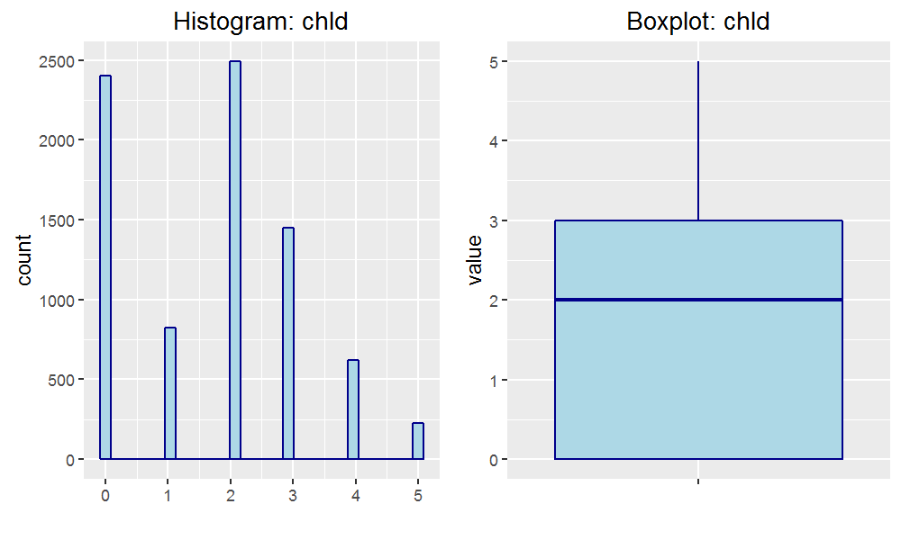{#id .class height=320px}

#### Figure 3.1.2 Histogram and Boxplot: TGIF

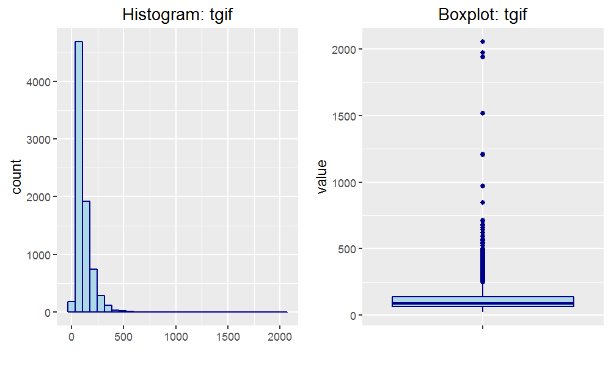{#id .class height=320px}

We immediately noticed that CHLD is zero-inflated, with many donors reported as not having any children. We also noted that while TGIF is more continuous in its nature than CHLD, this feature suffers from a heavy positive skew. This is in-fact a common attribute of the majority of features, with the greatest skew being noted for RGIF, INCA, INCM, and PLOW. The result is a number of observations which could be classed as outliers.

## 3.2 Bivariate Data Analysis

Since we intend on building a prediction model to determine both the chance of response to a mailing campaign (DONR) and the likely donation amount (DAMT), we have an interest in identifying variables which have explanatory power over these two variables. As such, we calculated and reviewed the Pearson correlation coefficient for all numeric variables against our numeric response variable, DAMT. Correlations are shown in the table below.

### Table 3.2.1 Correlation against DAMT

| Feature | Correlation | 
|---------|-------------| 
| wrat    | 0.231       | 
| npro    | 0.1458      | 
| incm    | 0.1453      | 
| inca    | 0.1294      | 
| tgif    | 0.1255      | 
| avhv    | 0.1112      | 
| rgif    | 0.0785      | 
| agif    | 0.0781      | 
| lgif    | 0.0768      | 
| hinc    | 0.0508      | 
| tdon    | -0.0922     | 
| tlag    | -0.1239     | 
| plow    | -0.1253     | 
| chld    | -0.5531     | 

None of the variables have reported a strong correlation with DAMT, with the greatest absolute correlation being reported by WRAT and CHLD. However, the polarity of the majority of coefficients seems reasonable. For example, a greater amount of wealth or having less children is suggested to result in a greater donation amount.

Finally, we used bar plots to explore the relationship between the categorical response variable (DONR) and each numeric variable. Two of these plots have been selected for further discussion below.

\newpage

#### Figure 3.2.1 Boxplot: DONR vs. NPRO / PLOW

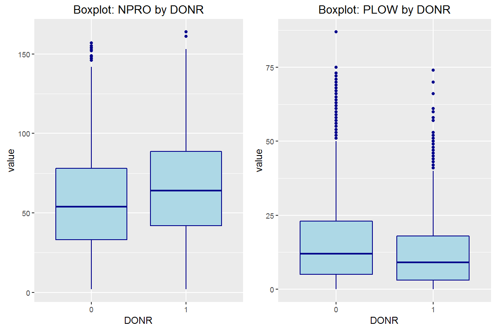{#id .class height=320px}

We can see that there are indeed recognizable differences in both the mean and distribution for both features, depending on whether they are associated with a positive or negative response to a mailing campaign. For example, we see that those donors who did in-fact respond received a greater number of promotions (NPRO) or had fewer people categorized as 'low income' within their neighborhood (PLOW).

# 4 Data Pre-processing

As part of the data pre-processing routine, we looked towards dealing with outlier observations for numeric variables. In many cases, the task of identifying outlier observations can be a subjective practice. As such, for this assessment, we took a statistical approach and targeted those observations which fell outside the 1st and 99th percentile range. Observations which met these criteria were replaced using the squish function as part of the scales package in R, effectively resulting in a newly created set of trimmed variables. Trimmed variables added to the dataset and can be recognized by the suffix '_T99'.

Next, we looked to transform the data by making a copy of each numeric variable and performing a log transformation on each copy. Such a transformation will help penalize extreme values and may aid in limiting the identified heavy skew for a number of numeric distributions. All transformed variables carry the suffix '_LN'.

Finally, we looked towards creating dummies for each of the retained factor variables. Dummy variables were named to include the prefix 'DUM_', along with a suffix to represent the factor level. Note that k-1 dummies were created, where k is the original number of levels for each variable. This resulted in the creation of six dummies.

# 5 Variable Importance

The data processing routine produced a data frame of 54 features, all of numeric type. With such a large feature set, it was clear that any subsequent model estimation would benefit from a further reduction in variable count. To achieve this, we leveraged the varImp function as part of the caret package in R to calculate the variable importance according to both response variables. In both cases, variable importance was calculated by fitting a Random Forest model, with 'importance' measured by the mean decrease in node impurity. Bar plots of the 20 most important variables for both response variables are below.

#### Figure 5.1 Variable Importance: DONR

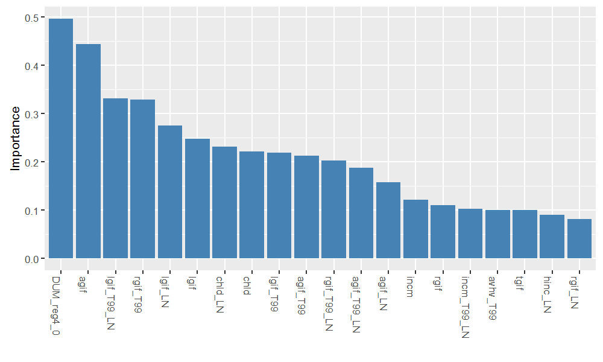{#id .class height=290px}

#### Figure 5.2 Variable Importance: DAMT

{#id .class height=290px}

We can see some commonality between variable importance plots, with CHLD and dummies for HOME and REG2 all within the top-10 rank for both response variables. We also note a fairly quick drop-off in variable importance beyond the first five variables within both plots. Based on these results, we elected to pass the top-20 ranked variables by importance through to our model estimation phase. We believe this reduction provides a suitable trade-off both in terms of accuracy and performance.

# 6 Model Estimation

## 6.1 Classification Modelling: Chance of Response

For this assessment, we fit six classification based models in order to predict the chance a donor will respond. These models include a Naive Bayes, Random Forest, Lasso and Elastic-Net Regularized Generalized Linear Model (GLMnet), Logit Boost, Linear Discriminant Analysis (LDA) and k-Nearest Neighbors (kNN) classifier. In each case, we leverage the train function as part of the caret package with a 3-fold cross-validation sampling method, which was applied to the training data and tested against the validation subset. Default parameters were used for each model. 

The in and out-of-sample Receiver Operating Characteristic (ROC) Curves are shown for each model in Appendix A. From observing each ROC curve, we note that both the Random Forest and kNN classifiers seem to have overfit the training data since both returned an AUC greater than 0.99 over the training set yet returned a much lower AUC over the validation set. The GLMnet and LDA classifiers seem to have delivered more promising results however, returning an AUC of over 0.95 over both the training and validation sets. Below we show the out-of-sample confusion matrix for each model.

#### Table 6.1.1 Confusion Matrix: Classification Model Comparison

|             |         |         |  |               |         |         |  |           |         |         | 
|-------------|---------|---------|--|---------------|---------|---------|--|-----------|---------|---------| 
| Naive Bayes |         |         |  | Random Forest |         |         |  | GLMnet    |         |         | 
|             | Pred: 0 | Pred: 1 |  |               | Pred: 0 | Pred: 1 |  |           | Pred: 0 | Pred: 1 | 
| Actual: 0   | 811     | 163     |  | Actual: 0     | 886     | 91      |  | Actual: 0 | 895     | 94      | 
| Actual: 1   | 208     | 836     |  | Actual: 1     | 133     | 908     |  | Actual: 1 | 124     | 905     | 
|             |         |         |  |               |         |         |  |           |         |         | 
| Logit Boost |         |         |  | LDA           |         |         |  | kNN       |         |         | 
|             | Pred: 0 | Pred: 1 |  |               | Pred: 0 | Pred: 1 |  |           | Pred: 0 | Pred: 1 | 
| Actual: 0   | 813     | 103     |  | Actual: 0     | 873     | 81      |  | Actual: 0 | 701     | 88      | 
| Actual: 1   | 206     | 896     |  | Actual: 1     | 146     | 918     |  | Actual: 1 | 318     | 911     | 

We can see that both the GLMnet and LDA classifiers have produced similar true positive and true negative rates over the validation set. That is, neither has a bias in performance towards classification of positive or negative observations. Finally, we present a set of performance metrics for each classifier in the table below.

#### Table 6.1.2 Performance Metrics: Classification Model Comparison

| Metric               | Naive Bayes | Random Forest | GLMnet | Logit Boost | LDA      | kNN    | 
|----------------------|-------------|---------------|--------|-------------|----------|--------| 
| Accuracy             | 0.8162      | 0.889         | 0.892  | 0.8469      | 0.8875   | 0.7988 | 
| 95% CI LB            | 0.7986      | 0.8745        | 0.8776 | 0.8304      | 0.8729   | 0.7806 | 
| 95% CI UB            | 0.8328      | 0.9024        | 0.9052 | 0.8623      | 9.01E-01 | 0.8161 | 
| Kappa                | 0.6324      | 0.7781        | 0.784  | 0.694       | 0.7751   | 0.5985 | 
| Sensitivity          | 0.8368      | 0.9089        | 0.9059 | 0.8969      | 0.9189   | 0.9119 | 
| Specificity          | 0.7959      | 0.8695        | 0.8783 | 0.7978      | 0.8567   | 0.6879 | 
| Pos Pred Value       | 0.8008      | 0.8722        | 0.8795 | 0.8131      | 0.8628   | 0.7413 | 
| Neg Pred Value       | 0.8326      | 0.9069        | 0.905  | 0.8876      | 0.9151   | 0.8885 | 
| Prevalence           | 0.495       | 0.495         | 0.495  | 0.495       | 0.495    | 0.495  | 
| Detection Rate       | 0.4143      | 0.45          | 0.4485 | 0.444       | 0.4549   | 0.4514 | 
| Detection Prevalence | 0.5173      | 0.5159        | 0.5099 | 0.5461      | 0.5273   | 0.609  | 
| Balanced Accuracy    | 0.8164      | 0.8892        | 0.8921 | 0.8474      | 0.8878   | 0.7999 | 

From a view of the performance metrics above, we can see that the GLMnet model has demonstrated a superior AUC, accuracy and specificity compared to the other models. As such, we have elected to use the GLMnet classifier to predict the chance of response.

## 6.2 Regression Modelling: Amount Donated

We next fit six regression based models in order to predict the amount of donation. These models include a Multiple Linear Regression (MLR), Random Forest, eXtreme Gradient Boost, Partial Least Squares, Ridge Regression, and a Least Absolute Shrinkage and Selection Operator (LASSO) estimator. Note that for the MLR, a stepwise variable selection technique was used based on the Akaike Information Criterion (AIC). As with the previous classification models, we employed a 3-fold cross-validation sampling method, and maintained the same training and validation split.

The in and out-of-sample actuals versus predictions for each model are shown in Appendix A. We can see that each model seems to struggle with outlier observations. We can extend the model assessment by observing the model fit statistics for each in the below table. Note that negative prediction values were taken as zero for the statistics shown in the table below. That is, we interpret negative donation amounts to be zero.

#### Table 6.2.1 Performance Metrics: Regression Model Comparison

|              | MLR    | Random Forest | eXtreme Grad Boost | Partial Least Squares | Ridge Regression | LASSO  |
|--------------|--------|---------------|--------------------|-----------------------|------------------|--------|
| Training set |        |               |                    |                       |                  |        |
| MAE          | 0.8    | 0.36          | 0.25               | 1.25                  | 0.8              | 0.79   |
| MSE          | 1.24   | 0.26          | 0.11               | 2.64                  | 1.25             | 1.24   |
| RMSE         | 1.11   | 0.51          | 0.34               | 1.62                  | 1.12             | 1.11   |
| R^2          | 0.669  | 0.9299        | 0.9695             | 0.296                 | 0.6675           | 0.6701 |
|              |        |               |                    |                       |                  |        |
| Test set     |        |               |                    |                       |                  |        |
| MAE          | 0.84   | 0.94          | 0.93               | 1.3                   | 0.83             | 0.83   |
| MSE          | 1.41   | 1.73          | 1.74               | 3.1                   | 1.4              | 1.41   |
| RMSE         | 1.19   | 1.31          | 1.32               | 1.76                  | 1.19             | 1.19   |
| R^2          | 0.6718 | 0.5989        | 0.5958             | 0.2799                | 0.6739           | 0.673  |

We can see that each regression model has performed quite poorly over the test set of data. For this assessment, we will adopt the Ridge Regression model to predict the amount donated as its training performance metrics were among the most favorable.

# 7 Donor Scoring

For the final part of this assessment, we construct a donor score based on the combined predictions of the GLMnet and Ridge Regression models discussed above. This function is to represent the expected value from conducting a new mailing campaign, based on a test subset of donors. The donor score function is shown below.

$DonorScore = P(response) \cdot E(donation) - CostofMail$

For the above function, 'P(response)' represents the probability of response as predicted by the chosen GLMnet based classification model. 'E(donation)' represents the expected donation amount as predicted by the chosen Ridge Regression based regression model. And finally, the 'cost of mail' represents the cost of mailing donors as part of a new mailing campaign which is assumed to be equal to $2.00 per donor. The sum of donor scores represents the expected value from conducting a new mailing campaign.

We use the donor score above to propose five possible strategies. The first strategy, ALL_MAIL involves mailing all donors within the test set, regardless of the probability of response or expected donation amount. This would obviously be a costly strategy, considering the cost of mailing each donor. The second strategy, ALLSCORE_MAIL involves mailing only those donors who return a positive donor score according to the above function. For the third strategy, PREDPROB_MAIL, only those donors with a predicted probability of response greater than 0.655 are mailed. This probability accounts for the weighted sampling between the validation and test sets of data, whereby an optimal mailing rate for maximizing profits of 0.636 was compared against the proposed test data response rate of 0.1. For the fourth strategy, HIGHPROB_MAIL, only those donors who are predicted to have a probability of response greater than or equal to 0.99 are mailed, and finally, for the fifth strategy, HIGHVAL_MAIL, only those donors who have a predicted donation amount of greater than or equal to $17.50 are mailed.

#### Table 7.1 Donor Score Summary

| Strategy      | Criteria                 | no. Donors Mailed | Expected Value | Value per Donor | 
|---------------|--------------------------|-------------------|----------------|-----------------| 
| ALL_MAIL      | -                        | 2007              | $2,605         | $1.30           | 
| ALLSCORE_MAIL | Donor Score >= 0         | 756               | $4,696         | $6.21           | 
| PREDPROB_MAIL | P(response) >= 0.6552621 | 327               | $3,786         | $11.58          | 
| HIGHPROB_MAIL | P(response) >= 0.99      | 50                | $678           | $13.56          | 
| HIGHVAL_MAIL  | E(donation amt) >= 17.50 | 42                | $205           | $4.88           | 

It should be no surprise that the greatest expected value comes from the strategy which involves targeting all donors with a positive donor score. However, we also find viable strategies from mailing only those donors with a high probability of response. This strategy is able to achieve a much greater expected value per donor. It may be that the most effective strategy would be to target those donors as flagged by HIGHPROB_MAIL in the first instance. And then, depending on the success of that campaign, proceed to target the remaining donors flagged by ALLSCORE_MAIL. We also note the poor performance of the HIGHVAL_MAIL strategy. Interestingly, although this strategy highlighted a number of donors with a high predicted donation amount, the predicted probability of donation for those donors was generally quite low. Note that a list of donor identification numbers according to the above strategies is available on request.

# 8 Conclusion

For this assessment, we fit six classification models to predict chance of response, and six regression models to predict donation amount. From the fitted models, we found a GLMnet based model to be superior in predicting chance of response, and the Ridge Regression model to be superior in predicting donation amount. Optimal models were selected and subsequently used in order to estimate the expected value from conducting a new targeted mailing campaign, accounting for the cost of mailing each donor. This score was then used to propose five possible strategies, ranging from mailing all donors to mailing only those donors who have a predicted donation amount greater than or equal to $17.50. Results suggest a viable strategy to mail donors with a high probability of response in the first instance, and to follow this by mailing the remaining donors with a positive donor score. 

\newpage

#### Figure A.1 ROC Curve: Naive Bayes

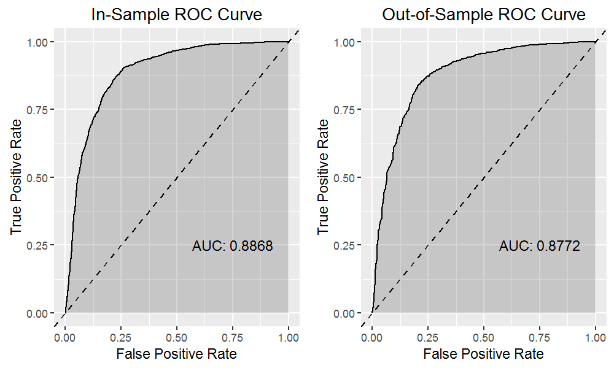{#id .class height=250px}

#### Figure A.2 ROC Curve: Random Forest

{#id .class height=250px}

#### Figure A.3 ROC Curve: Lasso and Elastic-Net Regularized Generalized Linear Model

{#id .class height=250px}

\newpage

#### Figure A.4 ROC Curve: Logit Boost

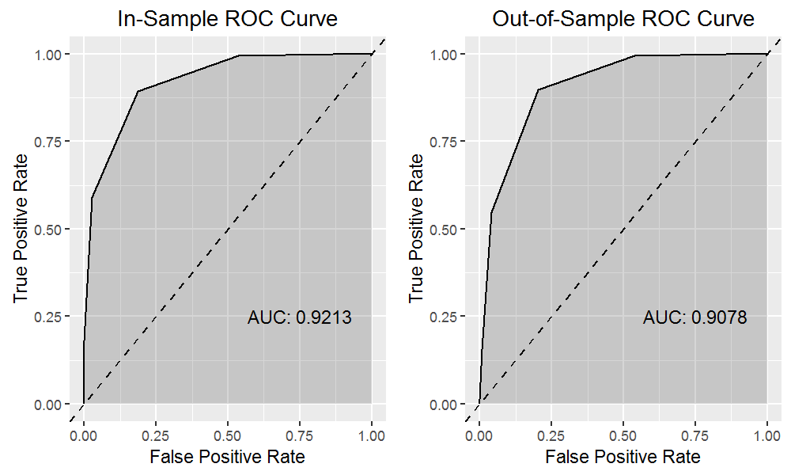{#id .class height=250px}

#### Figure A.5 ROC Curve: Linear Discriminant Analysis

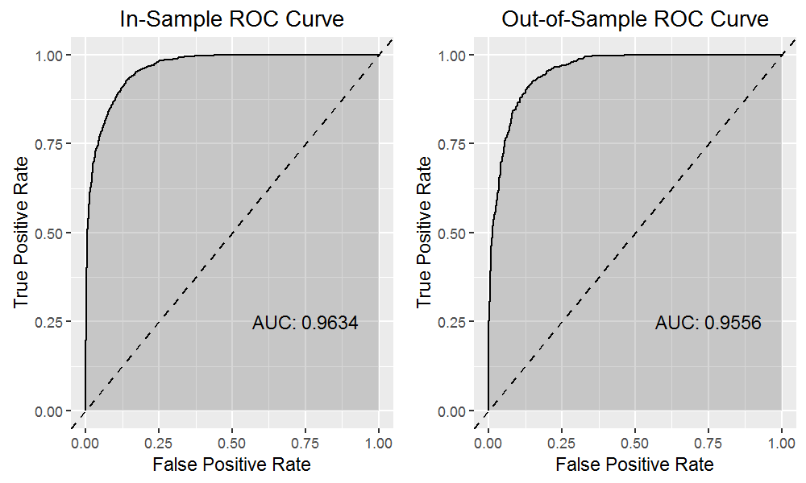{#id .class height=250px}

#### Figure A.6 ROC Curve: k-Nearest Neighbors

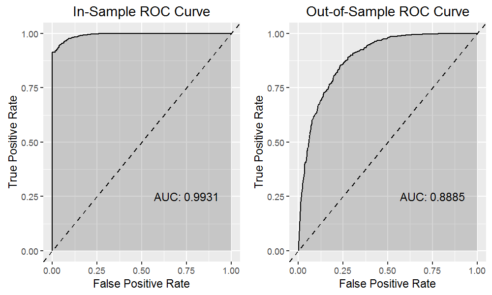{#id .class height=250px}

\newpage

#### Figure A.7 Actuals vs. Predictions: Multiple Linear Regression

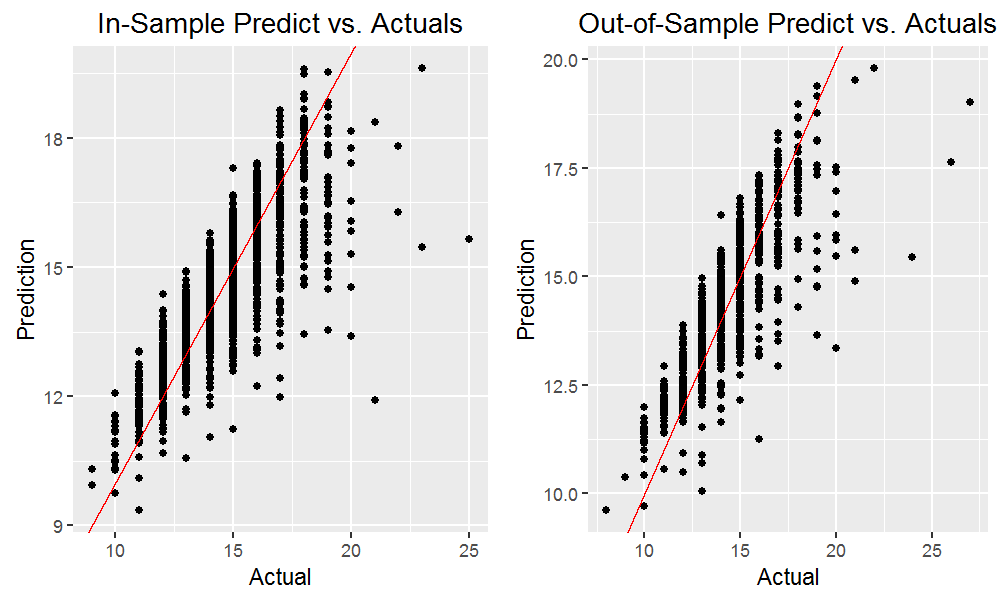{#id .class height=250px}

#### Figure A.8 Actuals vs. Predictions: Random Forest

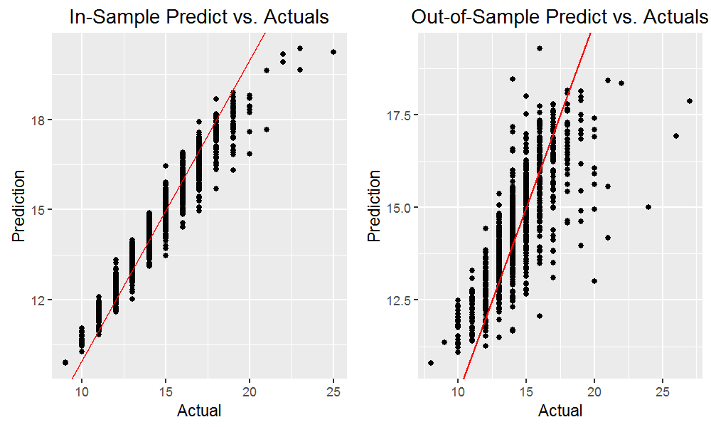{#id .class height=250px}

#### Figure A.9 Actuals vs. Predictions: eXtreme Gradient Boost

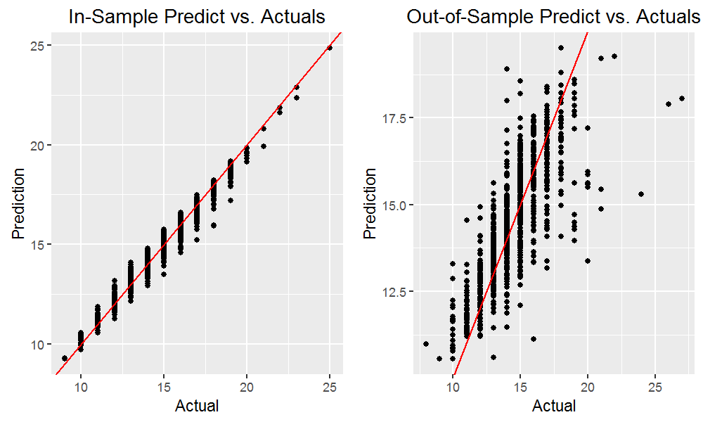{#id .class height=250px}

\newpage

#### Figure A.10 Actuals vs. Predictions: Partial Least Squares

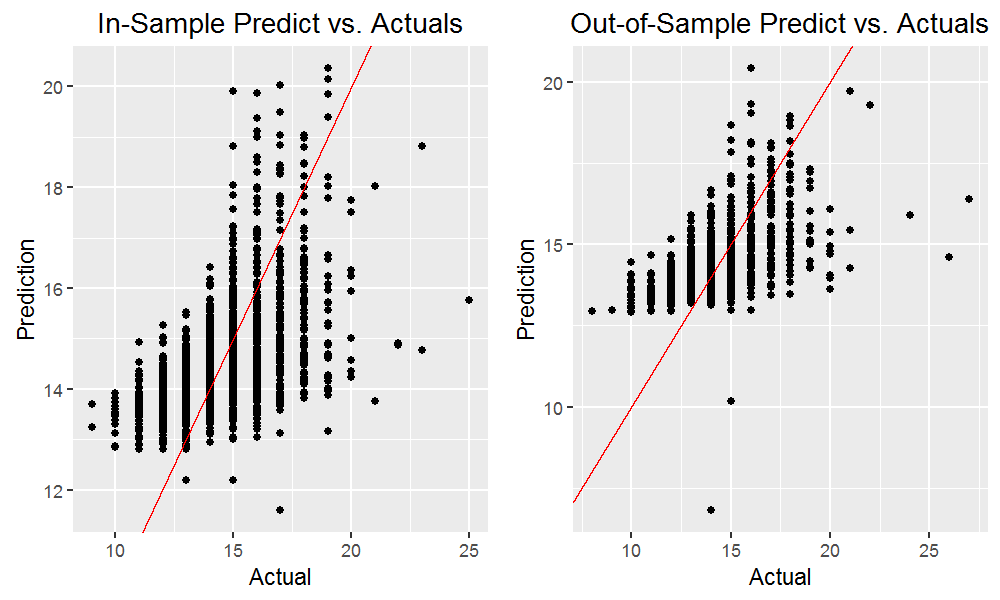{#id .class height=250px}

#### Figure A.11 Actuals vs. Predictions: Ridge Regression

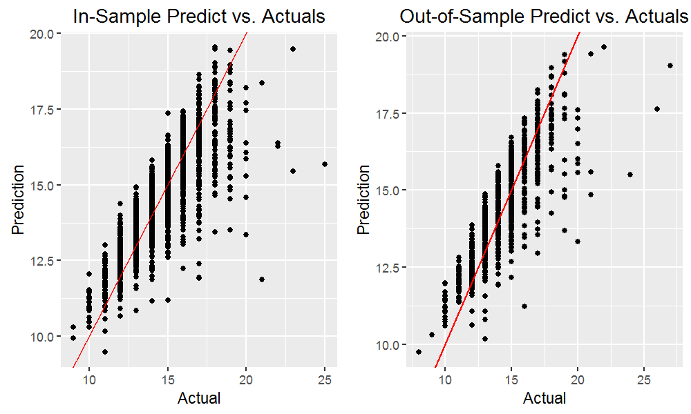{#id .class height=250px}

#### Figure A.12 Actuals vs. Predictions: Least Absolute Shrinkage and Selection Operator

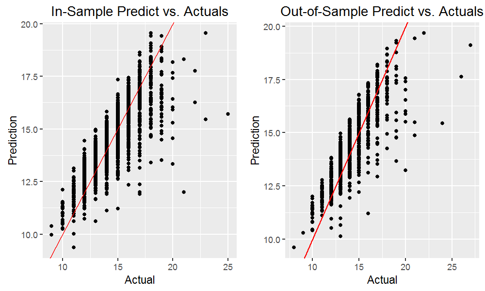{#id .class height=250px}