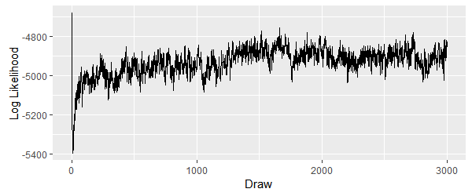
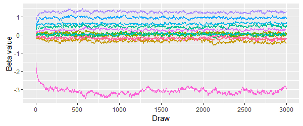
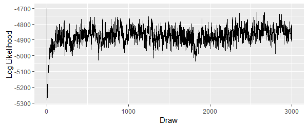

# 1 Introduction

This document presents the results of the second assignment for the Masters of Science in Predictive Analytics course: PREDICT 450. This assessment required the student to estimate consumer preference shares over choice scenarios for attributes of computer tablets, with the intention of being used by an electronics manufacturer who is looking to enter the tablet market.

For this assessment, the electronics manufacturer (Starful Technologies Company (STC)) provided four different choice scenarios for preference share modelling which were based on a wider set of survey results administered by NeverMind Marketing Insights. The survey results were used in order to fit two Hierarchical Bayes (HB) Multinomial Logit (MNL) models for preference shares. These models were to allow for the measurement of price sensitivity of respondent choices which are brand specific and also for examination of the possible effects of prior STC product ownership and respondent gender on the attributes' contributions to preferences.

# 2 Data

For this assessment, we were provided with consumer survey data from 360 respondents. The survey was designed and administered by STC and NeverMind and included questions focused on consumer interest, demographics and choice sets. The full set of survey questions included:

- STCOwner: Previous owner of an STC product?
- 36 choice set questions
- Interest questions:
    - Purchasing a new tablet?
    - Purchasing a new smart phone?
    - Using cloud storage for storing personal digital content?
    - Taking an online course to improve relevant skills?
- Gen: Gender of respondent
- Age: Age of respondent

The 36 choice set questions were build from the following five attributes:

- Brand: 4 levels: STC, Somesong, Pear, Gaggle (level codes: 0,1,2,3)
- Price: 3 levels: $199, $299, $399 (level codes: 0,1,2)
- Screen: 3 levels: 5 inch, 7 inch, 10 inch (level codes: 0,1,2)
- RAM: 3 levels: 8 Gb, 16 Gb, 32 Gb (Gb = "gigabytes") (level codes: 0,1,2)
- Processor: 3 levels: 1.5 GHz, 2 GHz, 2.5 GHz (GHz = "gigahertz") (level codes: 0,1,2)

Each of the 36 choice set questions had three alternatives with each alternative representing a specific combination of the above attribute levels (108 possibilities). Each consumer was to rank the three alternatives presented for each choice set with a score from one to three.

We were also provided with two additional datasets. The first is a dataframe of the 108 possible combinations of alternatives for the 36 choice set questions above. The second is a dataframe of 12 alternatives based on the choice sets of four additional respondents. The first of these datasets is to be used to form the predictor variable set for model estimation while the second is to be used for subsequent preference share modelling.

# 3 Data Pre-processing

A number of data pre-process routines were conducted in order to manipulate the data into a format which can easily allow fitting of the MNL regression models. These routines and their outputs are explained in their order of execution below:

1) Effects matrix: Generate a matrix which includes an effects coded version of the 108 possible combinations of attributes from the original dataset.
2) Brands matrix: Extract the coded levels associated with brand from the 'effects matrix'.
3) Price vector: Create a price vector of the difference between the price associated with each attribute combination and the mean price of all possible attribute combinations.
4) Brand by price matrix: Multiply the 'brands matrix' by the 'price vector' in order to create a matrix of interactions between brand and price.
5) X-matrix: Merge the 'effects matrix' and the 'brands by price matrix' to create a 'X-matrix' of predictor variables for the modelling phase.
6) y-data: Extract each respondents selection to the 36 choice set questions from the original dataset.
7) List of y by X-matrix: Create a list of combinations of each respondents selection to the 36 choice questions (y-matrix) and the matrix of predictor variables (X-matrix).

# 4 Model Estimation

For this assessment, we fit two HB MNL models for preference shares using the R function rhierMnIDP from the bayesm R package. One model includes a covariate indicating previous ownership of a STC product and a covariate for respondent gender, while the other model excludes these covariates. Both models were estimated using Markov Chain Monte Carlo (MCMC) simulation, for which we elected to include 30,000 iterations and retain every 10th sample.

## 4.1 Model 1

The first model (Model 1), includes the choice set responses for all 360 respondents (y-data) along with predictor variables (X-matrix). The functional form of the MNL likelihood model used for Model 1 can be shown as:

$y_{ijk} = X_{ijk} \cdot \beta_{i} + e_{ijk}$
  
where:
  
$\beta_i$ ~ $MVN\left(\overline{\beta },V_{\beta}\right)$

There are a number of statistical methods available to assess the overall model fit, including Mean Squared Error (MSE), Mean Absolute Error (MAE), likelihood measures (such as LL, RLH, and pseudo R-squared), Bayes factor, and posterior predictive checks. To calculate these statistical measures one would need to first find the posterior means for each beta of each respondent. Next, a matrix would be derived from multiplying the original X-matrix by the posterior means, which would then be exponentiated and divided by the row sums of exponentiated betas. For this assessment however, we elect to instead conduct a simple 'sniff test', by first ensuring we have included enough iterations for proper 'burn-in' of coefficients, and then to assess the beta means directly to determine whether each seem logical.

\newpage

The betadraws recorded over the MCMC simulation for Model 1 are shown in the figure below.

#### Figure 4.1.1 Model 1 Betadraw

{}

Likewise, the Log Likelihood values recorded over the MCMC simulation for Model 1 are shown below.

#### Figure 4.1.2 Model 1 Log Likelihood

{}

We can see that the beta and likelihood value tend to level out at around 2,000 iterations, suggesting that we have included more than enough iterations to achieve a proper burn-in.

The table below shows the beta means for each attribute.

\newpage

#### Table 4.1.1 Model 1 Beta Means

|                 |Attribute               | Beta mean|
|:----------------|:-----------------------|---------:|
|screen_1         |7 inch Screen           |    -0.181|
|screen_2         |10 inch Screen          |     0.486|
|RAM_1            |16Gb RAM                |     0.080|
|RAM_2            |32Gb RAM                |     0.616|
|processor_1      |2GHz Processor          |     0.939|
|processor_2      |2.5Ghz Processor        |     1.262|
|price_1          |$299                    |     0.311|
|price_2          |$399                    |    -2.907|
|brand_1          |Somesong Brand          |    -0.111|
|brand_2          |Pear Brand              |     0.046|
|brand_3          |Gaggle Brand            |    -0.393|
|brand_1_by_Price |Somesong Brand by Price |     0.126|
|brand_2_by_Price |Pear Brand by Price     |     0.047|
|brand_3_by_Price |Gaggle Brand by Price   |     0.008|

Since we generated an effects coded version of the attribute data as part of the pre-processing routine, we do not directly estimate beta mean values for the reference level of each attribute (level code: 0). We instead estimate the beta mean for the reference level by solving the sum of beta means for all levels of that attribute for zero. In this case, solving for zero is appropriate as our specification lacks an intercept term. An example would be for the RAM attribute, where we have a beta mean estimate of 0.080 and 0.616 for the second and third levels of this attribute (level code 1: 16 Gb, level code 2: 32 Gb). In this case, the beta estimate for the first level of the RAM attribute (level code 0: 8gb) would be equal to 0.304 (1-0.616-0.080).

From an assessment of the beta means for each attribute, we note that respondents seem to have a preference for tablets with a 10 inch screen, 32 Gb of RAM, 2.5 GHz processor speed, at a $199 price point, and of the STC brand. The attribute preferences for screen size, RAM and processor speed seem reasonable, noting that greater levels for these attributes coincide with values which can be seen to provide 'functional value'. i.e. a greater amount of RAM is seen to provide more value than less RAM. Likewise the preference for a lower price point seems reasonable. We have little justification for the STC brand preference, although we do note that the small magnitude of coefficient for each brand attribute.

Finally, there does not seem to be a great deal of variation in mean betas for our brand by price interaction terms and likewise the beta means for each are close to zero. This would suggest little price sensitivity between brands. However, to further assess whether price sensitivity does in fact vary by brand, we can derive the distribution of beta estimates for the final 300 draws of each of the brand by price attribute, and then determined the number of draws which fall outside of the 5th and 95th percentiles of each distribution. The results can be seen in the table below.

|                 | % of draws outside 5th/95th percentiles|
|:----------------|---------------------------------------:|
|brand_1_by_Price |                                    2.3%|
|brand_2_by_Price |                                    1.3%|
|brand_3_by_Price |                                    0.1%|

We note that each brand has only a small amount of draws which fall beyond the 5th and 95th percentiles of each distribution.

## 4.2 Model 2

The second model (Model 2), includes the choice set responses for all 360 respondents (y-data) along with predictor variables (X-matrix), but also includes additional covariates of responses to the survey questions "STCOwner" and "Gender". We can then express the beta's as dependent variables of the predictors (covariates):

$\beta_{i} = \psi \cdot Z_{i} + u_{i}$
  
where:
  
$u_{i}$ ~ $MVN\left(0,V_{u}\right)$

As noted previously, there are a number of statistical methods available to assess the overall model fit. For this assessment however, we again elect to instead conduct a simple 'sniff test'.

The betadraws recorded over the MCMC simulation for Model 2 are shown in the figure below.

#### Figure 4.2.1 Model 2 Betadraw

{}

Likewise, the Log Likelihood values recorded over the MCMC simulation for Model 2 are shown below.

#### Figure 4.2.2 Model 2 Log Likelihood

{}

We can see that the beta and likelihood value tend to level out at around 1,000 iterations, suggesting that we have included more than enough iterations.

The table below shows the beta means and delta means for each attribute.

#### Table 4.2.1 Model 2 Beta Means

|                 |Attribute               | Beta mean| STCOwner delta mean| Gender delta mean|
|:----------------|:-----------------------|---------:|-------------------:|-----------------:|
|screen_1         |7 inch Screen           |    -0.181|               0.021|            -0.112|
|screen_2         |10 inch Screen          |     0.486|              -0.320|            -0.085|
|RAM_1            |16Gb RAM                |     0.080|              -0.141|            -0.076|
|RAM_2            |32Gb RAM                |     0.616|              -0.191|            -0.143|
|processor_1      |2GHz Processor          |     0.939|               0.055|            -0.118|
|processor_2      |2.5Ghz Processor        |     1.262|               0.751|            -0.206|
|price_1          |$299                    |     0.311|               0.026|            -0.120|
|price_2          |$399                    |    -2.907|               0.442|             0.160|
|brand_1          |Somesong Brand          |    -0.111|              -0.458|             0.076|
|brand_2          |Pear Brand              |     0.046|               1.175|            -0.116|
|brand_3          |Gaggle Brand            |    -0.393|               0.258|            -0.466|
|brand_1_by_Price |Somesong Brand by Price |     0.126|               0.258|             0.060|
|brand_2_by_Price |Pear Brand by Price     |     0.047|              -0.136|             0.186|
|brand_3_by_Price |Gaggle Brand by Price   |     0.008|              -0.340|             0.023|

We can assess the delta means of both the 'STCOwner' and 'Gender' covariates in order to determine whether prior ownership of an STC product or gender has an impact on attribute preferences. For example, the STCOwner delta means above suggest that those who have previously owned an STC branded product can be seen to have a greater preference for tablets with a 5 inch screen, 8 Gb of RAM, and 2.5 GHz processor speed, at a $399 price point. This result is at odds to those suggested by the beta mean values. It is also surprising that those who previously owned an STC branded product had a much greater preference for Pear branded products. We can see a similar bias toward performance attributes for males. That is, males can also be seen to have a greater preference for tablets with a 5 inch screen and 8 Gb of RAM. But in this case, males also have a greater preference for 1.5Ghz processor speed and STC branded products.

# 5 New Choice Scenario

We can now use the estimated models to estimate preference shares for the alternatives in each of the four additional scenarios. To do this, we first create an X-matrix which includes an effects coded version of the additional provided scenarios. We then calculate the posterior means for each beta for each subject by using the betas from Model 1 and then multiply this matrix by the transpose of the mean betas matrix. The result is a matrix of the choice sets which can be converted to a matrix of choice probabilities by exponentiating each row and dividing it by its row sum.

We can use the choice probabilities in order to derive a set of preference shares for each attribute. To do this, we must calculate the conjoint part-worth utilities for each respondent. Quite simply, part-worth utility can be found by dividing the sum of the number of times an attribute was selected by the number of times the attribute was available for selection. This ratio provides an indication of attribute preference and can be used to measure the relative importance of attributes. The table below shows the preference share for each attribute over the four additional scenarios.

\newpage

#### Table 5.1 Preference Shares

|            | share| pct.5%| pct.95%|
|:-----------|-----:|------:|-------:|
|screen_1    | 0.044|  0.039|   0.049|
|screen_2    | 0.254|  0.243|   0.265|
|RAM_1       | 0.059|  0.053|   0.065|
|RAM_2       | 0.044|  0.037|   0.052|
|processor_1 | 0.033|  0.026|   0.041|
|processor_2 | 0.021|  0.016|   0.027|
|processor_3 | 0.030|  0.024|   0.036|
|price_1     | 0.114|  0.102|   0.125|
|price_2     | 0.044|  0.039|   0.049|
|brand_1     | 0.254|  0.243|   0.265|
|brand_2     | 0.059|  0.053|   0.065|
|brand_3     | 0.044|  0.037|   0.052|

We can see a relatively higher preference share for 10 inch Screen, at the $299 price point and of the Somesong Brand.

# 6 Conclusion

For this assessment, we fit two Hierarchical Bayes (HB) Multinomial Logit (MNL) models in order to measure the price sensitivity of respondent choices which are brand specific and to also examine the possible effects of prior STC product ownership and respondent gender on the attributes' contributions to preferences.

Firstly, an evaluation of the mean betas for brand by price interaction terms of Model 1 showed us that there was little variation between mean beta values and therefore little price sensitivity between brands. This is a positive indicator for STC's decision to join the market. We also evaluated the remaining mean betas of Model 1 and found that respondents had a preference for tablets with a 10 inch screen, 32 Gb of RAM, 2.5 GHz processor speed, at a $199 price point. 

In terms of the effects of prior STC product ownership, we found that the STCOwner delta means of Model 2 suggested that those who had previously owned an STC product tend to have a preference for Pear branded products. Clearly, STC would do well to target any advertising campaign as part of their market entry against the Pear brand. The Gender delta means of Model 2 also showed some interesting preferences for male respondents, with their attribute preferences tending to favor a smaller screen size, less RAM and slower processor speed.

It may be that STC would benefit from providing two product lines, the first with a greater screen size, greater amount of RAM and faster processor speed at a higher price point. The second with a smaller screen size, less amount of RAM and slower processor speed at a lower price point. The first of these products should be targeted towards female consumers, while the second should be targeted towards male consumers. However, the marketing campaign to introduce both of these products should be targeted against the Pear brand.