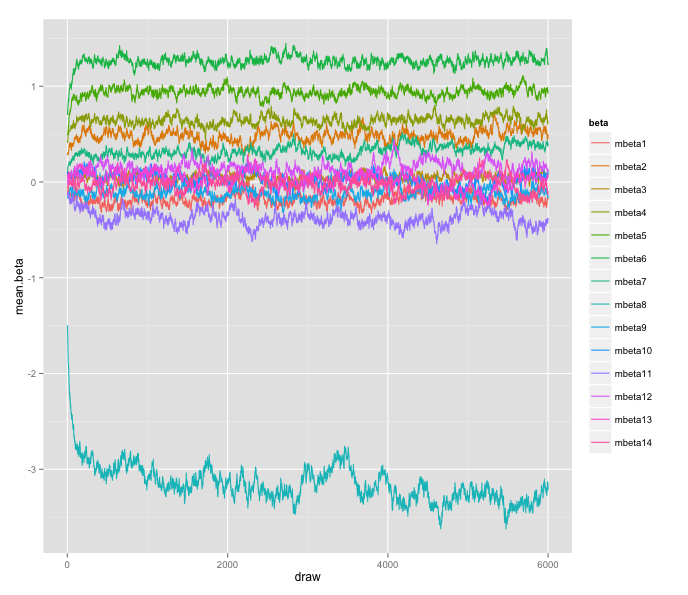

- - -

&copy; Creative Commons-BY Lynd Bacon & Associates, Ltd. DBA Loma Buena Associates.

Disclaimer:  All content is provided "as is." It's not warranted to be suitable for any particular purpose.

2015126a

_ _ _

### Assessing MCMC Convergence by Summarizing MCMC Chains Graphically

Getting valid results about model parameters when using MCMC methods depends on whether the algorithm used eventually _converges_ so as to be producing sample values from stable distributions.  It's the values that you can assume are drawn from stable distributions that you want to use for making inferences.

There are a variety of ways to assess whether convergence has been attained.  One way is to plot parameters' chains, like time series plots.   You can do this for each case and each parameter, but for results like the Solo 2 results this would make for many graphs.  In such a case many practitioners will plot summaries of the parameters' chains.  In the example given by Allenby et. al in their __Practitioners' Guide__ working paper (2005), they plot parameters' _average_ across rspondents chains.  That is, they calculate for each parameter the mean across respondents at each iteration of the algorithm.  They then plot these "mean chains" for the parameters.  The following describes doing this for the values in a "betadraw" array like what you generate when doing your Solo 2 modeling. 

The betadraw array we'll use for plotting here, "betadraw1" is 360 rows (respondents) by 14 columns (one for each beta parameter) by 6000 "blocks" (samples or "draws"; the 3rd dimension of betadraw1).  We're going to use the **ggplot2** and **reshape2** packages.  We'll use **reshape2** first to put our data into shape to use in **ggplot2**.

### Preparing the Data to Plot 

But first let's get the "mean chains" we want to plot.  We can do this with the following code:

```
meanbetas<-apply(betadraw1,c(2,3),mean)
```
This should get us a matrix with 14 rows and 6000 columns. Let's transpose meanbetas to make the rows the columns and vice versa:

```
tmeanbetas<-t(meanbetas)
```
The "t()" means take the matrix transpose.  Now let's add some names to the columns of this matrix.  Each column is the average chain for a beta:
```
betanames<-paste("mbeta",c(1:14),sep="")
dimnames(tmeanbetas)<-list(NULL,betanames)
```
You can make the names whatever you want them to be, of course.

### Help Me, I'm Melting!

Now we're going to rearrange this matrix to make it "tall and skinny."  We'll use the __melt__ function in **reshape2** to do this.  __melt__ can convert wide-format data into long_format data.
```
meltedbetas<-melt(tmeanbetas,varnames=c("draw","beta"),value.name="mean.beta")
```
_meltedbetas_ should be a dataframe with three columns, _draw_, _beta_, and _mean.beta_.  It's best to inspect this new object to make sure it's what we want, as always.

### Plotting with gglot

Next we're going to create our plot and assign it to the name _p_:
```
p<-ggplot(meltedbetas,aes(draw,mean.beta))+geom_line(aes(group=beta,colour=beta))
```
If you then print out this plot by typing ```p``` (no quotes) at the console command prompt, you should get a plot that looks something like:



The **ggplot** package provides many graphing capabilities, but it can require some study to get the most out of it.  Hadley Wickham, its author, has a Springer R series book about it that you can get for free in electronic form as an NU student.  It's a little dated bu useable:

Wickham, H. (2009) **gglot2: Elegant Graphics from Data Analysis.** New York: Springer-Verlag.

You might find the **ggplot2** website useful:  [http://ggplot2.org](http://www.ggplot2.org)

Wickham is also the author of **dpylr**, **reshape2**, and other R packages.


