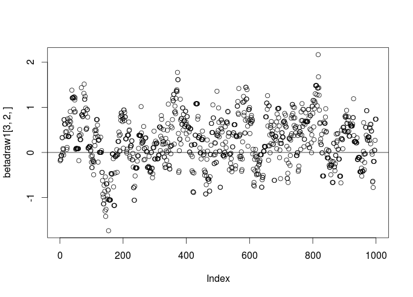
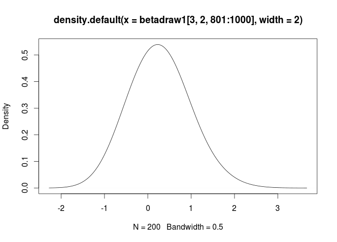
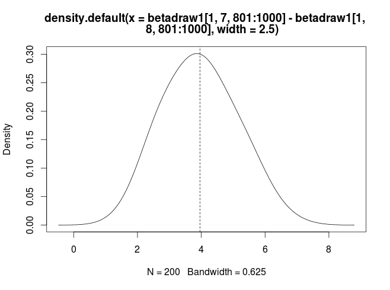

- - -

&copy; Creative Commons-BY 2015 Lynd Bacon & Associates, Ltd. DBA Loma Buena Associates.

Disclaimer:  All content is provided "as is." It's not warranted to be suitable for any particular purpose.

20150706a

_ _ _

The following assumes you have prepared the data as described in the data preparation note.  This means you should have created  the data objects X.matrix, lgtdata, zowner, and gender, and that you are running an R session into which you have made them available for use.

### Install the bayesm package

First, install the package “bayesm” from an R mirror if you haven't already.  Once it is installed, attach it your your session using using library(bayesm).   If you type

```
>help(package=”bayesm”)
```

you should see what's in this package.   The function  in bayesm you're going to use is rhierMnlDP(), which uses MCMC to fit a hierarchical MNL model.  Type help(rhierMnlDP) to see what it does, how it works, and what it outputs.  It produces a list of results, so when you run it, you are going to assign what it outputs to a name.  Note that the DP part of the name refers to “Dirichlet Process.”  This code uses a Dirichlet Process prior to add a little additional “fatness” as might be needed to the tails of the multivariate normal (MVN) distribution, which can be a little too thin in this kind of choice model.

### Creating inputs for rhierMnlDP() and running it

Next, you need to create inputs for rhierMnlDP().  These consist of data, and specifications telling rhierMnlDP() how it should run.  MCMC is a computationally intenstive method, and for testing/debugging purposes (only) we're first going to try running for a just small number of iterations, 5,000 of them, to see if things are properly specified and working.  *Note that in the examples that follow, somewhat different data have been used than what you are analyzing for this assignment.  Your numerical results will likely vary.*

Many more than 5,000 iterations are typically needed when estimating HB MNL choice models.   You should plan on running at least 30,000 (that's 30 thousand) iterations, and treating the first half of them as your “burn-in” (iterations required for the algorithm to produce samples from stable posterior distributions) to get your final results for each of this assignment's models.

To specify just 5,000 iterations, and that every 5th sample is kept :

```
>mcmctest=list(R=5000,keep=5)
```
R here is the number of iterations. 5 is the chain “thinning” constant.

Keeping only some iteration results on an “interval” basis is called “thinning.”

Create the “Data” list rhierMnlDP() expects:

```
>Data1=list(p=3,lgtdata=lgtdata)
```
p is choice set size, which is constant 3 for all choice sets and respondnets.  You already made lgtdata, the list of lists of Y and X.

OK, so no we're ready to do a test run. Let's call the results “testrun1:”

```
>testrun1=rhierMnlDP(Data=Data1,Mcmc=mcmctest)
```

You're using most of rhierMnlDP()'s defaults for priors, etc.

This algorithm like all MCMC algorithms will take a little bit to run, even with just 5,000 iterations.  You'll get some process feedback. (Or, error messages.)

If things are starting to work, you'll see output in the R console window that looks like the following.  Note that your results will likely differ from the following examples, as the data used are a little different, and MCMC is a stochastic sampling procedure:

```
Z not specified  
Table of Y values pooled over all units  
ypooled  
   1    2    3  
3551 3908 5501   
 
Starting MCMC Inference for Hierarchical Logit:  
   Dirichlet Process Prior  
   3  alternatives;  14  variables in X  
   for  360  cross-sectional units  
```

Etc.

Once the algorithm has completed 5,000 iterations, your output called testrun1 will be a list with several components:

```
> names(testrun1)
[1] "betadraw"  "nmix"   "alphadraw" "Istardraw" "adraw"     "nudraw"   
[7] "vdraw"     "loglike"
```

“betadraw” is an array that has the draws (i.e. samples from marginal posterior distributions) for the regression coefficients:

```
> dim(testrun1$betadraw)
[1]  360   14 1000
```

### Choice model regression coefficients: the betas

betadraw is the focus of much of your attention for this assignment.  For this example it has 360 rows, the respondents, 14 columns corresponding to the columns in your X.matrix, and 1000 “blocks,” the third dimension of betadraw, which are the 1,000 samples provided by the (thinned) iterations of the algorithm.

Let's get betadraw out of testrun1 and take a closer look at what's in it:

```
> betadraw1=testrun1$betadraw
> dim(betadraw1)
[1]  360   14 1000
```

Note that the 3^rd^ dimension of the betadraw array is 1000.  That's because we ran 5,000 iterations, and kept every 5^th^ one.  *Note that when you run your 'final' models for this assignment you should use at least 30,000 iterations, and consider at least the first half of them your "burn-in."*

To make what's in betadraw1 easier to understand, you might want to add meaningful names to the columns.  You can do this by creating a vector of names for the 14 columns, and then doing something like:

```
> dimnames(betadraw1)=list(NULL,namvec,NULL)  #namvec is your vector of names
```

The above command adds column names, but not row or “block” names. 

### Starting to look at those betas

Variable names notwithstanding, here's what the chain in betadraw1[3,2,] looks like using plot(betadraw1[3,2,]).  This is the chain for the third observation or respondent's second beta regression coefficient:



The horizontal line at zero was produced with the command abline(h=0).  “Index” is the MCMC algorithm's iteration number after “thinning.”  Each circle is a draw from this beta's posterior distribution. If you look closely at this plot you'll see that the points tend to fall more above the zero line than below it.  Your perception is consistent with what follows.

The beta samples used for inference are those that are after the “burn-in” period, corresponding to when you're reasonably sure that the algorithm is producing samples from stable distributions..   As an example, here's what the distribution of the last 200 sampled values for respondent 3's 2nd beta coefficient looks like.  The density has been “smoothed” a little by using a bandwidth to scale the smoothing kernel (i.e. distribution) used:

```
> plot(density(betadraw1[3,2,801:1000],width=2))
```



Some descriptive statistics for the last 200:

```
> summary(betadraw1[3,2,801:1000])
   Min. 1st Qu.  Median    Mean 3rd Qu.    Max. 
-0.7776 -0.1471  0.2714  0.2703  0.5961  2.1690 
```

Based on the above, would you say that this beta coefficient tends to be very different from zero?  A little different?

We can summarize the samples of the coefficients.  If we do the following, we get the overall means of the coefficients, the means across respondents:

```
> apply(betadraw1[,,801:1000],2,mean)
 [1] -0.24224063  0.47693214  0.04280695  0.63883086
 [5]  0.95760311  1.28390671  0.28959509 -2.99202030
 [9] -0.14260529  0.07264027 -0.32392822  0.07181538
[13]  0.09574949 -0.01385585
```

This result is worth looking at to see of the overall patterns make sense.  Do the mean coefficients make sense given what the attribute levels are? Are they what you'd expect?  For example, does it appear that in the aggregate, more RAM has greater utility than less RAM, and larger screen sizes more than smaller screen sizes?

You may ask yourself how you can be sure when your “burn-in” has been long enough.  It turns out that there are various ways this is judged that include some summary statistics comparing different parts of chains to each other, and graphical methods.  

In the “Practitioner's Guide” by Allenby et al. (2005; it's on Canvas) you'll see in Figure 1 a graph of model coefficients (coefficients for covariates of betas, actually) across respondents plotted over iterations.   A somewhat common practice that's similar to this is to graph the average (across respondents) betas over iterations to determine how many iterations it seems to take for all the mean beta data to stabilize.   Even though MCMC algorithms can be expected to eventually converge to steady states under very general conditions, there is no guarrantee that all generated chains for all parameters will converge for all observations at the same rate, and it's always possible that any particular hierarchical model may not describe the data of individual cases very well at all.  But you can look at the chains of the betas in the aggregate.  Using the betadraw array you can compute chains of mean betas by doing:

```
> betaMeanChains=apply(betadraw1,c(2:3),mean)
```

which will return in betameans a matrix that is 14 rows (one for each beta) by (in this case) 1000 columns, one each for the iteractions saved after thinning to every 5th.   How does this plot look to you?  Anything unusual?  It can sometimes be more informative to look at the chains for higher level parameters, or “hyperparameters.”   In this case you could, for example, extract and plot the chains for the means of the MVN distribution on the beta coefficients to see if they (the chains) suggested a number of burn-in iterations.

R's apply() function and it's cousins sapply(), lapply(), and tapply() are powerful means of summarizing data in various ways.  You might find what's in the R packages plyr and dplyr to be even more useful for some things, and maybe as easier to use for summarizing some kinds of data.  Try help(package=”dplyr”) in R after you have installed dplyr.

Moving right along here, we can get a matrix of coefficient means by respondent with:

```
> apply(betadraw1[,,801:1000],c(1,2),mean)
```

this will produce a 360 row x14 column matrix:  360 respondents, 14 mean coefficients.

### Comparing betas

Since we have the (thinned) MCMC sampler chains, we can estimate arbitrary functions of them that we want to evaluate.  For example,  we can estimate the distribution of the differences between respondent 1's 7th and 8th coefficients (these are the two coefficients for the price attribute):

```
> summary(betadraw1[1,7,801:1000]-betadraw1[1,8,801:1000])
   Min. 1st Qu.  Median    Mean 3rd Qu.    Max. 
  1.400   3.038   3.873   3.958   4.677   6.920
```
A smoothed density plot of the coefficient differences with a vertical line at the mean of the differences:

```
> plot(density(betadraw1[1,7,801:1000]-betadraw1[1,8,801:1000],width=2.5))
> abline(v=mean(betadraw1[1,7,801:1000]-betadraw1[1,8,801:1000]),lty=2)
```
 
 
 
 Would you say that the distributions of these two coefficients differ for this respondent?
 
 - - -

&copy; Creative Commons-BY 2015 Lynd Bacon & Associates, Ltd. DBA Loma Buena Associates.

Disclaimer:  All content is provided "as is." It's not warranted to be suitable for any particular purpose.

20150706a

_ _ _

