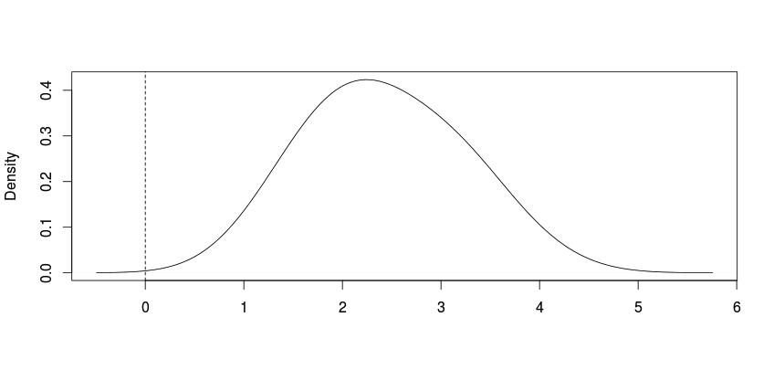

- - -

&copy; Creative Commons-BY 2015 Lynd Bacon & Associates, Ltd. DBA Loma Buena Associates.

Disclaimer:  All content is provided "as is." It's not warranted to be suitable for any particular purpose.

20150707a

_ _ _

The following assumes you have prepared the data as described in the data preparation notes, and that you have worked through the first Solo 2 modeling document.

### What's that stuff in the rhierMnlDP() output?


You may be wondering what those other things are in the list of results that rhierMnlDP() returns.   If you saved your results in testrun1, then what's in it is:

```
> names(testrun1)
[1] "betadraw"  "nmix"      "alphadraw" "Istardraw" "adraw"    
[6] "nudraw"    "vdraw"     "loglike"
```
rhierMnlDP() returns results in a list.  The names of the list elements are shown above.

The help for rhierMnlDP describes what these things are.  You'll see that “loglike” is the log-likelihood of the model at each iteration.  You already know what “betadraw” is.  “nmix” includes estimates of the the parameters of the MVN distribution on the betas.  “Istardraw” summarizes the distribution of the number Dirichlet Process (DP) components used per iteration.  We've mentioned that a Dirichlet Process prior is used here to “fatten” MVN tails as needed.  If you do:

```
>table(testrun1$Istardraw)
```
You may (probably) see that the modal number of DP components drawn is 2. (Your results may vary.)

### Adding a covariate of the betas to the model

There are no results for how the betas might depend on whether a respondent had owned an STC product.  That's because we didn't include zowner, the ownership indicator variable we created, as a covariate.  It will be a covariate of the betas, the choice regression model coefficients.  Let's try doing that now.

Remember that variable zowner that you created previously?  (If not, go back to the data prep note.)  You're going to use it as a covariate of your MNL choice model regression coefficients, the beta coefficients.  To do so we need to create new data to input into rhierMnlDP().  Let's call it Data2.  Since rhierMnlDP() likes its z's centered, we're going to “demean” zowner and make the result a one column matrix (rhierMnlDP likes a matrix):

```
>zownerc=matrix(scale(zowner,scale=FALSE),ncol=1)
```

zownerc should be a matrix with 360 rows and one column.  What do you think that mean(zownerc[,1]) will be equal to?

Now we'll make the new data list that includes zownerc:

```
>Data2=list(p=3,lgtdata=lgtdata,Z=zownerc)
```

Now let's run the algorithm again, giving the output a new name so that we don't replace testrun1, and only first using 5,000 iterations to see if things are working right:

```
>testrun2=rhierMnlDP(Data=Data2,Mcmc=mcmctest)
```
If things go ok, when the run is finished, testrun2 will now have in it:

```
> names(testrun2)
[1] "Deltadraw" "betadraw"  "nmix"      "alphadraw" "Istardraw"
[6] "adraw"     "nudraw"    "vdraw"     "loglike"  
```

ou can see that there is now an element called Deltadraw.  Deltadraw is a matrix with number of rows=saved iterations (1000), and number of columns = number of regression predictors in your X.matrix (14):

```
> dim(testrun2$Deltadraw)
[1] 1000   14
```

The columns of Deltadraw correspond to coefficients from regressing the 14 MNL betas on zownerc.  The rows are “thinned” samples from the coefficients' posterior distributions. These coefficients indicate how the betas depend (linearly) on zownerc.

Here are the means of each column of Deltadraw we obtained:

```
> apply(testrun2$Deltadraw[801:1000,],2,mean)
 [1]  0.15226082 -0.16381591 -0.02836344 -0.02513873
 [5] -0.08865065  0.05535692  0.05197641 -0.19830603
 [9] -0.20726975  0.96667143 -0.21367504 -0.21854423
[13] -0.01912421  0.25042145
```

Note that I've selected the last 200 draws from these chains to be consistent with the previous modeling example note.  We're “pretending” that draws 1 through 800 are our “burn-in.”  When you estimate this second MNL model for the assignment, be sure to run at least 30,000 (thirty thousand) iterations of the algorithm, and treat at least the first 15,000 of them as your burn-in.

### Summarizing how the "deltas" (covariate coefficinents) are distributed

Here are selected “quantiles” of our last 200 draws. I've “rounded” them to 4 significant digits to better fit them here:

```
>round(apply(testrun2$Deltadraw[801:1000,],2,quantile,probs=c(0.10,0.25,0.5,0.75,0.90)),4)
      [,1]    [,2]    [,3]    [,4]    [,5]    [,6]    [,7]
10% 0.0148 -0.3020 -0.2011 -0.1717 -0.2163 -0.1118 -0.0679
25% 0.0918 -0.2407 -0.1271 -0.1068 -0.1577 -0.0540 -0.0106
50% 0.1520 -0.1667 -0.0161 -0.0111 -0.0861  0.0288  0.0538
75% 0.2189 -0.0902  0.0665  0.0532 -0.0336  0.1361  0.1036
90% 0.2903 -0.0187  0.1334  0.1110  0.0540  0.2976  0.1740
       [,8]    [,9]  [,10]   [,11]   [,12]   [,13]  [,14]
10% -0.5872 -0.4082 0.8233 -0.3607 -0.3313 -0.1905 0.0965
25% -0.4236 -0.2840 0.8818 -0.3056 -0.2786 -0.0969 0.1498
50% -0.1801 -0.2025 0.9663 -0.2191 -0.2377 -0.0078 0.2276
75%  0.0118 -0.1152 1.0455 -0.1377 -0.1620  0.0683 0.3408
90%  0.1612 -0.0260 1.1189 -0.0274 -0.0887  0.1235 0.4562
```
The rows above are the selected percentiles, and the columns correspond to the coefficients from regressing the betas on zownerc, herein called “delta” coefficients. The first column, [,1], for example, is for the delta relating the beta coefficient of the effects-coded 16Gb level of RAM to zownerc.  Would you say that the 16Gb level beta is negatively related, not related, or positively related to prior ownership of an STC product? (Hint: think of each column above as summarizing the distribution of a delta regression coefficient.)

The fourth delta coefficient, in column [,6], is for a the effects-coded 10 inch screen size attribute level.  How would you say it depends on zownerc?

By the way, note that you can make your life easier by naming the columns in a matrix like this one.  Ditto for matrices that summarize the distributions of betas or other parameters.

The assignment asks you to assess the impacts of both prior ownership and gender on how the attributes affect preferences.  You can examine the impacts of gender in a couple of different ways.  One is to run a model like the above, but replacing zownerc with a version of gender centered on its mean.   Let's call this genderc.    A better approach is to include both zownerc and genderc as covariates of the betas in the same model.   Here's how you can do it.

First, center gender:

```
>genderc=scale(gender, scale=FALSE)	# center on mean, don't standardize
```

Then, make a matrix we'll call zmatrix that will replace the matrix above we called zownerc:

```
>zmatrix=cbind(zownerc,genderc) # this binds the two vectors into matrix columns
```

You previously centered STCowner as zownerc, right?  Next, create a new data list to input to rhierMnlDP that includes zmatrix:

```
>Data3=list(p=3,lgtdata=lgtdata,Z=zmatrix)
```

and then run your model again.  Here's a test run:

```
>testrun3=rhierMnlDP(Data=Data3,Mcmc=mcmctest)
```

Once your run is finished, and assuming that everything when correctly, testrun3$Deltadraw will be a matrix with 28 columns.  The first 14 columns are from regressing the betas on zownerc, and the second 14 columns are from regression the betas on genderc.

Note that here again you should run your “final” model at least 30,000 iterations, and discard at least the first 15,000 as your burn-in.

As you probably realize by now, running an MCMC algorithm can take a little time.  Be sure to save your session results often using the save.image() command.

Your assignment asks that you answer Obee's question about whether price sensitivity varies over brands.   “Better” questions, questions that make good use of the richness of your Bayesian model results so as to better understand customer heterogeneity, are:

(1) Does price sensitivity vary across brands for any of the respondents?

(2) If it does, for how many, and for which ones?

To answer these questions, we need to express them in a way they can be addressed with the model results.

As an example, suppose we wanted to answer them regarding whether the utility provided by the screen sizes of 7 inches and 5 inches differed.   The fifth beta coefficient provides an estimate of this difference for each of STC's survey respondents. For each respondent we have MCMC draws (the chain values) that approximate the posterior density of this beta coefficient.   Remember that in Bayesian statistics, parameters have uncertainty; that is, they vary.   They don't have a specific, single "true" value.

Since for each respondent we have an approximate posterior density for this beta, we can for each and every respondent determine whether this beta is likely to be different from zero.  If it's not likely to be different from zero, then we'd conclude that the two levels of screen size don't differ in the utility they provide a given respondent.

Now consider this density plot.  It's of the post- burn-in chain for the fifth beta for “subject 171.”   Do you see where this distribution is relative to zero?  Would you say that this subject's second beta coefficient is likely to differ from zero?



We can use the respondents' posterior densities for this beta to determine which of any of them has a beta that is likely to differ from zero.   Suppose our decision rule for making these inferences is that if zero is less than or equal to the 5th percentile of a respondent's beta distribution, or if zero is greater then or equal the 95th percentile of the distribution, then that respondent's beta is likely to be different from zero.  You'll probably note that this is a little like using a traditional confidence interval.  In fact, this would be what's called a Bayesian 90% “credible interval.”  The meanings of these two kinds of intervals are quite different.

Here's how we can apply this decision rule to respondents' second beta coefficients.  First, to make things a little easier, let's get the second betas out of the betadraw array that has the MCMC chains from our testrun1 example model results.  Here let's assume that we're using the last 300 of a saved 1,000 sampled values from the testrun1 results we obtained previously.  Let's put them in a matrix:

```
> betamat=testrun1$betadraw[,2,701:1000]	# This will be a 360 X 300 matrix
```
Next, we want to calculate where zero falls relative to the distribution of what's in each row of betamat.  The easiest way to do this is to use a function that we can apply to each row of betamat:

```
> getp.f=function(x,y=0){
+    pfcn=ecdf(x)
+    return(pfcn(y))
+ }
```

The “+” signs are the R console's “continuation line” prompts.  ecdf() calculates an empirical cumulative density function.  This function returns the empirical percentile/100 of y, and y defaults to zero. Now let's apply this function to the rows of betamat:

```
> zp=apply(betamat,1,getp.f)
```
zp should be a vector.   Given that the values in it are percentiles/100, what do you think the range of possible values will be?

Now that we have zp, all we need to do is to find out for each respondent whether their zp value is <= 0.05 or is >= 0.95:

```
> betaDiffZero=rep(0,nrow(betamat)) # make a vector of zeros
> betaDiffZero[zp <= 0.05 | zp>= 0.95] = 1	
```

In the second statement, “|”, sometimes called the "pipe," is the logical “or” symbol.  The first statement makes a vector of zeros the length of which is equal to the number of rows in betamat, which is the number of respondents. The second datement sets an element of the vector to be 1 if zp is less then or equal to 0.05 or if it is greater than or equal to 0.95.

You can count up the number of one's in betaDiffZero, or just tabulate it, like by using table(betaDiffZero).

Want to select the respondents whose betas are likely to be different from zero?  Use:

```
> respDiffBetas=betamat[betaDiffZero==1,]
```

How would you use the foregoing to determine how many respondents have second betas that are likely to be greater than zero?  How about for determining whether two betas, like the second and third, are different?

Note that the above procedure is a method you can use to address very fully Obee's question about whether price sensitivity varies by brand.  All you need to do is to decide what beta coefficients to look at, and then use them following steps like those above.

- - -

&copy; Creative Commons-BY 2015 Lynd Bacon & Associates, Ltd. DBA Loma Buena Associates.

Disclaimer:  All content is provided "as is." It's not warranted to be suitable for any particular purpose.

20150707a

_ _ _


