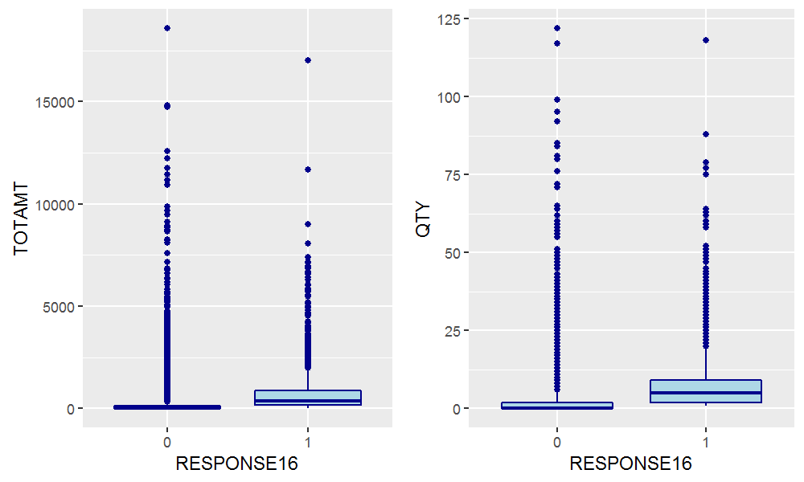
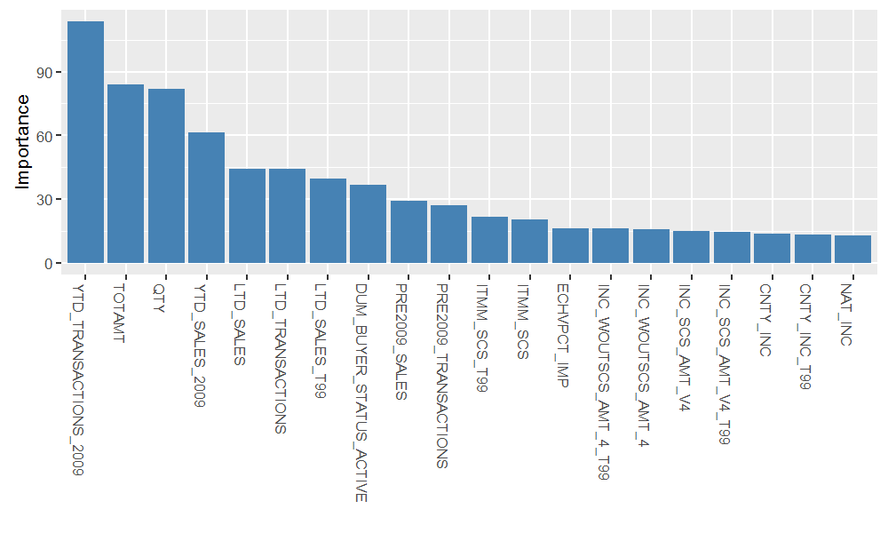
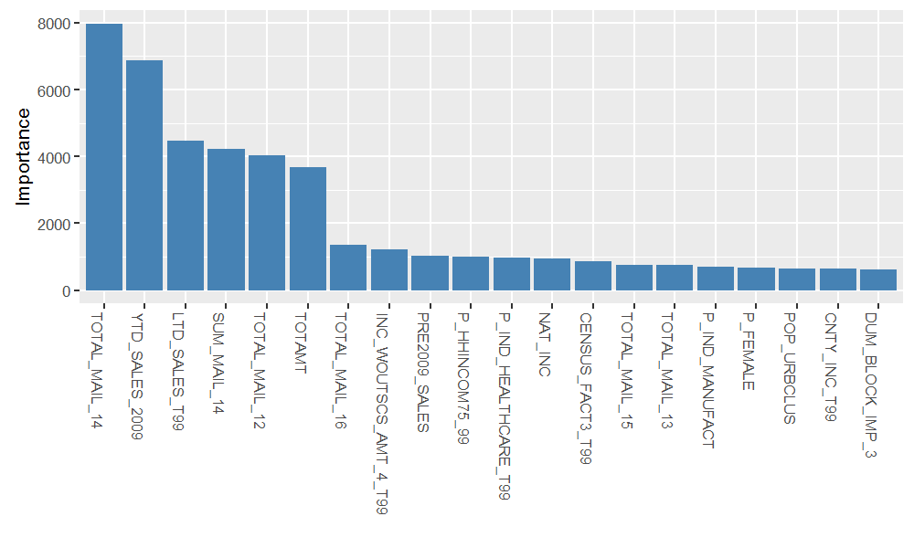
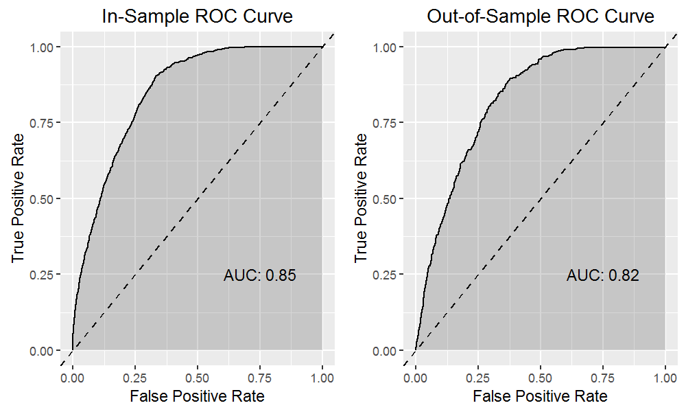
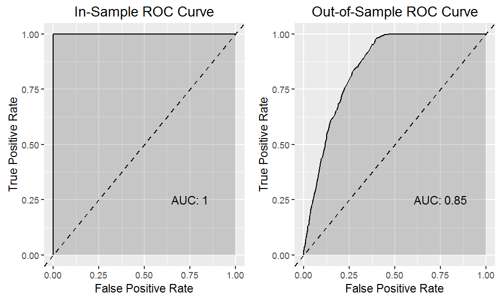
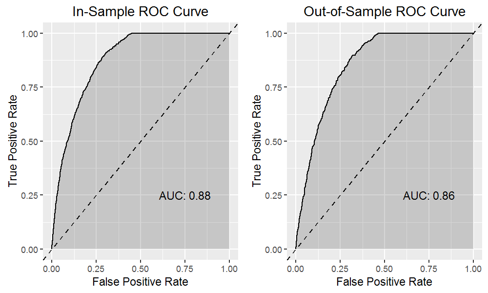
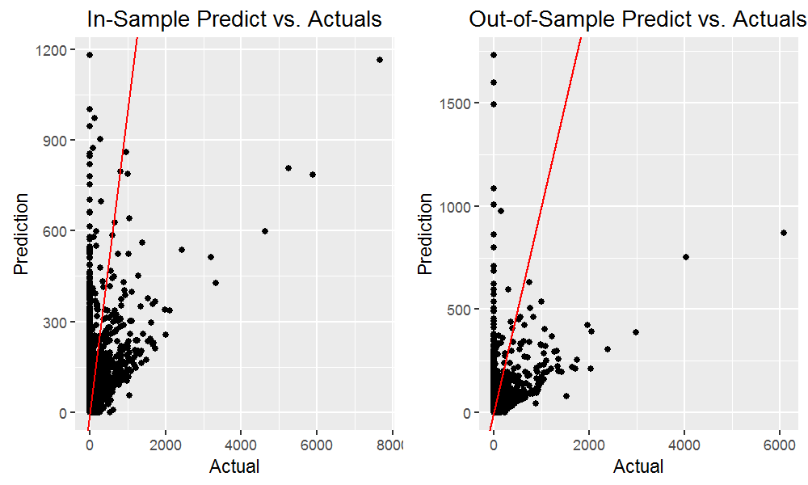
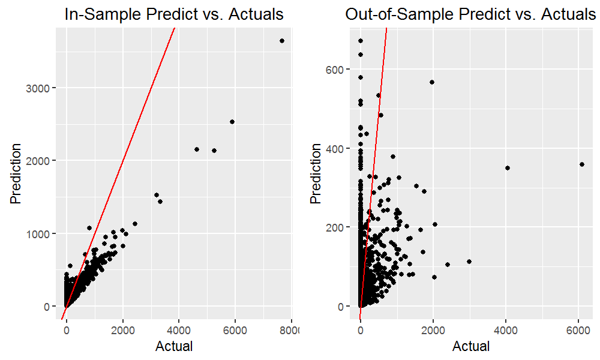
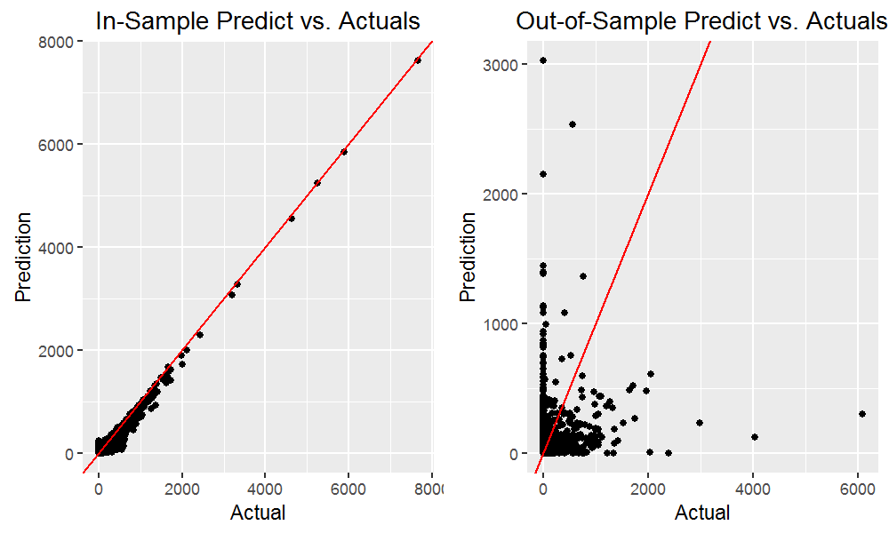

# 1 Introduction

This document presents the results of the third assignment for the Masters of Science in Predictive Analytics course: PREDICT 450. This assessment required the student to develop a predictive model in order to identify customers that are likely to respond to a mailing campaign, and once identified, estimate the net profit that may result from targeting those customers as part of a new mailing campaign.

For this assessment, we leverage XYZ's database of customers which contains a large number of variables relating to sales and campaign results. We use this data to first assess which variables have the greatest 'importance' in determining both the chance of response to a mailing campaign as well as the likely spend of each customer. We then use this reduced dataset to fit three classification models to predict chance of response, and three regression models to predict likely spend. Optimal models are selected and subsequently used in order to estimate the expected net revenue from conducting a new targeted mailing campaign, accounting for the cost of mailing each customer.

# 2 Data

The dataset used for this assessment is based on XYZ's database of customers. It includes 30,779 records and 554 features of customer data. The features capture customer sales, results from previous mailing campaigns, and Experian properties which provide additional insights about each customer. The features are broken up into 345 character, 48 integer and 161 numeric variable types.

Due to the scale of data, we conducted a subjective assessment of variable relevance prior to employing any pre-processing or modelling routines. We did this by assessing the descriptions for variables contained within the provided data dictionary and grading each by its perceived ability to predict both the chance of response and likely spend. This resulted in 227 variables being graded as having a 'low' relevance, which were subsequently excluded from the dataset. Note that a summary data file of each variable grade is available on request. The remaining variables can be broken up into 119 character, 48 integer and 160 numeric variable types.

From an initial look at the data, we noted that the compiled R data frame fails to distinguish between numeric and factor variables. As such, prior to performing any data exploration, we converted all character class variables to factor type and retained all other variables as numeric type. We then manually converted all 'ANY_MAIL_x' and 'RESPONSEx' variables to factor type, since these variables contained no character based observations yet were observed to be categorical in nature.

# 3 Data Exploration

A number of exploration routines were conducted. These routines allowed us to gain an understanding of potential data limitations, including identifying variables which have missing observations, outlier observations, or those variables which may benefit from transformation.

## 3.1 Univariate Data Analysis

As part of the univariate data analysis, summary statistics for all of the 160 retained numeric variables were calculated and observed. The majority of numeric variables do not suffer from missing values. However, many variables have a minimum value of zero, suggesting zero-inflated data. Histogram and box plots were also generated and reviewed for a large subset of numeric variables, with total amount spent (TOTAMT) selected for further discussion below. Note that zero value observations were removed prior to generating each plot.

#### Figure 3.1.1 Histogram and Boxplot: TOTAMT

{#id .class height=320px}

We immediately noticed that the variable suffers from a heavy positive skew, which is in-fact a common attribute over the majority of numeric variables. The result is a number of observations which could be classed as outliers.

## 3.2 Bivariate Data Analysis

Since we intend on building a prediction model to determine both the chance of response to a mailing campaign (RESPONSE16) and the likely spend of each customer (TOTAMT16), we have an interest in identifying variables which have explanatory power over these two variables. As such, we calculated and reviewed the Pearson correlation coefficient for all numeric variables against our numeric response variable, TOTAMT16. Correlations for the 10 most correlated numeric variables against TOTAMT16 are shown in the table below.

### Table 3.2.1 Correlations vs. TOTAMT16 (Top 10 Correlations)

| variable              | correl coeff |
|-----------------------|--------------|
| YTD_SALES_2009        | 0.3723       |
| YTD_TRANSACTIONS_2009 | 0.2938       |
| LTD_SALES             | 0.2218       |
| LTD_TRANSACTIONS      | 0.2067       |
| PRE2009_TRANSACTIONS  | 0.1587       |
| PRE2009_SALES         | 0.1445       |
| TOTAL_MAIL_13         | 0.1182       |
| TOTAL_MAIL_14         | 0.1178       |
| TOTAL_MAIL_15         | 0.1178       |
| SUM_MAIL_12           | 0.1158       |

None of the variables have reported a strong correlation with TOTAMT16, with the greatest absolute correlation being reported by total sales through to 2009 (YTD_SALES_2009) and total transactions through to 2009 (YTD_TRANSACTIONS_2009) at 0.37 and 0.29, respectively. Finally, we used bar plots to explore the relationship between the categorical response variable (RESPONSE16) and each numeric variable. Two of these plots have been selected for further discussion below.

#### Figure 3.2.1 Boxplot: RESPONSE16 vs. TOTAMT / QTY

{#id .class height=320px}

We can see that there are indeed recognizable differences in both the mean and distribution of a number of numeric variables depending on whether they are associated with a positive or negative response to an advertising mailing campaign.

# 4 Data Pre-processing

As part of the data pre-processing routine, we first focused on imputing data for missing observations (~11% of the dataset). This was initially attempted using the rfImpute function from the Random Forest package in R, however processing time eliminated this as a viable option. Instead, we looped over each variable and imputed observations for numeric variables with the variables' median value, and at the same time, imputed observations for character variables with the variables' most common value. Those variables which required imputation were copied and renamed to include the suffix '_IMP' while the original (non-imputed) equivalent was removed from the dataset. Note that while 89 of the retained categorical variables were identified as having missing values, only one of the retained numeric variables, ECHVPCT, was identified as having missing values. 

We then looked towards dealing with outlier observations for numeric variables. In many cases, the task of identifying outlier observations can be a subjective practice. As such, for this assessment, we took a statistical approach and targeted those observations which fell outside the 1st and 99th percentile range. Observations which met these criteria were replaced using the squish function as part of the scales package in R, effectively resulting in a newly created set of trimmed variables. Trimmed variables added to the dataset and can be recognized by the suffix '_T99'.

Finally, we looked towards creating dummies for each of the retained factor variables. Our first preference was to convert all factor variables to dummies, however we noted that many had a high level count and a number of levels with relatively low occurrence. As such, we elected to create dummies for only those factors which had 10 or less levels. Dummy variables were named to include the prefix 'DUM_', along with a suffix to represent the factor level. Note that k-1 dummies were created, where k is the original number of levels for each variable. This resulted in the creation of 351 dummies.

# 5 Variable Importance

The data processing routine produced a data frame of 586 numeric variables. With such a large dataset, it was clear that any subsequent model estimation would benefit from a further reduction in variable count. To achieve this, we leveraged the varImp function as part of the caret package in R to calculate the variable importance according to both response variables. In both cases, variable importance was calculated by fitting a Random Forest model, with 'importance' measured by the mean decrease in node impurity. Bar plots of the 20 most important variables for both response variables are below.

#### Figure 5.1 Variable Importance: RESPONSE16

{#id .class height=290px}

#### Figure 5.2 Variable Importance: TOTAMT16

{#id .class height=290px}

We can see some commonality between variable importance plots, with TOTAMT, YTD_SALES_2009 and PRE2009_SALES all within the top-10 rank for both response variables. We also note a fairly quick drop-off in variable importance beyond the first five variables within both plots. Based on these results, we elected to pass the top-50 ranked variables by importance through to our model estimation phase. We believe this reduction provides a suitable trade-off both in terms of accuracy and performance.

# 6 Model Estimation

## 6.1 Classification Modelling: Chance of Response

For this assessment, we fit three classification based models in order to predict the chance a customer will respond to a mailing campaign. These models include a Naive Bayes, Random Forest and a Lasso and Elastic-Net Regularized Generalized Linear Model (GLMnet) classifier. In each case, we leverage the train function as part of the caret package with a 3-fold cross-validation sampling method, which was applied to a 70% subset of training data and tested against a 30% subset. Default parameters were used for each model. 

The in and out-of-sample Receiver Operating Characteristic (ROC) Curves are shown for each model in Appendix A. The Naive Bayes classifier managed to deliver an in-sample Area Under the Curve (AUC) of 0.85, while its out-of-sample AUC was 0.82. Clearly, the classifier has avoided over-fitting the training data and has managed to maintain similar classification performance over both the training and test sets. The Random Forest classifier on the other hand, reported an in-sample AUC of 1.00 and an out-of-sample AUC of 0.85, which suggests that it greatly suffers from over-fitting. Finally, the GLMnet classifier generated an in-sample AUC of 0.87 and out-of-sample AUC of 0.86.

Below we show the out-of-sample confusion matrix for each model.

#### Table 6.1.1 Confusion Matrix: Classification Model Comparison

| Naive Bayes |         |         |   | Random Forest |         |         |   | GLMnet    |         |         |
|-------------|---------|---------|---|---------------|---------|---------|---|-----------|---------|---------|
|             | Pred: 0 | Pred: 1 |   |               | Pred: 0 | Pred: 1 |   |           | Pred: 0 | Pred: 1 |
| Actual: 0   | 3503    | 246     |   | Actual: 0     | 3992    | 452     |   | Actual: 0 | 4004    | 416     |
| Actual: 1   | 496     | 218     |   | Actual: 1     | 7       | 12      |   | Actual: 1 | 20      | 38      |

We can see that while the Random Forest and GLMnet classifiers were able to produce similar out-of-sample performance according to their ROC curves, the Random Forest classifier has done so by providing less true positive and true negative values. We can confirm this by observing the performance metrics in the table below, which shows that the GLMnet classifier was able to obtain a superior true positive rate and true negative rate.

#### Table 6.1.2 Performance Metrics: Classification Model Comparison

|                      | Naive Bayes      | Random Forest    | GLMnet           |
|----------------------|------------------|------------------|------------------|
| Accuracy             | 0.8337           | 0.8972           | 0.9026           |
| 95% CI               | (0.8225, 0.8446) | (0.8879, 0.9059) | (0.8936, 0.9112) |
| Kappa                | 0.2793           | 0.0419           | 0.1284           |
| Sensitivity          | 0.4698           | 0.0259           | 0.0837           |
| Specificity          | 0.8760           | 0.9983           | 0.9950           |
| Pos Pred Value       | 0.3053           | 0.6316           | 0.6552           |
| Neg Pred Value       | 0.9344           | 0.8983           | 0.9059           |
| Prevalence           | 0.1040           | 0.1040           | 0.1014           |
| Detection Rate       | 0.0489           | 0.0027           | 0.0085           |
| Detection Prevalence | 0.1600           | 0.0043           | 0.0130           |
| Balanced Accuracy    | 0.6729           | 0.5121           | 0.5394           |

From a view of the performance metrics above, we can see that the GLMnet model has demonstrated a superior AUC, accuracy, sensitivity and specificity compared to the other models. As such, we have elected to use the GLMnet classifier to predict the chance of response.

## 6.2 Regression Modelling: Amount Spent

We next fit three regression based models in order to predict the amount a customer will spend. These models include a Multiple Linear Regression (MLR), Random Forest and eXtreme Gradient Boost linear regression estimator. Note that for the MLR, a stepwise variable selection technique was used based on the Akaike Information Criterion (AIC). As with the previous classification models, we employed a 3-fold cross-validation sampling method, and maintained the same 30/70 split between test and training data subsets.

The in and out-of-sample actuals versus predictions for each model are shown in Appendix A. We can see that each model seems to struggle with both outlier observations and the zero-inflated predictor data. We can extend the model assessment by observing the model fit statistics for each in the below table. Note that negative response values were taken as zero for the statistics shown in the table below. That is, we interpret negative spend amounts to be zero.

#### Table 6.2.1 Performance Metrics: Regression Model Comparison

|              | MLR      | Random Forest | Grad Boost |
|--------------|----------|---------------|------------|
| Training set |          |               |            |
| MAE          | 52.74    | 28.42         | 18.96      |
| MSE          | 27243.39 | 9856.1        | 2005.58    |
| RMSE         | 165.06   | 99.28         | 44.78      |
| R^2          | 0.18     | 0.7034        | 0.9396     |
| Adj R^2      | 0.1782   | 0.7019        | 0.9393     |
|              |          |               |            |
| Test set     |          |               |            |
| RMSE         | 177.96   | 179.68        | 189.49     |
| R^2          | 0.1366   | 0.1199        | 0.0211     |
| Adj R^2      | 0.1321   | 0.1098        | 0.0099     |

We can see that each regression model has performed quite poorly over the test set of data. It is hoped however, that combining the predictions with chance of response will aid in dealing with the zero-inflated response data. For this assessment, we will adopt the MLR regression to predict the amount spent as its training performance metrics were among the most favorable.

# 7 Customer Scoring

For the final part of this assessment, we construct a customer score based on the combined predictions of the Random Forest classification and MLR model discussed above. This function is to represent the expected value from conducting a new advertising campaign, based on predictions against a subset of customers who have not yet been mailed. The customer score function is shown below.

$CustomerScore = P(response) \cdot E(netrevenue) - CostofMail$

For the above function, 'P(response)' represents the probability of response as predicted by the chosen classification model, Random Forest. 'E(net revenue)' represents expected net revenue, which is assumed to be 10% of the amount spent as predicted by the chosen regression model, MLR. And finally, the 'cost of mail' represents the cost of mailing customers as part of a new advertising campaign which is assumed to be equal to $1.00 per customer. The sum of customer scores represents the expected value from conducting a new advertising campaign.

We use the customer score above to propose four possible marketing strategies. The first strategy, ALL_MAIL involves mailing all customers who have not yet been mailed, regardless of the probability of response or expected net revenue. This would obviously be a costly strategy, considering the cost of mailing all customers. The second strategy, ALLSCORE_MAIL involves mailing only those customers who return a positive customer score according to the above function. For the third strategy, HIGHPROB_MAIL, only those customers who are predicted to have a probability of response greater than or equal to 0.7 are mailed. Note that this strategy ignores the customer score, and may capture customers who have a negative expected return when accounting for their predicted spend amount. Finally, the fourth strategy, HIGHVAL_MAIL, involves mailing only those customers who have a predicted spend amount of greater than or equal to $500 ($50 net revenue). This strategy also ignores the customer score, and may capture customers who have a negative expected return when accounting for their probability of response.

#### Table 7.1 Customer Score Summary

| strategy       | criteria             | no. mailed | expected value | value per customer |
|----------------|----------------------|------------|----------------|--------------------|
| ALL_MAIL       | ANY_MAIL_16 = 0      | 15,857     | -$10,916.25    | -$0.69             |
| ALLSCORE_MAIL  | Customer Score >= 0  | 1,111      | $2,640.33      | $2.38              |
| HIGHPROB_MAIL  | P(response) >= 0.7   | 19         | $390.06        | $20.53             |
| HIGHVAL_MAIL   | E(net revenue) >= 50 | 20         | $692.07        | $34.60             |

It should be no surprise that the greatest expected value comes from the strategy which involves targeting all customers with a positive customer score. However, we also find viable strategies from mailing only those customers with a high probability of response or a high predicted spend amount. These two strategies are able to achieve a much greater expected value per customer. It may be that the most effective marketing strategy would be to target those customers as flagged by HIGHPROB_MAIL and HIGHVAL_MAIL in the first instance. And then, depending on the success of that campaign, proceed to target the remaining customers flagged by ALLSCORE_MAIL. Note that a list of un-mailed customer account numbers according to the above strategies is available on request.

We note some interesting observations when reviewing the customers which were flagged by ALLSCORE_MAIL. The majority of these customers were flagged as 'active' customers, who are homeowners, with incomes between $50-$150k, and are educated with a Bachelor's degree or higher. We also note some interesting observations when comparing the predicted customer response against those who have previously been mailed. Firstly, of the 14,922 customers who were previously mailed, 1,440 customers did in-fact respond (~10% response rate). Our chosen classifier however, suggests that only 71 of the 15,857 un-mailed customers have a probability of response greater than 0.5 (~0.4% response rate). In addition, of the customers who were previously mailed, the average spend amount of those customers was $342. Our chosen regression model however, suggests that the average spend amount for those customers with a probability of response greater than or equal to 0.5, is only $204. It may be that both the chosen classification and regression models are quite conservative in their predictions, or that those customers who were already mailed carried a higher probability of response and higher predicted spend.

# 8 Conclusion

For this assessment, we fit three classification models to predict chance of response, and three regression models to predict likely spend. From the fitted models, we found a GLMnet based model to be superior in predicting chance of response, and the MLR model to be superior in predicting spend. Optimal models were selected and subsequently used in order to estimate the expected net revenue from conducting a new targeted mailing campaign, accounting for the cost of mailing each customer. This score was then used to propose four possible marketing strategies, ranging from mailing all customers who had not yet been mailed to mailing only those customers who have a predicted spend amount greater than or equal to $500. Results suggest a viable strategy to mail customers with a high probability of response and/or high expected spend in the first instance, and to follow this by mailing the remaining customers with a positive customer score. 

\newpage

#### Figure A.1 ROC Curve: Naive Bayes

{#id .class height=250px}

#### Figure A.2 ROC Curve: Random Forest

{#id .class height=250px}

#### Figure A.3 ROC Curve: GLMnet

{#id .class height=250px}

\newpage

#### Figure A.4 Actuals vs. Predictions: Multiple Linear Regression

{#id .class height=250px}

#### Figure A.5 Actuals vs. Predictions: Random Forest

{#id .class height=250px}

#### Figure A.6 Actuals vs. Predictions: eXtreme Gradient Boost

{#id .class height=250px}